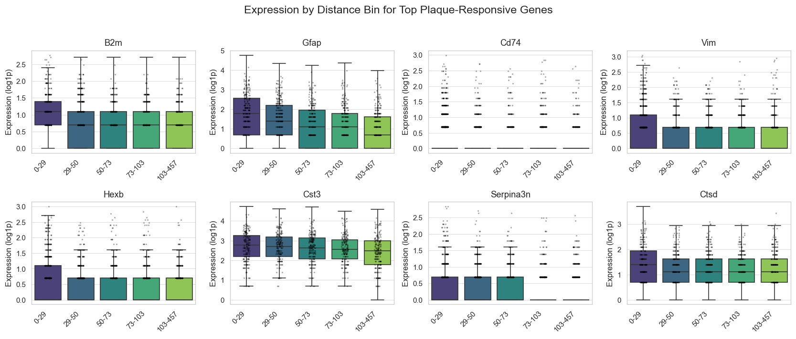
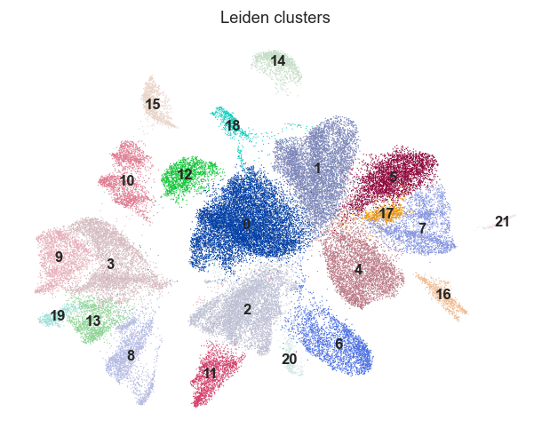
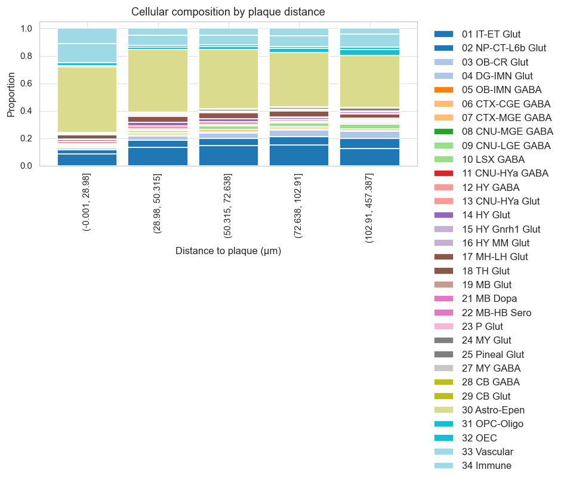
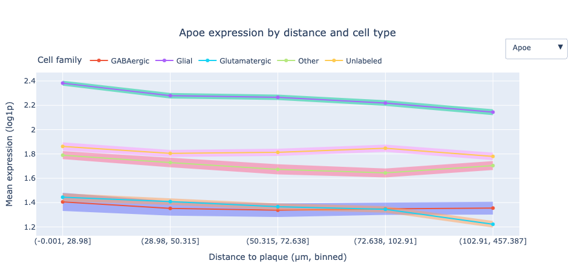
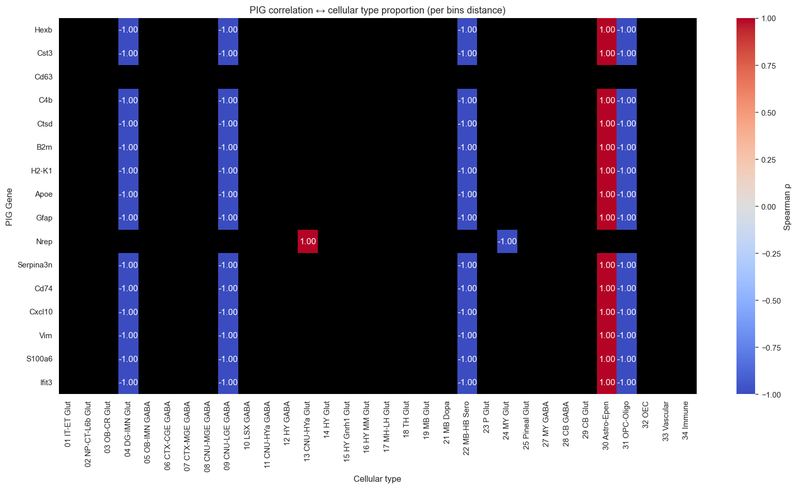
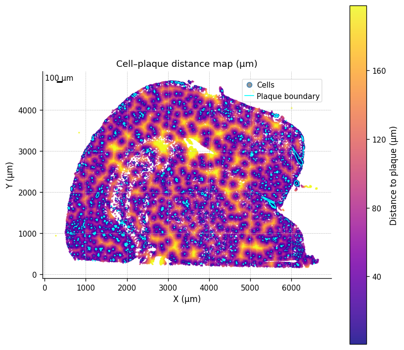

# Team ADAstraPerAspera: Milestone P2
## Spatial Analysis in Alzheimer's Disease: Modeling Gene Expression and Morphology Around Amyloid-β Plaques

## Abstract

This project investigates how Aβ plaques impact the surrounding microenvironment. We aim to develop a quantitative model to precisely describe the influence of the plaques on the surrounding tissue. Knowing which genes and cells are impacted at different plaque distances can refine our understanding of Alzheimer's development. Further, the developers of new drugs can use our model to select realistic targets within the plaque regions accessible from the vasculature.

Our story explores how plaque proximity impacts the cellular, molecular, and tissue environments. We aim to analyze the cell‑to‑plaque distances and apply rigorous statistical tests to describe the spatial trends in gene expression and cell composition. Further, we look at the interplay between gene expression and cell composition, asking ourselves which of the two phenomena is the underlying cause. Finally, we flip the perspective and benchmark predictive models to infer plaque distance from multigene expression.

## Research Questions and Key Findings

### **RQ1 — How does gene expression change with distance from plaques?**
Expression of 16 Plaque-Induced Genes (PIGs) was regressed on plaque distance and compared across bins.
Most PIGs (*Gfap, Cst3, Apoe, B2m, Hexb*) show significantly negative slopes (FDR < 0.01), confirming decreasing expression with distance.
*Gfap* decays fastest (half-distance ~130 μm). Sparse genes (*Cxcl10, Ifit3, Nrep*) show weaker trends.

  
   <em>Expression by distance bin</em>

### **RQ2 — How do cell-type frequencies vary with distance?**
Leiden clustering on **347 genes (~54 k cells)** identified 22 clusters mapped to canonical cell types (*Apoe, Gfap, Mbp, Nrep* markers).

  <table>
    <tr>
      <td align="center" style="border: none;">
         
        <em>Leiden clusters</em>
      </td>
      <td align="center" style="border: none;">
         
        <em>Cell type composition by distance to plaque</em>
      </td>
    </tr>
  </table>

- Microglia, reactive astrocytes, and immune cells are enriched within < 30 µm.
- Neurons and oligodendrocytes decline near plaques.

### **RQ3 — How do gene-expression gradients relate to cell-composition shifts?**
Integrating cell-type annotations with plaque distances shows that mean PIG expression and cell type proportions co-vary strongly, and *Cd63* remains distance-dependent after controlling for composition.
Thus, plaque effects reflect both **cell-type redistribution** and **intrinsic transcriptional activation**, a dual mechanism of spatial gliosis.

  <table>
    <tr>
      <td align="center" style="border: none;">
         
        <em>Apoe regression by distance and cell type</em>
      </td>
      <td align="center" style="border: none;">
         
        <em>Spearman correlation between PIGs and cell types</em>
      </td>
    </tr>
  </table>

### **RQ4 — Which genes predict a cell’s plaque proximity?**
We modeled plaque distance from **347-gene** expression using **LASSO, Elastic Net, Random Forest, and XGBoost**.
**Best model:** XGBoost (Test R² ≈ 0.25).
**Top predictors:** *Gfap, Lyz2, Apoe, Spag16, Igf2*.
Oligodendrocyte genes (*Mbp, Plp1*) show weak coupling.

  
   <em>Residual structure and cell-type bias</em>

**Next steps**
1) Add plaque area, orientation, multi-plaque proximity, and neighborhood gene expression.
2) Restrict to one brain region (e.g., amygdala).
These additions should raise explanatory power, reduce heteroscedasticity, and increase biological specificity in P3.

## Dataset Description and Feasibility

| **Aspect**              | **Procedure**                          | **Outcome**                    |
|------------------------:|----------------------------------------|--------------------------------|
| **Source**              | Xenium V1 FFPE TgCRND8 (17.9 m)        | Public 10x Genomics dataset    |
| **Size**                | ~**54 k cells × 347 genes**            | < 16 GB RAM                    |
| **QC**                  | Remove bottom 5% by transcripts/area   | ~89% retained                  |
| **Plaque Alignment**    | 26 control points + RANSAC             | 3 µm RMS error                 |
| **Distance Computation**| Shapely STRtree nearest boundary       | < 1 min                        |
| **Integration**         | Merge expression + morphology + distance| Unified ~**54 k × 370** frame  |

Feasible on MacBook Pro (M4, 16 GB); full pipeline < 10 min.

---

## Methods

**Preprocessing:** Automatic download → QC filtering → log₁₊ normalization → plaque alignment → distance computation → merged dataset.

**Analyses include:**
- Gene-wise stats (mean, var, skew, zero/NaN fractions)
- “Weirdness” score (dispersion + shape metrics)
- Quantile-binned spatial trends (5 bins ± 1.96×SEM)
- Spearman ρ, OLS slopes (BH-FDR correction)
- Leiden clustering → cell-type enrichment by distance
- Predictive models (R², feature importance)

All core logic modularized under `src/scripts/` and executed via a single Jupyter notebook.

---

## Data Understanding

| Category       | Description                                                                 |
|----------------|-----------------------------------------------------------------------------|
| Morphological  | Cell area, nucleus area                          |
| Spatial        | (x, y) centroid                    |
| Molecular      | **347 genes** (incl. 16 PIGs)                                               |
| Derived        | Cluster ID, cell-type, distance bin, distance to plaque, nearest plaque area                                         |

Distributions: cell areas are log-normal (median ≈ 120 µm²); distances 0–350 µm (median ≈ 95 µm); PIG ρ ≈ −0.3 with distance.
Visual overlays confirm correct alignment and anatomical structure.

  
   
  <em>Brain regions colored by plaque proximity (cool = near plaque)</em>

## Initial Analyses Completed
- QC and filtering
- Plaque geometry cleanup and alignment
- Nearest-plaque distance computation for all cells
- PIG spatial gradients and heatmaps (proximal glial activation)
- Cell-type composition vs distance (microglia ↑, neurons ↓)
- Predictive modeling (XGB test R² ≈ 0.25)

## Proposed Additional Datasets (if any)
- **P2:** None.
- **P3 (planned):** Additional mice (WT + Tg, 2.5–17.9 m) to enable subject-specific analyses and generalization tests, pending feasibility checks.

## Planned Analyses and Proposed Timeline for Milestone 3
1. **Enhanced Regression Features** *(due Nov 13, 2025)*
   Add plaque area, orientation, multi-plaque proximity, and neighborhood gene expression; restrict to amygdala; quantify gains via ΔR² and cross-validation.
2. **Personalized Detection of Subject-Specific Signatures** *(due Nov 20, 2025)*
   Extend to multiple mice (WT + Tg, 2.5–17.9 m); train pooled models → fine-tune per-mouse; identify biomarkers deviating from baseline; assess generalization and within-subject consistency.
3. **Multimodal Embeddings (Expression + Morphology + Spatial)** *(due Nov 27, 2025)*
   Learn joint representations with interpretable autoencoders/contrastive models; evaluate latent structure via UMAP and marker coherence.
4. **Morphology-Encoded Expression Prediction** *(due Dec 4, 2025)*
   Regress gene expression on morphological + neighbor features; rank genes by predictability; assess Moran’s I; test contextual feature gains in explained variance.

## Team Organization (Milestone 2)

| **Role**           | **Member(s)**                        | **Responsibilities**                                                        |
|--------------------|--------------------------------------|------------------------------------------------------------------------------|
| Preprocessing      | Alexander, Sogand, Zayed, Walid      | Data acquisition, QC, plaque alignment, distance computation, integration    |
| Modeling           | Sogand, Rosa                          | Statistical regressions, clustering, predictive models, feature enrichment   |
| Visualization      | Rosa, Sogand                          | Heatmaps, regression trends, interactive figures, readability                |
| Documentation      | Alexander, Sogand, Rosa               | Code organization, repo structure, README, clean scripts                     |

**Timeline:**
For Milestone P3, team members will work in parallel on complementary directions:
- **Walid & Zayed** → Regression enrichment, regional modeling
- **Sogand** → Subject-specific detection and fine-tuning
- **Alexander** → Multimodal embeddings
- **Rosa + team** → Morphology-encoded prediction & GitHub Pages site
