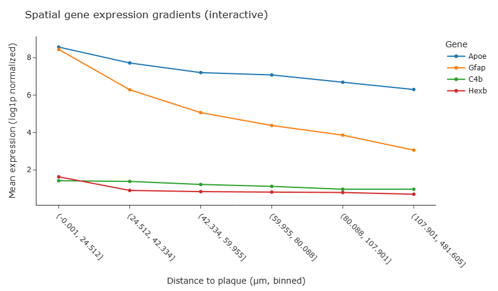
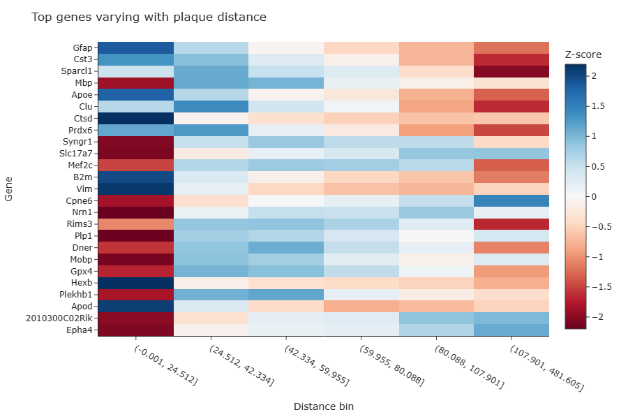
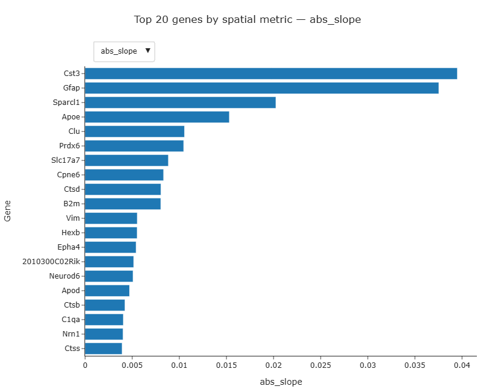

# Team ADAstraPerAspera: Milestone P2

## Introduction

The goal of this project is to build upon the “proximal vs. distal” analysis in Xenium’s application note and inspect the continuous change in gene expression levels and cell type proportions as we move away from the nearest amyloid-beta plaque.

## Data Preprocessing

### Loading and filtering Xenium data

- The Xenium Alzheimer’s dataset (`Xenium_V1_FFPE_TgCRND8_17_9_months_outs.zip`) was downloaded directly from the 10x Genomics cloud using a dedicated `download.py` script.
- The data package includes:
  - `cells.parquet` - per-cell morphological and QC metadata
  - `cell_feature_matrix.h5` - cell × gene expression matrix
- The archive is automatically extracted to
  `src/data/Xenium_V1_FFPE_TgCRND8_17_9_months/xenium_raw/`.

#### Quality control and filtering

- The initial cell metadata is loaded via
  `load_cells_table()` from `src/scripts/preprocessing/loaders.py`.
- Cells are filtered by relative thresholds rather than fixed cut-offs to ensure robustness across experiments:
  - Cells below the 5th percentile of transcript counts or cell area are discarded.
  - The filtering is performed with `filter_cells()` from `qc.py`.
- Summary histograms of transcript counts and cell area are generated by `plot_qc_distributions()` to confirm appropriate thresholding.

---

### Computing plaque proximity per cell

- Amyloid plaque polygons are loaded from
  `plaque_polygons.csv` using `load_plaque_polygons()` in `plaque_distance.py`.
- Each cell’s centroid coordinate (`x_centroid`, `y_centroid`) is used to compute its Euclidean distance to the nearest plaque polygon via `compute_cell_to_plaque_distance()`.
- The resulting DataFrame (`cells_with_dist`) includes a new column `distance_to_plaque` (µm).
- The function `plot_cell_to_plaque_map()` provides a spatial sanity check:
  - Cells are colored by distance (cool = near plaque, warm = far).
  - Plaque outlines are shown in green overlay to confirm correct alignment.

  

---

### Integrating gene expression data

- Gene expression data are loaded as an `AnnData` object using
  `load_expression_matrix()` from `loaders.py`.
- The expression matrix is normalized by total counts per cell and log-transformed (`log1p`) to stabilize variance.
- Expression data are converted to a dense DataFrame and merged with the per-cell metadata using `merge_expression_with_cells()`, aligning on `cell_id`.
- The resulting integrated table contains both spatial features (e.g., `distance_to_plaque`) and normalized gene expression for downstream analysis.

---

### Spatial trend analysis

#### Distance binning and mean expression

- `assign_distance_bins()` in `spatial_trends.py` groups cells into equal-width bins based on distance from the nearest plaque.
- `mean_expression_by_bin()` then computes the mean log1p expression for each gene per distance bin.
- Visualization functions (`plot_gene_trends`, `plot_mean_heatmap`) reveal genes whose expression systematically varies with plaque proximity.

#### Regression and correlation analysis

- Gene-wise correlations and slopes versus plaque distance are computed with
  `compute_gene_spatial_stats()` in `regression_analysis.py`.
- For each gene, the function reports:
  - Spearman correlation (ρ) and p-value
  - Linear regression slope (change in expression per µm)
  - Benjamini–Hochberg FDR-corrected p-value (`fdr_pval`)
- Genes are ranked by `spearman_r` or absolute `slope` and visualized using `plot_top_spatial_genes()`.

#### Example biological insight

- Classical plaque-induced glial markers such as **Cst3**, **Gfap**, **Apoe**, and **Clu** show steep positive slopes and significant correlations (FDR < 0.05), confirming strong up-regulation near amyloid plaques.
- Neuronal genes (e.g., **Npy2r**, **Trp73**) exhibit negative or flat trends, indicating spatial down-regulation near plaque cores.
