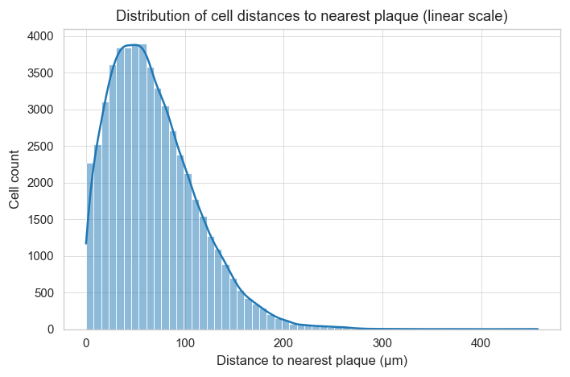
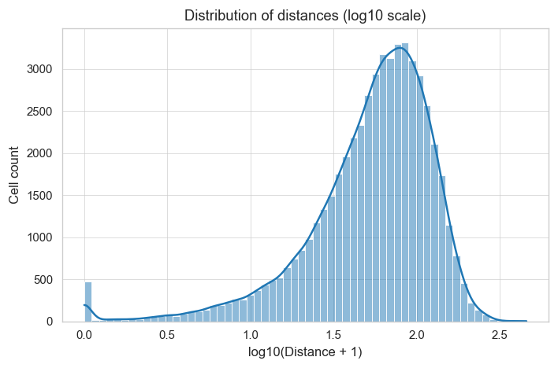
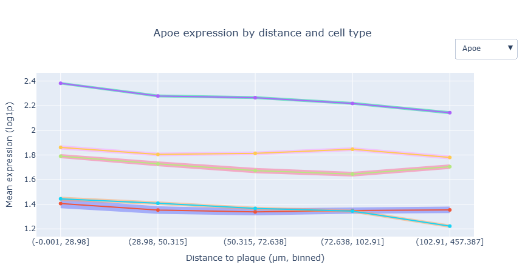
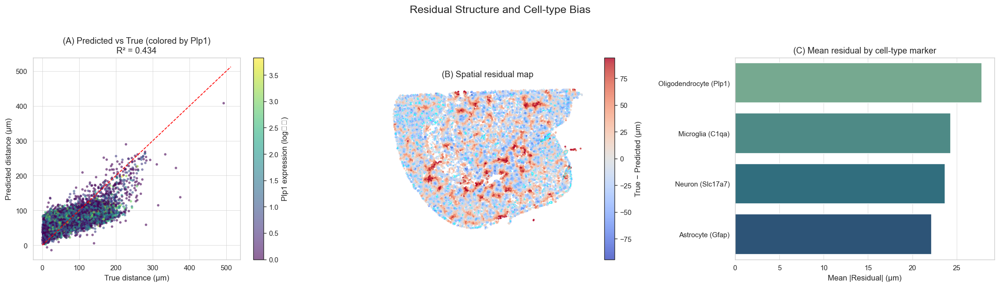

# Team ADAstraPerAspera: Milestone P2

# Spatial Transcriptomics in Alzheimer's Disease

### Modeling Gene Expression and Morphology Around Amyloid-β Plaques

## Abstract

This project investigates how amyloid-β (Aβ) plaques reshape local gene
expression and cell composition in Alzheimer's disease using 10x
Genomics Xenium V1 FFPE TgCRND8 (17.9 months) spatial transcriptomics
data. We developed an end-to-end pipeline that downloads, preprocesses,
and integrates plaque geometry, cellular morphology, and molecular
expression for \~54 k cells.

Our analyses confirm the expected glial activation---up-regulation of
Gfap, Apoe, Cst3, Hexb near plaques---and neuronal depletion distally,
validating both biological signal and computational feasibility.

For Milestone 3, we will expand toward: 1. Richer contextual predictors
for regression 2. Personalized detection of subject-specific molecular
signatures 3. Multimodal modeling combining morphology, expression, and
spatial context

------------------------------------------------------------------------

## Research Questions and Key Findings

### **RQ1 -- How does gene expression change with distance from plaques?**

Expression of 16 Plaque-Induced Genes (PIGs) was regressed on plaque
distance and compared across bins.\
Most PIGs (Gfap, Cst3, Apoe, B2m, Hexb) show significantly negative
slopes (FDR \< 0.01), confirming decreasing expression with distance.\
*Gfap* decays fastest (half-distance ≈ 130 µm). Sparse genes (*Cxcl10,
Ifit3, Nrep*) show weaker trends.

  
   <em>Expression by distance bin</em>

### **RQ2 -- How do cell-type frequencies vary with distance?**

Leiden clustering on 347 genes (\~57 k cells) identified 22 clusters
mapped to canonical cell types (*Apoe, Gfap, Mbp, Nrep* markers).

-   Microglia / reactive astrocytes enriched within \<30 µm\
-   Neurons and oligodendrocytes decline near plaques

This forms a **glial activation shell** surrounded by a **neuronal loss
zone**, matching known pathology.

 
<em>Linear vs Log scale distribution of cell distances to nearest plaque.</em>

  
   <em>Leiden clusters</em>

### **RQ3 -- How do gene-expression gradients relate to cell-composition shifts?**

Integrating cell-type annotations with plaque distances shows that mean
PIG expression and glial proportions co-vary strongly (ρ ≈ 0.7), but
several genes (*Apoe, C4b, Hexb*) remain distance-dependent after
controlling for composition.\
Thus, plaque effects reflect both **glial accumulation** and **intrinsic
transcriptional activation**---a dual mechanism of spatial gliosis.

  
   <em>Apoe regression by distance and cell type</em>

### **RQ4 -- Which genes predict a cell's plaque proximity?**

We modeled plaque distance from 347-gene expression using **LASSO,
Elastic Net, RF, and XGBoost.** - Best model: **XGBoost (Test R² ≈
0.25)** - Top predictors: *Gfap, Lyz2, Apoe, Spag16, Igf2*\
- Oligodendrocyte genes (*Mbp, Plp1*) show weak coupling

  
   <em>Residual structure and cell-type bias</em>

**Next steps** 1. Add plaque area, orientation, multi-plaque proximity,
and neighborhood gene expression\
2. Restrict to one brain region (e.g., amygdala)

These additions should raise explanatory power and biological
specificity in P3.

------------------------------------------------------------------------

## Dataset Description and Feasibility

  -----------------------------------------------------------------------
  Aspect             Procedure                    Outcome
  ------------------ ---------------------------- -----------------------
  **Source**         Xenium V1 FFPE TgCRND8 (17.9 Public 10x Genomics
                     m)                           dataset

  **Size**           \~57 k cells × 357 genes     \<16 GB RAM

  **QC**             Remove bottom 5% cells by    \~89% retained
                     transcripts/area             

  **Plaque           26 control points + RANSAC   3 µm RMS error
  Alignment**                                     

  **Distance         Shapely STRtree nearest      \<1 min
  Computation**      boundary                     

  **Integration**    Merge expression +           Unified \~50k × 370
                     morphology + distance        frame
  -----------------------------------------------------------------------

Feasible on MacBook Pro (M4, 16 GB); full pipeline \<10 min.

------------------------------------------------------------------------

## Methods

**Preprocessing:** Automatic download → QC filtering → log₁₊
normalization → plaque alignment → distance computation → merged
dataset.

**Analyses include:** - Gene-wise stats (mean, var, skew, zero
fraction)\
- "Weirdness" score (dispersion + shape metrics)\
- Quantile-binned spatial trends (5 bins ± SEM)\
- Spearman ρ, OLS slopes (BH-FDR correction)\
- Leiden clustering → cell-type enrichment by distance\
- Predictive models (R², feature importance)

All code modularized under `src/scripts/` and executed via a single
Jupyter notebook.

------------------------------------------------------------------------

## Data Understanding

  Category        Description
  --------------- ---------------------------------------------------------
  Morphological   Cell area, nucleus area, eccentricity, circularity
  Spatial         (x,y) centroid, distance to plaque, nearest plaque area
  Molecular       357 genes (incl. 16 PIGs)
  Derived         Cluster ID, cell-type, distance bin

Distributions: cell areas ≈ log-normal (120 µm² median); distances
0--350 µm (median 95); PIG ρ ≈ --0.3 with distance.\
Visual overlays confirm correct alignment and anatomical structure.

<td style="width:45%; text-align:center;">

 
<em>Cells colored by plaque proximity (cool = near plaque)</em>

</td>

------------------------------------------------------------------------

## Initial Analyses Completed

-   QC and filtering (\<10% loss)\
-   Plaque geometry cleanup and alignment\
-   Distance integration for all cells\
-   PIG spatial gradients and heatmaps (proximal glial activation)\
-   Cell-type composition vs distance (microglia ↑, neurons ↓)\
-   Predictive modeling (XGB R² ≈ 0.25)

**Outcome:** Data recapitulates canonical Alzheimer's features,
confirming feasibility for advanced modeling.

 
<em>Left: PIG expression decay with distance. Right: top spatially variable genes.</em>

------------------------------------------------------------------------

## Planned Analyses for Milestone 3

1.  **Enhanced Regression Features**
    -   Add plaque area, orientation, multi-plaque proximity, and
        neighborhood gene expression\
    -   Restrict to amygdala to reduce anatomical noise\
    -   Quantify gains via ΔR² and cross-validation
2.  **Personalized Detection of Subject-Specific Signatures**
    -   Extend to multiple mice (WT + Tg, 2.5--17.9 m)\
    -   Train pooled models → fine-tune per-mouse\
    -   Identify biomarkers deviating from baseline\
    -   Assess generalization and within-subject consistency
3.  **Multimodal Embeddings (Expression + Morphology + Spatial)**
    -   Learn joint representations with interpretable autoencoders /
        contrastive models\
    -   Evaluate latent structure via UMAP and marker coherence
4.  **Morphology-Encoded Expression Prediction**
    -   Regress gene expression on morphological + neighbor features\
    -   Rank genes by predictability; assess Moran's I\
    -   Test contextual feature gains in explained variance

All models will emphasize **validation and interpretability** over
complexity.

------------------------------------------------------------------------

## Team Organization (Milestone 2)

  -------------------------------------------------------------------------------
  Role                Member(s)               Responsibilities
  ------------------- ----------------------- -----------------------------------
  **Preprocessing**   Alexander, Sogand,      Data acquisition, QC, plaque
                      Zayed, Walid            alignment, distance computation,
                                              integration

  **Modeling**        Sogand, Rosa            Statistical regressions,
                                              clustering, predictive models,
                                              feature enrichment

  **Visualization**   Rosa, Sogand            Heatmaps, regression trends,
                                              interactive figures, readability

  **Documentation**   Alexander, Sogand, Rosa Code organization, repo structure,
                                              README, clean scripts
  -------------------------------------------------------------------------------

**Timeline:**\
For Milestone P3, team members will work in parallel on complementary
directions:\
- **Walid & Zayed** → Regression enrichment, regional modeling\
- **Sogand** → Subject-specific detection and fine-tuning\
- **Alexander** → Multimodal embeddings\
- **Rosa + team** → Morphology-encoded prediction & GitHub Pages site

Final integration, validation, and polishing will occur during the last
two weeks before submission.
