# Table of Contents

- [Introduction](#introduction)
- [Dataset Analysis](#dataset-analysis)
  - [Microscopy data](#microscopy-data)
  - [Gene expression](#gene-expression)
  - [Cell type analysis](#cell-type-analysis)
- [Research Questions](#research-questions)
  - [RQ1: How does cell type composition change in plaque proximity?](#rq1-how-does-cell-type-composition-change-in-plaque-proximity)
  - [RQ2: Relationship between cell type composition, PIG expression, and plaque distance](#rq2-relationship-between-cell-type-composition-pig-expression-and-plaque-distance)
  - [RQ3: How does PIG expression change in plaque proximity?](#rq3-how-does-pig-expression-change-in-plaque-proximity)
    - [Mean PIG expression at different plaque distances](#mean-pig-expression-at-different-plaque-distances)
    - [Regression analysis: PIG expression vs. plaque distance](#regression-analysis-pig-expression-vs-plaque-distance)
  - [RQ4: Inferring plaque distance from gene expression](#rq4-inferring-plaque-distance-from-gene-expression)

# Introduction
This project investigates how Aβ plaques impact the surrounding microenvironment. We aim to develop a quantitative model to precisely describe the influence of the plaques on the surrounding tissue. Knowing which genes and cells are impacted at different plaque distances can refine our understanding of Alzheimer's development. Further, the developers of new drugs can use our model to select realistic targets within the plaque regions accessible from the vasculature.

Our story explores how plaque proximity impacts the cellular, molecular, and tissue environments. We aim to analyze the cell-to-plaque distances and apply rigorous statistical tests to describe the spatial trends in gene expression and cell composition. Further, we look at the interplay between gene expression and cell composition, asking ourselves which of the two phenomena is the underlying cause. Finally, we flip the perspective and benchmark predictive models to infer plaque distance from multigene expression.

# Dataset Analysis

In total, Xenium dataset contains:
- 6 mice
- 6 morphology images
- 1 Immunofluorescence (IF) image
- 347 genes
- 351,714 cells
- 78,885,074 transcripts
- 34.7 GB of data
- 0 missing values
- 1736 Aβ plaques

## Microscopy data

In this project, we analyze the Xenium dataset from 10X Genomics which contains trascriptomic data accompanied by morphology images. The data comes from sagittal brain slices of 6 mice stained with 4′,6-diamidino-2-phenylindole (DAPI) fluorescent DNA-binding nucleus dye. Three mice constitute healthy controls (wild type, no induced mutations) at 2.5, 5.7, and 13.4 months of age. The remaining mice are mutated (i.e., transgenic) at 2.5, 5.7, and 17.9 months of age.

Since each brain slice comes from a different mouse, the inter-mouse variation in brain morphology is very significant. Our best attempt to align a pair of most similar mice in terms of age and disease status(transgenic at 17.9 and 5.7 months) reveals significant divergences in the brain geometry, especially the dentate gyrus. Overall, the Root Mean Square Error (RMSE) for the 8 key point pairs reached 3,390 µm, which is over 50 times larger than the median cell to plaque distance.

  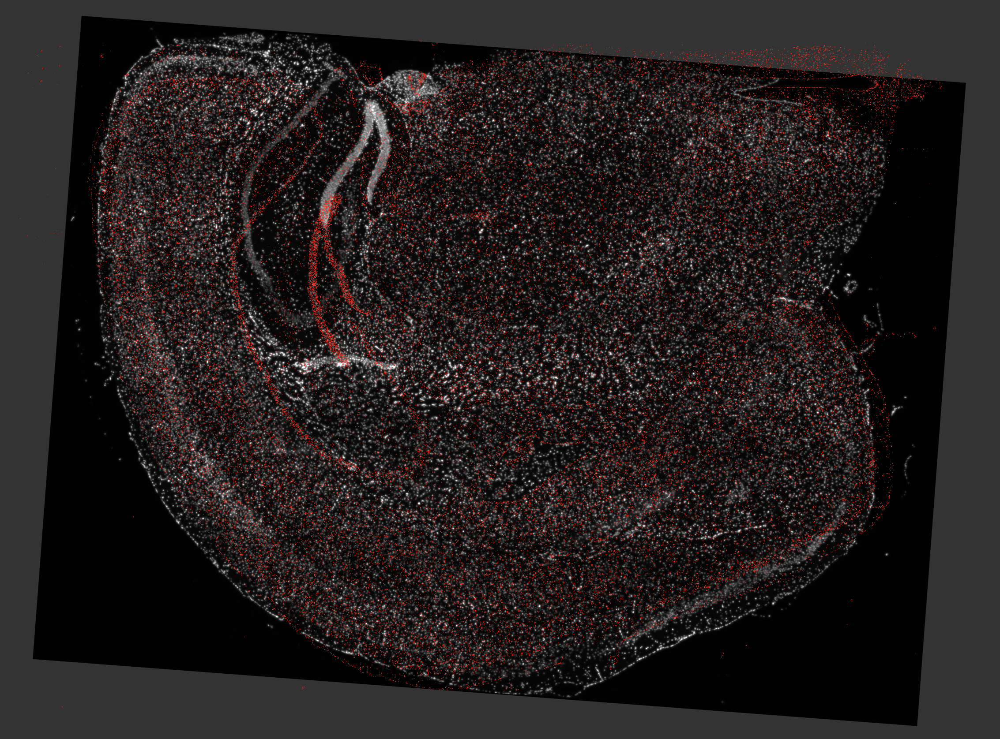
   <em>Attempted alignment of Tg 5.7 months old mouse onto Tg 17.9 months old mouse</em>

The induced mutation forces the murine cells to express the amyloid precursor protein (App) carrying known Alzheimer's disease familial mutations. As a result of mutations, the transgenic mice express up to 5 times more of the endogenous App. This leads to early and aggressive cerebral amyloid beta (Aβ) plaque deposition as soon as 3 months of age. The Aβ plaques are revealed with immunofluorescence (IF) staining, but only in transgenic mice at 17.9 months of age; in the figure below, the plaques appear in red.

  
   <em>Microscopy images of 6 mice</em>

 To extract the coordinates of the stained plaques, we hand-labeled 11 plaque-free regions and 9 plaques of various sizes; we then trained a random forest classifier to mark the remaining plaques. Next, we transformed the plaque coordinates from the space of the IF image to that of the morphology image. For that, we used a RANSAC-transform trained on 26 visually aligned pairs of points around important anatomical landmarks. After the transformation, we achieved a Root Mean Square Error (RMSE) of 3.2 µm, which compares favorably to the median cell to plaque distance at 61 µm. Following this, we merged intersecting plaques, plaques outside of the brain boundary, and plaques with areas below the 5th percentile. This resulted in 1736 Aβ plaques visualized in the following figure:

  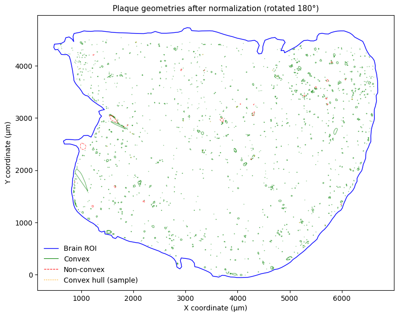
   <em>1736 Aβ plaques visualized in the morphology image</em>

Next, for each cell, we computed the distance to the nearest plaque. Namely, we calculate the Euclidean distance between the cell centroid and the nearest plaque boundary. In the following figure, we highlight which brain regions are far away from Aβ-plaques and which are located nearby. We show this by overlaying the plaque polygons onto the morphology image. We will then color the brain tissue by distance to the nearest plaque.

  
   <em>Brain regions colored by plaque proximity (cool = near plaque)</em>

We can see that the maximum distance from any plaque is 457 µm; however, over 99% of all cells are located at most 200 µm from the nearest plaque, with the median being 61 µm. The standard deviation is very significant at 44.4 µm. This is supported by the previous figure showing the brain regions by distance to the nearest plaque - some regions are very close, and some are very far. Further, we can observe that the distribution of cell-to-plaque distances is right-skewed, with a long tail of infrequent cells which are very far from the nearest plaque.

  
   <em>Distribution of cell-to-plaque distance</em>

## Gene expression

We are dealing with a spatial transcriptomics dataset which contains single cell gene expression measurements of 347 genes. The gene expression matrix tends to be sparse. For the transgenic mouse at 17.9 months of age, 302 out of 347 genes have zero median transcript count. Further, we can see that all 347 genes have right-skewed transcript counts. Finally, we can see that the fraction of cells with nonzero transcript count varies widely (from 0.002 to 0.989) among genes

Looking at the gene selection, out of 347 genes, 248 represent markers for 8 main cell types, canonical neuronal cortical layer markers, and non-neuronal markers; 83 genes related to activated microglia and astrocytes; and 16 PIGs curated from primary literature. The figure below reveals the individual cells as filled circles with clustering component.

  
   <em>Single cell images of 6 mice</em>

First, let us explore the data by visualizing the distribution of log1p-transformed transcript counts for the 16 PIGs against the average distribution of all 347 genes. To that end, we will plot histograms with $B=50$ bins as well as Gaussian Kernel Density Estimate (KDE) curves for PIGs. We will focus on the mouse with the most advanced stage of the Alzheimer's disease (transgenic at 17.9 months of age).

  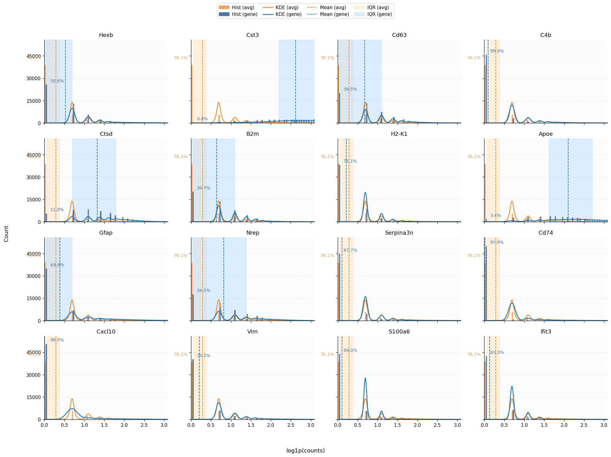
   <em>Probability distribution of log1p-transformed PIG transcript counts</em>

We can observe that for 13 out of 16 PIGs, the distribution has a mode at zero. Above zero, the support gradually drops off at higher transcript counts; however, different PIGs have a different rate of the density decay.

Next, we diagnose the PIGs with the most unusual expression patterns. To that end, we combine several diagnostic metrics (among which, zero-inflation, dispersion, and shape) into a composite score.

| gene       | zero_frac | weird_score |
|------------|----------:|------------:|
| Cxcl10     |      1.00 |        9.35 |
| Cd74       |      0.98 |        8.13 |
| Serpina3n  |      0.88 |        0.79 |
| C4b        |      0.90 |        0.19 |
| Gfap       |      0.69 |        0.05 |

We find that among the 5 most unusual PIGs, Cxcl10 and Cd74 clearly stand out. Both have the weirdness score exceeding 8; the next highest is Serpina3n with a score an order of magnitude lower at 0.79. Looking at the diagnostic statistics above, we can see that both Cxcl10 and Cd74 have a very high zero proportion exceeding 0.97%.

## Cell type analysis

We will now explore clustering of cells based on the 347-dimensional gene expression vector. We apply Leiden clustering with 15 nearest neighbors on PCA-reduced gene expression space. As a result, we obtained $K=19$ clusters. The clusters are then reduced to 2 dimensions using UMAP; the resulting plot is shown in the following figure.

  
   <em>Joint Leiden clustering UMAP plot</em>

Superimposing the color-coded clusters onto the brain tissue, we can see that the gene expression-based clustering strongly correlates with the brain morphology.

  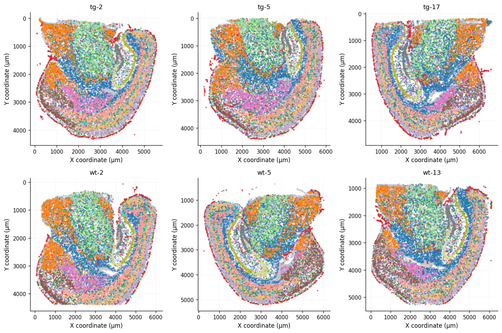
   <em>Joint Leiden clustering of 6 mice</em>

Cluster 6 (i.e., vascular cells) is almost exclusively localized to the outer rim of the brain, corresponding to epidural space. Hippocampal formation shows a distinct cluster 14 which follows the elongated shape of the dentate gyrus. Looking at the inferred cell type, we can confirm that cluster 14 corresponds to Dentate gyrus immature neurons (glutamatergic). Meanwhile, the region hosting amygdala and hypothalamus is dominated by cluster 10. Cluster 10 corresponds to Hypothalamic medial mammillary glutamatergic neurons, matching its observed localization. The ventricle cavities are lined with distinct cluster of cells (ID 15). This cluster corresponds to Hypothalamic GnRH1-expressing glutamatergic neurons. This finding is expected since hypothalamus forms the floor and part of the lateral walls of the third ventricle.

# Research Questions

## RQ1: How does cell type composition change in plaque proximity?

We will use logistic regression to model the relationship between cluster membership and distance to the nearest plaque. As a result of running regression, we found statistically significant coefficients for 14 out of 19 clusters. We used Bonferroni-adjusted p-value threshold of 0.01. As a result, we obtained the regression coefficients and interpreted them as (1) baseline probability of seeing a cluster at the plaque surface (i.e., $p(0)$), (2) probability of seeing a cluster at 100 µm from the plaque (i.e., $p(100)$), and (3) relative change in probability of seeing a cluster as we move away from the plaque (i.e., $p(100) - p(0)$).

| Cluster | Slope $\beta_k$ | $p(0)$ | $p(100)$ | Relative change |
|:------:|-----------------:|-------:|---------:|----------------:|
| Immune | −0.01427 | 0.159 | 0.043 | −72.7% |
| Vascular | −0.01116 | 0.100 | 0.035 | −64.9% |
| Pons, Gluta | −0.00772 | 0.015 | 0.007 | −53.4% |
| Intra/Extratelencephalic, Gluta | −0.00361 | 0.075 | 0.054 | −28.7% |
| Cortex medial, GABA | −0.00282 | 0.041 | 0.031 | −23.8% |
| Astrocyte | −0.00114 | 0.136 | 0.123 | −9.5% |

| Cluster | Slope $\beta_k$ | $p(0)$ | $p(100)$ | Relative change |
|:------:|-----------------:|-------:|---------:|----------------:|
| Hypothalamic Gnrh1, Gluta | +0.02346 | 0.002 | 0.019 | +927.0% |
| Medulla, GABA | +0.01815 | 0.002 | 0.012 | +508.2% |
| Cerebral LGE, GABA | +0.00781 | 0.016 | 0.035 | +114.3% |
| Olfactory bulb, Gluta | +0.00678 | 0.011 | 0.021 | +94.9% |
| Dentate, Gluta | +0.00591 | 0.014 | 0.025 | +78.5% |
| Corticothalamic, Gluta | +0.00384 | 0.029 | 0.042 | +44.8% |
| Hypothalamic medial, Gluta | +0.00256 | 0.033 | 0.042 | +27.9% |
| Oligodendrocyte | +0.00208 | 0.161 | 0.191 | +18.7% |

These coefficients are further visualized in the figure below.

  
   <em>Plaque distance by cell type</em>

The results reveal the changes in cell composition with a varying distance to the nearest plaque. We can see that the proportion of most neural cells is strongly depleted around the plaque. On the contrary, astrocytes, vascular and immune cell subtypes are highly enriched in the nearest distance bin.

This agrees well with the known mechanisms of Alzheimer's progression Existing findings reveal that amyloid plaque environment are inducing neuronal degeneration, pathological astrocytic and microglial activation, and vascular remodeling.

In the above table, the relationship between the frequency and distance form plaque is especially strong for Hypothalamic GnRH1-expressing glutamatergic neurons. For this cluster, the frequency increases by around 10 times as we move away from the plaque by 100 µm. Inspecting the overlayed clusters on brain tissue, we can see that cells from this cluster predominantly occur inside the ventricle cavities. This makes them trivially distant from the plaque. These cells are surrounded by cerebrospinal fluid, a clear liquid devoid of amyloid beta plaques. The amyloid beta plaques are instead scattered throughout the solid brain tissue, explaining the steep increase in frequency for Cluster 21 at larger distances.

However, our table also reveals a surprising finding: some neurons (namely, intratelencephalic–Extratelencephalic glutamatergic neurons, Pons glutamatergic neurons, and Cortex–medial ganglionic eminence GABAergic neurons) seem to be enriched close to plaques. We suspect that this could be due to the fact that these neurons could be somewhat more resilient to the plaque-induced damage. Thus, they die, but a lower rate compared to the other neurons.

Next, we can discuss the figure presenting the relationship between the cluster frequency and the binned distance to the nearest plaque. We can clearly see an upward trend in the frequency of the members of clusters 0 (Oligodendrocyte precursor cells / oligodendrocytes) as we move away from the plaque. For other clusters, the frequency only changes at extreme distances. For instance, cluster 15 (Hypothalamic GnRH1-expressing glutamatergic neurons) shows a steep increase in proportion only after 113 µm. Meanwhile, cluster 14 (Dentate gyrus immature glutamatergic neurons) shows a steep decline after 138 µm. As for the short distances, cluster 8 (immune cells) shows a sharp drop as we move past the first bin; however the decay quickly levels off.

  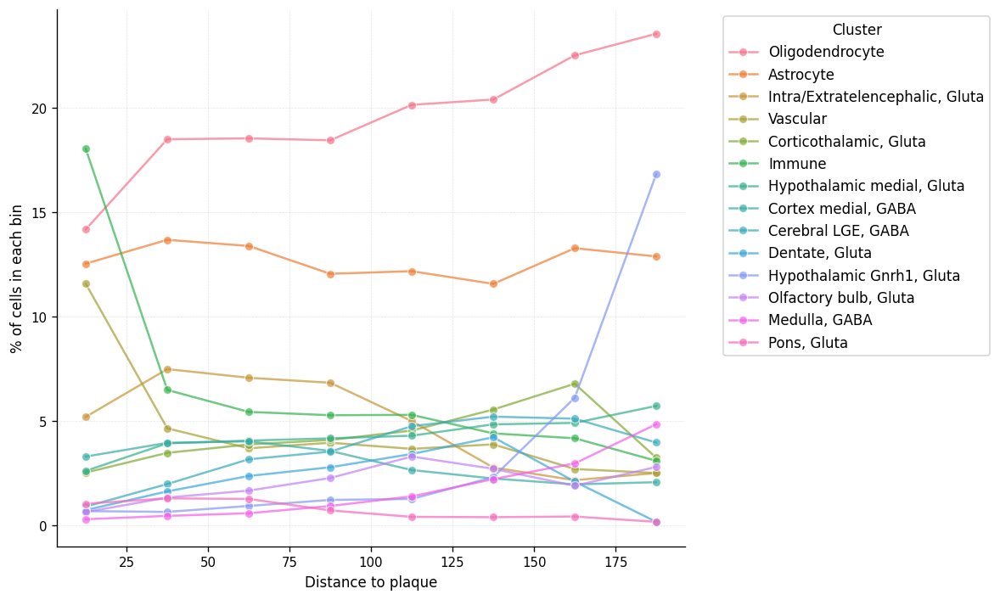
   <em>Cluster frequency vs. distance to plaque</em>

Looking at the marker gene enrichment diagram, we can see that some clusters are characterized by a strong over- or under-expression of specific genes. For instance, cluster 8 (immune cells) is characterized by a strong over-expression of the gene Hexb. The z-score is around 4, indicating that the expression of Hexb in cluster with ID 8 is at impressive 4 standard deviations above the mean. Meanwhile, cluster 14 (Dentate gyrus immature glutamatergic neurons) is characterized by a strong under-expression of the gene Cst3, which happens to be at around 2 standard deviations below the mean. This pattern highlights the fact that the morphological structure of the brain is closely related to the gene expression patterns.

  
   <em>Expression per cluster</em>

## RQ2: Relationship between cell type composition, PIG expression, and plaque distance

Next, we will analyze cell-type proportions and PIG expression across distance. Our goal is to see if cell type composition can explain the changes in PIG expression. This could reveal a potential mechanism of how the amyloid beta plaques exert their influence on the gene expression in the surrounding area.In other words, we want to see if plaques change gene expression patterns by selectively killing some cells while sparing or even recruiting others.

Having observed a strong relationship between the cell type proportions and the distance to the nearest plaque, we want to test whether PIG expression changes could be due to the changes in cell composition.To this end, we compute a Spearman rank correlation matrix between the cell type proportions and the average PIG expression, aligned on the same distance bins. We choose Spearman over Pearson because we suspect that the nature of the relationship is non-linear. For instance, some cells can be "mega-expressing" a given PIG only when grouped together; this could result in a step-like pattern, favoring a more flexible Spearman. Further, we perform a Spearman test with a multiple testing correction to obtain a p-value for each gene–cell-type pair.

  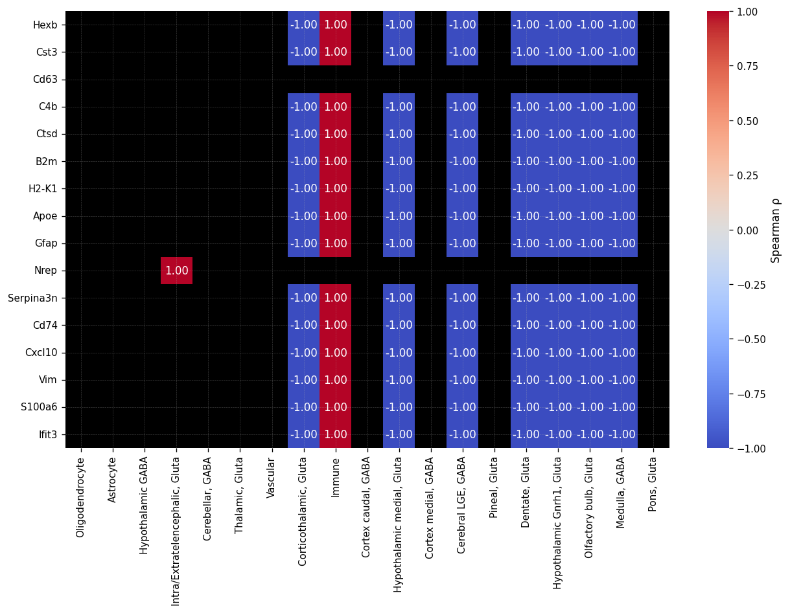
   <em>PIG type correlation vs. cellular type proportion</em>

As a result, we found 9 cell types showing significant Spearman rank correlations with PIG expression. However, they differ by which PIGs they are correlated with. 8 out of 9 cell types are strongly correlated with the core 14 PIGs. The remaining cell type is strongly correlated with a single PIG, Nrep.

Overall, the 14 core PIGs are overexpressed in the immune cells. They are underexpressed in most neuronal cell types. Meanwhile, the Nrep gene complements the above 14 PIGs in the sense that the Intratelencephalic–Extratelencephalic glutamatergic cell type that is correlated with it is unrelated to any other PIG. The following tables present the exact cell types, their roles, and which PIGs they are correlated with in detail.

Cell types vs. PIG expression:

| Cell type (ID & label) | Description (expanded name) | Sign | $\rho_{gc}$ | PIG genes involved |
|---|---|---:|---:|---|
| 07 — “Corticothalamic, Gluta” | Near-projecting corticothalamic layer 6b glutamatergic neurons | Negative | $-1.00$ | Core 14 PIGs |
| 08 — “Immune” | Immune cells (microglia, macrophages, etc.) | Positive | $+1.00$ | Core 14 PIGs |
| 10 — “Hypothalamic medial, Gluta” | Hypothalamic medial mammillary glutamatergic neurons | Negative | $-1.00$ | Core 14 PIGs |
| 12 — “Cerebral LGE, GABA” | Cerebral nuclei LGE-derived GABAergic neurons | Negative | $-1.00$ | Core 14 PIGs |
| 14 — “Dentate, Gluta” | Dentate gyrus immature neurons (glutamatergic) | Negative | $-1.00$ | Core 14 PIGs |
| 15 — “Hypothalamic Gnrh1, Gluta” | Hypothalamic GnRH1-expressing glutamatergic neurons | Negative | $-1.00$ | Core 14 PIGs |
| 16 — “Olfactory bulb, Gluta” | Olfactory bulb Cajal–Retzius glutamatergic neurons | Negative | $-1.00$ | Core 14 PIGs |
| 17 — “Medulla, GABA” | Medulla GABAergic neurons | Negative | $-1.00$ | Core 14 PIGs |
| 03 — “Intra/Extratelencephalic, Gluta” | Intratelencephalic–Extratelencephalic glutamatergic neurons | Positive | $+1.00$ | Nrep only |

Counts by correlation direction:

| Direction | # Cell types | Representative IDs |
|---|---:|---|
| Negative ($\rho_{gc}=-1.00$) | 7 | 07, 10, 12, 14, 15, 16, 17 (Core 14) |
| Positive ($\rho_{gc}=+1.00$) | 2 | 08 (Core 14); 03 (Nrep) |

Following this, we will fit a joint linear regression model to predict PIG expression from the broad cell type and distance to the nearest plaque. We will dive deep and discuss the results for one of the 16 PIGs, Apoe. Here, we set the baseline cell type to Vascular Endothelial Pericyte cells.

After fitting the linear model, we managed to explain 20.3% of the variance of the normalized transcript count ($R^2 = 0.203$). Using the F-test, we obtained an overall p-value below $2.13e-{174}$. This means that we can confidently reject the joint null hypothesis $H_0$ of no significant effects. The table below presents the coefficients of the linear model.

| Term | Coef (log) | p-value | Natural-scale factor | Interpretation vs Vascular_Endothelial_Pericyte |
|---|---:|---:|---:|---|
| Intercept (at d=0, Vascular_Endothelial_Pericyte) | 1.8328 | < 1e-300 | exp(1.8328) − 1 ≈ 5.25 transcripts | Baseline expected expression at plaque surface |
| Glia, Astrocyte Ependymal | +0.9494 | < 1e-300 | exp(0.9494) = 2.584× | 158% higher than baseline |
| Glia, Oligodendrocyte Lineage | -0.0700 | 6.5e-06 | exp(-0.0700) = 0.932× | 6.8% lower than baseline |
| Immune, Microglia Macrophage | +0.3562 | < 1e-300 | exp(0.3562) = 1.428× | 43% higher than baseline |
| Neuron, GABAergic | -0.0271 | 0.068 | exp(-0.0271) = 0.973× | 2.7% lower than baseline (not significant at 0.05) |
| Neuron, Glutamatergic | -0.1924 | < 1e-300 | exp(-0.1924) = 0.825× | 17.5% lower than baseline |
| distance to plaque (per µm) | -0.0012 | < 1e-300 | exp(-0.0012) = 0.9988× per µm | Each additional µm reduces expected expression by ~0.12% |

From the table above, we can see a confirmation of our previous findings. Neuronal populations, especially glutamatergic neurons, show reduced Apoe expression relative to the vascular reference. Meanwhile, astrocyte and microglia populations are enriched in Apoe expression near plaques.In other words, what little of Apoe remains around the plaques, is due to the astrocytes and microglia, not the depleted neuronal cells.
The GABAergic effect is small and not statistically significant at the 0.05 level in this specification, mirroring the previous findings on Cortex–medial ganglionic eminence GABAergic neurons.

In this section, we will inspect the mean PIG expression at different distance bins and cell types. We present a 95% confidence interval based on the standard error of the mean.

  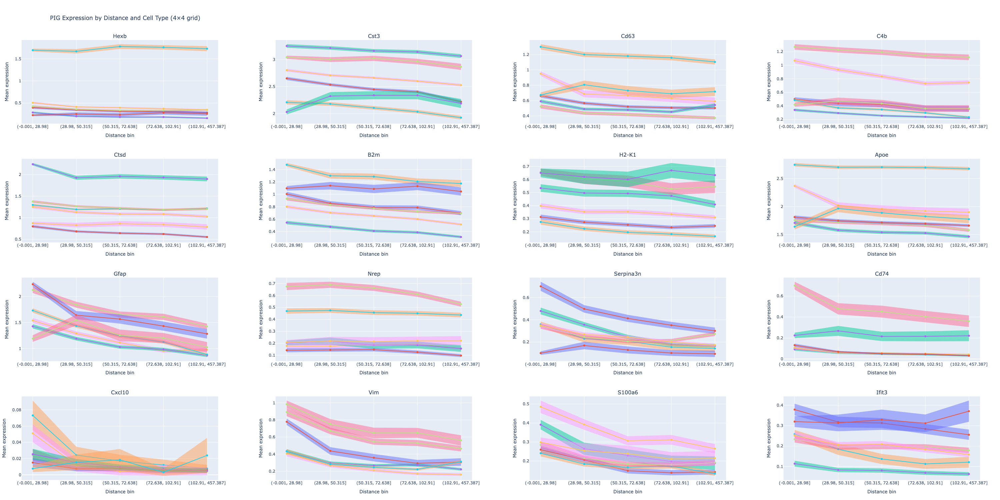
   <em>PIG expression by type</em>

Looking at the interactive plot above, we can confirm that Glia and Astrocyte Ependymal cells exhibit a higher transcript count of Apoe compared to Vascular Endothelial Pericyte cells. Further, Glutamatergic neurons show a much lower expression of Apoe in comparison. The difference in expression (relative to the vascular cells) remains significant even after accounting for the 95% confidence interval.

## RQ3: How does PIG expression change in plaque proximity?

### Mean PIG expression at different plaque distances

In this section, we investigate how the expression of the 16 plaque-induced genes changes with distance to the nearest plaque. To this end, we group the cells into 5 equal-count distance bins and compute the mean log1p-normalized transcript count within each bin along with the 95% confidence interval. ANOVA analysis confirms that all the 16 PIGs show significant differences in mean expression across distance bins at Bonferroni-corrected FDR set to 0.01.

  
   <em>Expression of PIGs vs. distance to plaque</em>

From the figure above, we can see that Gfap shows the biggest difference in the log1p-transformed expression between the closest and furthest distance bin at 0.72. This difference is about two orders of magnitude larger than the Standard Error of the Mean (SEM) which is on the scale of 0.01 thanks to a large number of cells (10779) per bin. The aforementioned difference corresponds to exp(0.72) = 2.05 times more expression in the closest bin compared to the furthest bin. Overall, per-bin expression of Gfap decreases monotonically from the closest bin to the farthest.

Thus, Gfap shows the strongest spatial variation, as its expression quickly decays as we move away from the plaque. This is supported by the Gfap's role as an intermediate filament protein found predominantly in astrocytes

The visualization also highlights consistent decreasing gradients for microglial (e.g., Hexb, Ctsd, Cst3, Apoe) and astrocytic (e.g., Gfap, Serpina3n, Vim) markers. In other words, the brain regions most proximal to plaques (up to 29 µm) show elevated microglial and astrocytic gene expression that fades with distance.

### Regression analysis: PIG expression vs. plaque distance

For each of the 16 PIGs, we regress the log1p-normalized transcript count against the distance to the nearest plaque. Further, we perform multiple testing correction using the Benjamini–Hochberg False Discovery Rate (FDR) adjustment since we perform 16 independent regressions.

All 16 PIGs exhibit a statistically significant negative slope at 0.01 FDR level. However, the slopes vary significantly among PIGs, with the smallest and largest absolute values of slopes corresponding to Cxcl10 and Gfap, respectively. Translating the slopes to the original integer transcript count scale, we get 128 µm distance to halve the expression for Gfap and 4,415 µm distance for Cxcl10. For context, the entire diameter of the mouse brain is about 6,000 µm, meaning that for Cxcl10, the expression is nearly constant. This result is in large due to the fact that Cxcl10 is extremely zero-inflated. In other words, its expression is very low across all distances with a low absolute value of the spatial variation. The distances to halve the expression for these and other PIGs are visualized in the figure below.

  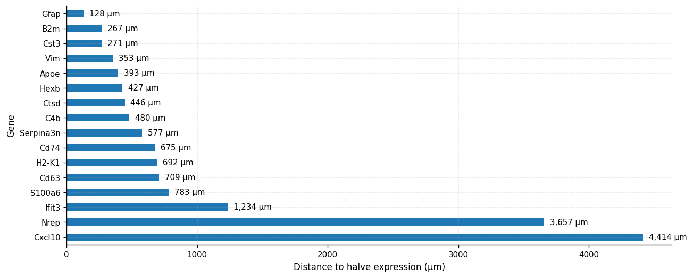
   <em>Distances to halve expression for the 16 PIGs</em>

## RQ4: Inferring plaque distance from gene expression

In this section, we benchmark a number of predictive models to estimate the distance to plaque from a 347-gene expression vector. 
We evaluate LASSO, ElasticNet, Random Forest, and XGBoost. In our analysis, we use a random 80/20 train/test split in terms of cells. For LASSO and ElasticNet, we standardize the log1p-transformed transcript counts. Meanwhile, we use unstandardized log1p-transformed transcript counts for tree models. As a result of the analysis, we report train and test $R^2$, feature importances, and the learned coefficients where appropriate. As a result of the analysis, we observed the following performance: 

| Model | Train $R^2$ | Test $R^2$ |
|---|---:|---:|
| LASSO | 0.1969 | 0.1955 |
| ElasticNet | 0.1969 | 0.1955 |
| Random Forest | 0.2252 | 0.1874 |
| XGBoost | 0.4784 | 0.2577 |

XGBoost shows the largest train–test gap (train $R^2=0.478$, test $R^2=0.258$), a sign of overfitting. This is consistent with a higher modeling capacity of XGBoost. However, its test performance is still the best, possibly due to the benefit of overparameterization. The LASSO and ElasticNet linear models have nearly matching train and test $R^2$. We can explain this due to the lower modeling capacity of these simpler models.

The distribution of residuals of the XGBoost model reveals clear heteroscedasticity. Instead of being uniformly dotted around the horizontal zero line, the residuals show a linear trend: most near to the plaque, the model tends to over-predict, and the further away, the more it under-predicts.

  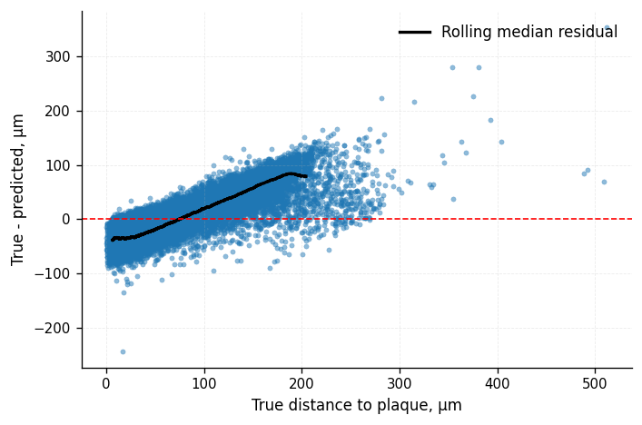
   <em>Residual diagnostics</em>

We can see that most of the distribution's mass is concentrated the [0, 100] µm range. In other words, the model doesn't utilize the full target range. Plotting the residuals against the brain tissue reveals non-uniform distribution that is clearly aligned with the plaque centroids shown as red stars.

  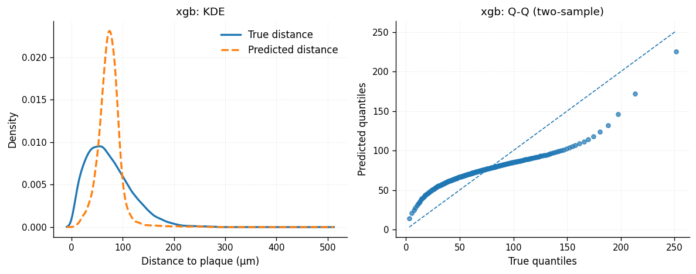
   <em>True vs. predicted plaque distance</em>

The residuals tend to fall into 3 broad categories:
- 25.51% are highly negative (under -17.2 µm) and appear close to the plaque (within 49 µm)
- 28.15% are highly positive (over 10.6 µm) and appear further away (beyond 87 µm)
- 20.94% are moderate residuals (between -17.2 and 10.6 µm) and appear between 49 and 87 µm
This heteroscedasticity implies that the model is missing important covariates.

  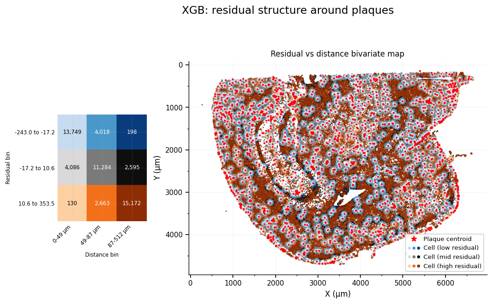
   <em>Spatial diagnostics</em>

Looking at the per-cell mean absolute residuals, we can see that the average error is largest in Hypothalamic GnRH1-expressing glutamatergic neurons. This is likely due to the fact that, as discussed before, these cells are located in the third ventricle, which is the furthest away from plaques than any other brain region. As a result, most residuals in this cluster are in the highly positive (over 10.6 µm) bracket. Meanwhile, Pons glutamatergic neurons exhibit the lowest mean absolute residuals, indicating that the model performs best in this region.

| Cluster (Leiden) | Inferred cell type | n | Mean absolute residual (µm) |
|---:|---|---:|---:|
| 15 | Hypothalamic GnRH1-expressing glutamatergic neurons | 917 | 32.2295 |
| 18 | Pons glutamatergic neurons | 499 | 17.8746 |

The top genes for predicting plaque distance are fairly consistent across all four models. Gfap and Spag16 appear in the top 5 for all models. Three out of four models rank Gfap (an astrocyte-associated PIG) as the top predictor of proximity to amyloid beta plaque, reinforcing our earlier findings. Other highly ranked genes include Spag16 and Lyz2, which are associated with glial and immune cells. Agreement across both the linear and the tree-based models suggests that the top genes have a robust relationship with plaque proximity. This agrees with our previous findings, which revealed that Gfap peaks within the first 10 µm and declines with distance. Meanwhile, lgf2 has an opposite trend, peaking at around 270 µm and declining towards the plaque.

|  | ElasticNet |  | LASSO |  | Random Forest |  | XGBoost |  |
|---:|---|---:|---|---:|---|---:|---|---:|
| Rank | Gene | Importance | Gene | Importance | Gene | Importance | Gene | Importance |
| 1 | Gfap | 7.738978 | Gfap | 7.864686 | Gfap | 0.228450 | Spag16 | 0.033058 |
| 2 | Spag16 | 3.780172 | Spag16 | 3.801531 | Spag16 | 0.084622 | Lyz2 | 0.023342 |
| 3 | Slc17a6 | 3.025042 | Slc17a6 | 3.073279 | Lyz2 | 0.066671 | Gfap | 0.016999 |
| 4 | Slc17a7 | 2.953878 | Slc17a7 | 3.057380 | Cabp7 | 0.063918 | Igf2 | 0.015752 |
| 5 | Igf2 | 2.907111 | Igf2 | 2.949014 | B2m | 0.034584 | Strip2 | 0.013022 |

