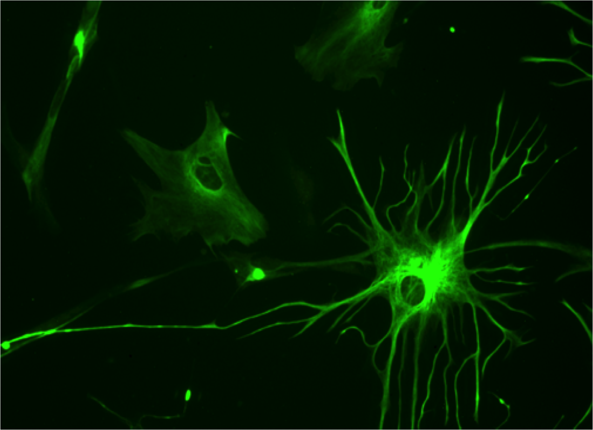

# Introduction
This project investigates how Aβ plaques impact the surrounding microenvironment. We aim to develop a quantitative model to precisely describe the influence of the plaques on the surrounding tissue. Knowing which genes and cells are impacted at different plaque distances can refine our understanding of Alzheimer's development. Further, the developers of new drugs can use our model to select realistic targets within the plaque regions accessible from the vasculature.

Our story explores how plaque proximity impacts the cellular, molecular, and tissue environments. We aim to analyze the cell-to-plaque distances and apply rigorous statistical tests to describe the spatial trends in gene expression and cell composition. Further, we look at the interplay between gene expression and cell composition, asking ourselves which of the two phenomena is the underlying cause. Finally, we flip the perspective and benchmark predictive models to infer plaque distance from multigene expression.

# Dataset Analysis

In total, Xenium dataset contains:
- 6 mice
- 6 morphology images
- 1 Immunofluorescence (IF) image
- 347 genes
- 351,714 cells
- 78,885,074 transcripts
- 34.7 GB of data
- 0 missing values
- 1736 Aβ plaques

## Microscopy data

In this project, we analyze the Xenium dataset from 10X Genomics which contains trascriptomic data accompanied by morphology images. The data comes from sagittal brain slices of 6 mice stained with 4′,6-diamidino-2-phenylindole (DAPI) fluorescent DNA-binding nucleus dye. Three mice constitute healthy controls (wild type, no induced mutations) at 2.5, 5.7, and 13.4 months of age. The remaining mice are mutated (i.e., transgenic) at 2.5, 5.7, and 17.9 months of age.

Since each brain slice comes from a different mouse, the inter-mouse variation in brain morphology is very significant. Our best attempt to align a pair of most similar mice in terms of age and disease status(transgenic at 17.9 and 5.7 months) reveals significant divergences in the brain geometry, especially the dentate gyrus. Overall, the Root Mean Square Error (RMSE) for the 8 key point pairs reached 3,390 µm, which is over 50 times larger than the median cell to plaque distance.

// ToDo:
// 1. Add interactive zoom-in
// 2. Make background transparent so that it blends into the dark theme of the website
// Current plot is a simple cropped screenshot in a png format

  
   <em>Attempted alignment of Tg 5.7 months old mouse onto Tg 17.9 months old mouse</em>

The induced mutation forces the murine cells to express the amyloid precursor protein (App) carrying known Alzheimer's disease familial mutations. As a result of mutations, the transgenic mice express up to 5 times more of the endogenous App. This leads to early and aggressive cerebral amyloid beta (Aβ) plaque deposition as soon as 3 months of age. The Aβ plaques are revealed with immunofluorescence (IF) staining, but only in transgenic mice at 17.9 months of age; in the figure below, the plaques appear in red.

// ToDo:
// 1. Add interactive zoom-in
// 2. Make background transparent so that it blends into the dark theme of the website
// Current plot was obtained with: src.scripts.visualization.plots.make_image_grid; exact inputs can be found in results.ipynb

  
   <em>Microscopy images of 6 mice</em>

 To extract the coordinates of the stained plaques, we hand-labeled 11 plaque-free regions and 9 plaques of various sizes; we then trained a random forest classifier to mark the remaining plaques. Next, we transformed the plaque coordinates from the space of the IF image to that of the morphology image. For that, we used a RANSAC-transform trained on 26 visually aligned pairs of points around important anatomical landmarks. After the transformation, we achieved a Root Mean Square Error (RMSE) of 3.2 µm, which compares favorably to the median cell to plaque distance at 61 µm. Following this, we merged intersecting plaques, plaques outside of the brain boundary, and plaques with areas below the 5th percentile. This resulted in 1736 Aβ plaques visualized in the following figure:

\\ ToDo: plaque polygons plot
\\ Interactive zoom in, transparent background
\\ Current plot was obtained with: src.scripts.visualization.plots.plot_plaques; exact inputs can be found in results.ipynb

  
   <em>1736 Aβ plaques visualized in the morphology image</em>

Next, for each cell, we computed the distance to the nearest plaque. Namely, we calculate the Euclidean distance between the cell centroid and the nearest plaque boundary. In the following figure, we highlight which brain regions are far away from Aβ-plaques and which are located nearby. We show this by overlaying the plaque polygons onto the morphology image.

// ToDo: improve the plot based on src.scripts.visualization.plots.plot_cell_to_plaque_map_visible; exact inputs can be found in results.ipynb
// Make it interactive by addding zoom
// Make background transparent so that it blends into the dark theme of the website

  
   <em>Brain regions colored by plaque proximity (cool = near plaque)</em>

// ToDo: improve the plot based on src.scripts.visualization.plots.analyze_plaque_distance; exact inputs can be found in results.ipynb
// Use only linear scale
// Zoom in, transparent background

  
   <em>Distribution of cell-to-plaque distance</em>

We can see that the maximum distance from any plaque is 457 µm; however, over 99% of all cells are located at most 200 µm from the nearest plaque, with the median being 61 µm. The standard deviation is very significant at 44.4 µm. This is supported by the previous figure showing the brain regions by distance to the nearest plaque - some regions are very close, and some are very far. Further, we can observe that the distribution of cell-to-plaque distances is right-skewed, with a long tail of infrequent cells which are very far from the nearest plaque.

## Gene expression

We are dealing with a spatial transcriptomics dataset which contains single cell gene expression measurements of 347 genes. The gene expression matrix tends to be sparse. For the transgenic mouse at 17.9 months of age, 302 out of 347 genes have zero median transcript count.

Looking at the gene selection, out of 347 genes, 248 represent markers for 8 main cell types, canonical neuronal cortical layer markers, and non-neuronal markers; 83 genes related to activated microglia and astrocytes; and 16 PIGs curated from primary literature. The figure below reveals the individual cells as filled circles with clustering component.

// ToDo:
// 1. Add interactive zoom-in
// 2. Make background transparent so that it blends into the dark theme of the website
// Current plot was obtained with: src.scripts.visualization.plots.make_image_grid; exact inputs can be found in results.ipynb

  
   <em>Single cell images of 6 mice</em>

First, let us explore the data by visualizing the distribution of log1p-transformed transcript counts for the 16 PIGs against the average distribution of all 347 genes. We will focus on the mouse with the most advanced stage of the Alzheimer's disease (transgenic at 17.9 months of age).

// ToDo:
// 1. Add interactive zoom-in
// 2. Make background transparent so that it blends into the dark theme of the website
// Current plot was obtained with: src.scripts.visualization.plots.plot_gene_distributions; exact inputs can be found in results.ipynb

  
   <em>Probability distribution of log1p-transformed PIG transcript counts</em>

We can observe that for 13 out of 16 PIGs, the distribution has a mode at zero. Above zero, the support gradually drops off at higher transcript counts; however, different PIGs have a different rate of the density decay.

Next, we diagnose the PIGs with the most unusual expression patterns. To that end, we combine several diagnostic metrics (among which, zero-inflation, dispersion, and shape) into a composite score.

| gene       | zero_frac | weird_score |
|------------|----------:|------------:|
| Cxcl10     |      1.00 |        9.35 |
| Cd74       |      0.98 |        8.13 |
| Serpina3n  |      0.88 |        0.79 |
| C4b        |      0.90 |        0.19 |
| Gfap       |      0.69 |        0.05 |

We find that among the 5 most unusual PIGs, Cxcl10 and Cd74 clearly stand out. Both have the weirdness score exceeding 8; the next highest is Serpina3n with a score an order of magnitude lower at 0.79. Looking at the diagnostic statistics above, we can see that both Cxcl10 and Cd74 have a very high zero proportion exceeding 0.97%.

# Research Questions

## Predicting Cell Composition

### Joint cell clustering

// ToDo: improve the plot based on src.scripts.visualization.plots.plot_leiden_umap_grid; usage in results.ipynb
// Zoom in, transparent background
// Add unified axi like in figures/microscopy_cells_unified.png
// Should be 2x3 grid; oY: mouse type (first row: wild type, second row: transgenic); oX: age (first column: 2.5 months, second column: 5.7 months, third column: 13+ months)

  
   <em>Joint Leiden clustering UMAP plot</em>

// ToDo: improve the plot based on src.scripts.visualization.plots.plot_leiden_spatial_grid; usage in results.ipynb
// Zoom in, transparent background
// Add unified axi like in figures/microscopy_cells_unified.png
// Should be 2x3 grid; oY: mouse type (first row: wild type, second row: transgenic); oX: age (first column: 2.5 months, second column: 5.7 months, third column: 13+ months)

  
   <em>Joint Leiden clustering of 6 mice</em>

### Plaque distance by cell type

// ToDo: improve the plot based on src.scripts.visualization.plots.plot_leiden_logit_slopes; usage in results.ipynb
// Zoom in, transparent background

  
   <em>Plaque distance by cell type</em>

// ToDo: improve the plot based on src.scripts.research_questions.RQ2.analyze_leiden_spatial; usage in results.ipynb
// Zoom in, transparent background

  
   <em>Cluster frequency vs. distance to plaque</em>

## Predicting Gene Expression

### Mean PIG expression at different plaque distances

In this section, we investigate how the expression of the 16 plaque-induced genes changes with distance to the nearest plaque. To this end, we group the cells into 5 equal-count distance bins` and compute the mean log1p-normalized transcript count within each bin along with the 95% confidence interval. ANOVA analysis confirms that all the 16 PIGs show significant differences in mean expression across distance bins at Bonferroni-corrected FDR set to 0.01.

// ToDo: improve the plot based on src.scripts.visualization.plots.plot_gene_trends; all 16 PIGs should be plotted
// One option: utilize src.scripts.visualization.plots.plot_gene_expression_by_distance_interactive, but add all genes at once, not just one at a time
// Zoom in, transparent background

  
   <em>Expression of PIGs vs. distance to plaque</em>

From the figure above, we can see that Gfap shows the biggest difference in the log1p-transformed expression between the closest and furthest distance bin at 0.72. This difference is about two orders of magnitude larger than the Standard Error of the Mean (SEM) which is on the scale of 0.01 thanks to a large number of cells (10779) per bin. The aforementioned difference corresponds to exp(0.72) = 2.05 times more expression in the closest bin compared to the furthest bin. Overall, per-bin expression of Gfap decreases monotonically from the closest bin to the farthest.

Thus, Gfap shows the strongest spatial variation, as its expression quickly decays as we move away from the plaque. This is supported by the Gfap's role as an intermediate filament protein found predominantly in astrocytes

The visualization also highlights consistent decreasing gradients for microglial (e.g., Hexb, Ctsd, Cst3, Apoe) and astrocytic (e.g., Gfap, Serpina3n, Vim) markers. In other words, the brain regions most proximal to plaques (up to 29 µm) show elevated microglial and astrocytic gene expression that fades with distance.

// ToDo: Integrate this astrocyte image nicely into the website

  
   <em>Human astrocyte</em>

### Regression analysis: PIG expression vs. plaque distance

For each of the 16 PIGs, we regress the log1p-normalized transcript count against the distance to the nearest plaque. Further, we perform multiple testing correction using the Benjamini–Hochberg False Discovery Rate (FDR) adjustment since we perform 16 independent regressions.

All 16 PIGs exhibit a statistically significant negative slope at 0.01 FDR level. However, the slopes vary significantly among PIGs, with the smallest and largest absolute values of slopes corresponding to Cxcl10 and Gfap, respectively. Translating the slopes to the original integer transcript count scale, we get 128 µm distance to halve the expression for Gfap and 4,415 µm distance for Cxcl10. For context, the entire diameter of the mouse brain is about 6,000 µm, meaning that for Cxcl10, the expression is nearly constant. This result is in large due to the fact that Cxcl10 is extremely zero-inflated. In other words, its expression is very low across all distances with a low absolute value of the spatial variation.

// ToDo: improve the plot based on src.scripts.visualization.plots.plot_half_distance;usage in results.ipynb
// Add Zoom in, transparent background

  
   <em>Distances to halve expression for the 16 PIGs</em>

## Predicting Plaque distance
