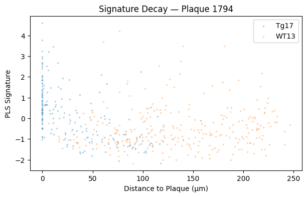
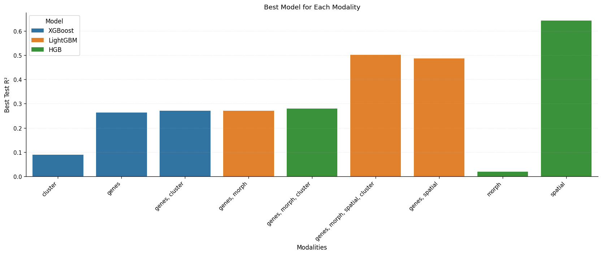
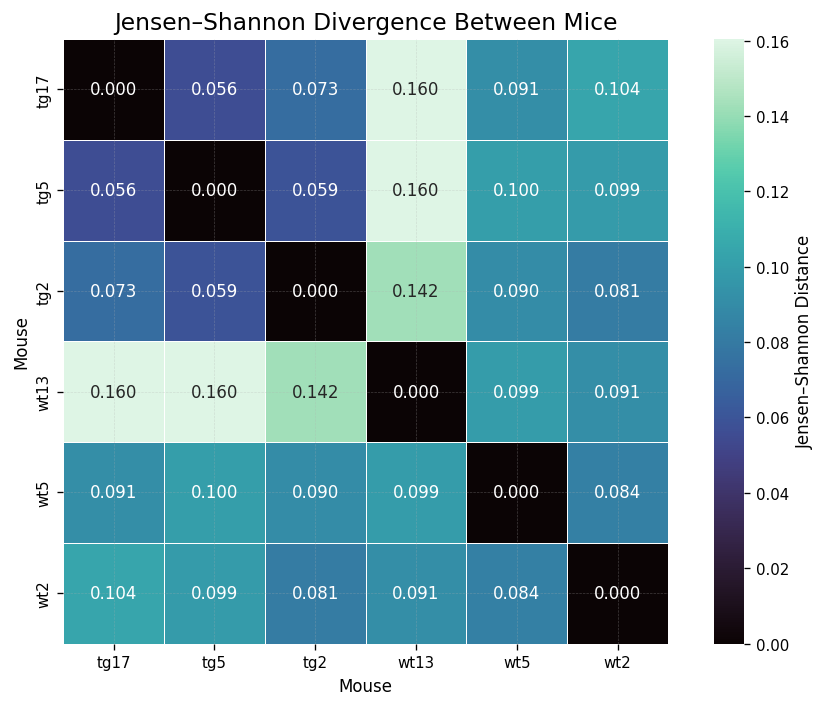
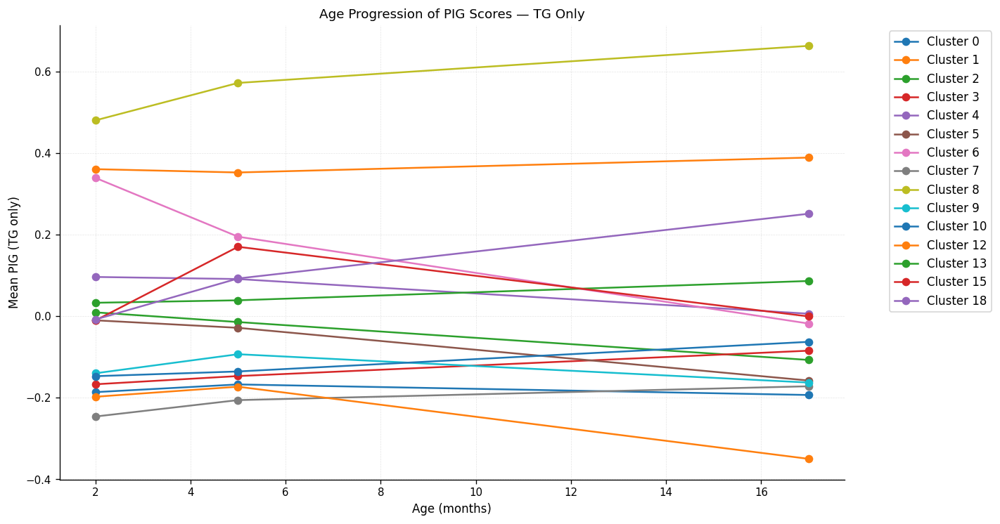
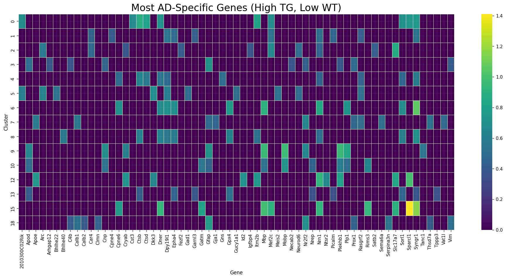
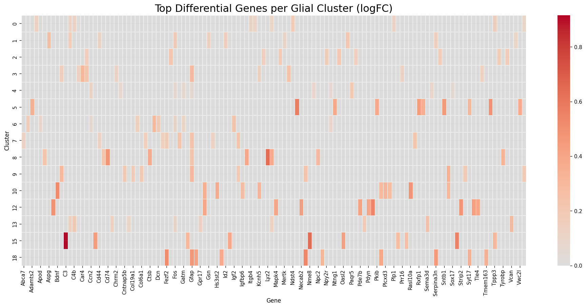

# Data Story: Quantifying How Aβ Plaques Reshape Tissue Microenvironment

## Table of Contents

1. Introduction  
   1.a Motivation  
   1.b Project goals  
   1.c Research questions  

2. Dataset Preprocessing Pipeline  
   2.a Xenium dataset summary 
   2.b Microscopy modalities and plaque ground truth  
   2.c. Cell-to-plaque distance definition and computation  
   2.d Gene panel composition and sparsity properties  
   2.e. Inferring cell types via clustering 

3. Results: Plaque-Proximity Effects  
   3.a RQ1 — How does cell-type composition change in plaque proximity?  
   3.a.i Logistic regression specification, multiple-testing control, and effect interpretation  
   3.b RQ2 — Relationship between cell type composition, PIG expression, and plaque distance  
   3.b.i Correlation analysis: cell-type proportions vs mean PIG expression (Spearman)  
   3.b.ii Joint regression case study (Apoe): cell type + distance → expression  
   3.b.iii Stratified mean expression by distance and cell type  
   3.c RQ3 — How does PIG expression change in plaque proximity?  
   3.c.i Binned means, confidence intervals, and ANOVA evidence  
   3.c.ii Per-gene distance regressions, FDR control, and “distance-to-half-expression”   

4. Predictive Modeling: Inferring Plaque Distance  
   4.a RQ4 — When modeling plaque distance, which features are most important?
   4.a.i Benchmarking setup and results 
   4.b Additional feature modalities

5. Age- and Genotype-Aware Signatures  
   5.a RQ5 — How does the gene expression change with age for each cell type and mouse group?
   5.b Disease specificity (Tg vs WT) by cluster and gene ranking  
   5.c Age trajectories: Tg (2→5→17 months) vs WT stability  

6. Discussion and Limitations  
   6.a What we can conclude robustly (and what we cannot)  
   6.b Confounding, alignment error, sparsity/zero inflation, and interpretation risks  
   6.c Implications for target selection and drug development relevance  

7. Appendix  
   7.a Multiple-comparisons controls used (Bonferroni, BH-FDR)  
   7.b Feature engineering terminology

---

## 1. Introduction

### 1.a Motivation

Amyloid beta plaques (Aβ) are a known hallmark of Alzheimer's disease (AD) with known effects including changes in gene expression, glial activation and neuronal death. However, the bulk of the existing research only examines this influence across rough distance bins.  Building a finer model of plaque-induced microenvironment has important downstream applications. With the knowledge of *which* cells and *which* genes respond *where* around the plaques, drug developers can pre-filter therapeutic targets accessible from the vasculature.

### 1.b Project goals

In this project, we utilize Xenium murine transcriptomics dataset to develop and interpret quantitative models. We investigate (1) temporal and spatial trends in gene expression, and (3) time and distance-dependent changes in cell composition. We describe the interplay between the two and provide a plausible causal relationship. Finally, we flip the direction and benchmark predictive models to infer plaque distance from multiple modalities. 

### 1.c Research questions

In the upcoming sections, we will explore the following research questions (RQs).

- **RQ1:** How does the cell type composition change in plaque proximity?  
- **RQ2:** How are the cell type composition, PIG expression, and plaque distance related?
- **RQ3:** How does the Plaque Induced Gene (PIG) expression change in plaque proximity?  
- **RQ4:** When modeling plaque distance, which feature modalities are most important?  
- **RQ5:** How does the gene expression change with age for each cell type and mouse group?

When addressing these questions, we compute the statistical significance of findings and perform critical diagnostics of trained models.

---

## 2. Dataset Preprocessing Pipeline

### 2.a Xenium AD dataset
We analyze a 10X Genomics Xenium spatial transcriptomics dataset consisting of:

- 6 mice  
- 6 morphology images  
- 1 immunofluorescence (IF) image  
- 347 genes  
- 351,714 cells  
- 78,885,074 transcripts  
- 34.7 GB of data  
- 0 missing values  
- 1,736 Aβ plaques

The data comes from sagittal brain slices of 6 mice stained with DAPI, a fluorescent DNA-binding nucleus dye. Three mice are healthy controls (wild type or Wt) at **2.5, 5.7, and 13.4 months**. The remaining three are transgenic (Tg) at **2.5, 5.7, and 17.9 months**.

The mutations induced in Tg mice forces the expression of amyloid precursor protein (App) with known familial AD abnormalities. Transgenic mice express up to 5× more App. This leads to early and aggressive Aβ plaque deposition. The plaques in the **17.9 month transgenic mouse** are revealed with the IF staining and appear in red.

  
   <em>*Figure 1. Morphology images of Wt and transgenic mice across ages.*</em>

---

### 2.b Plaque detection and coordinate alignment

To obtain plaque coordinates, we hand-labeled **11 plaque-free regions** and **9 plaques** across a range of sizes, then trained a **random forest classifier** to segment the remaining plaques in the IF image.

Next, plaque coordinates were transformed from IF-image space to morphology-image space using a **RANSAC-based transformation** trained on **26 visually aligned landmark pairs**. After alignment, we achieved **RMSE = 3.2 µm**, which is small relative to the **median cell-to-plaque distance (61 µm)**—supporting that alignment error is unlikely to dominate distance-based trends.

After alignment, we performed plaque post-processing to improve biological plausibility and robustness: we merged intersecting plaques, removed plaques outside the brain boundary, and filtered plaques below the 5th percentile in area. This produced **1,736 Aβ plaques**, visualized below.

  
   <em>*Figure 2. Final plaque set after alignment and QC, shown as plaque geometries overlaid in morphology-image coordinates.*</em>

---

### 2.c
For each cell, we computed distance to the nearest plaque as the **Euclidean distance between the cell centroid and the nearest plaque boundary** (not the plaque centroid). This yields a direct geometric measure of proximity to plaque surfaces.

To build intuition, we overlay plaque polygons onto the morphology image and color tissue by distance to the nearest plaque, highlighting regions that are consistently near plaques versus regions that are relatively plaque-free.

  
   <em>*Figure 3. Tissue-wide plaque proximity map: plaque geometries overlaid on morphology image, with tissue colored by distance to the nearest plaque boundary (cool colors indicate smaller distances).*</em>

Distances are spatially heterogeneous but concentrated near plaques:

- Maximum distance from any plaque: **457 µm**  
- **>99%** of cells are within **200 µm** of a plaque  
- Median distance: **61 µm**  
- Standard deviation: **44.4 µm**  
- Distribution is **right-skewed** with a long tail of cells far from plaques

  
   <em>*Figure 4. Distribution of distances from each cell centroid to the nearest plaque boundary, showing strong right skew and a long tail of plaque-distant cells.*</em>

---

### 2.d Gene panel composition and sparsity
This Xenium dataset provides single-cell expression for **347 genes**, but expression is sparse. In the most AD-advanced sample (the 17.9-month transgenic mouse), **302/347 genes** have **zero median transcript count**. Across genes, transcript counts are **right-skewed**, and the fraction of cells with nonzero counts varies widely (**0.002 to 0.989**), underscoring substantial gene-dependent detection and expression variability.

The gene panel includes:
- **248** markers for 8 main cell types, neuronal cortical layer markers, and non-neuronal markers  
- **83** genes related to activated microglia and astrocytes  
- **16** plaque-induced genes (PIGs) curated from primary literature

  
   <em>*Figure 5. Spatial distribution of individual cells (points) across all mice, colored by a clustering-derived component to illustrate spatial organization and local heterogeneity.*</em>

---

We next compare the distribution of **log1p-transformed** transcript counts for the **16 PIGs** against the typical distribution across all 347 genes, focusing on the **17.9-month transgenic mouse** to study advanced pathology. We plot histograms (B = 50 bins) and (for PIGs) Gaussian KDE curves.

  
   <em>*Figure 6. Distributions of log1p-transformed transcript counts for each PIG, compared to the broader gene panel, highlighting sparsity and heavy tails.*</em>

A consistent pattern emerges: for **13/16 PIGs**, the distribution has a **mode at zero**, followed by gradual density decay at higher counts. Different PIGs decay at different rates, indicating heterogeneous activation intensity and/or cell-state specificity.

To identify PIGs with particularly unusual expression structure, we combine diagnostics (including **zero inflation**, dispersion, and shape) into a composite “weirdness score.” The five most unusual PIGs are:

| gene | zero_frac | weird_score |
|---|---:|---:|
| Cxcl10 | 1.00 | 9.35 |
| Cd74 | 0.98 | 8.13 |
| Serpina3n | 0.88 | 0.79 |
| C4b | 0.90 | 0.19 |
| Gfap | 0.69 | 0.05 |

Cxcl10 and Cd74 clearly stand out: both have weirdness scores > 8 and extremely high zero proportions (> 0.97), foreshadowing downstream modeling challenges (e.g., very small effective signal range after log transforms).

---

### 2.e Cell clustering workflow (PCA → kNN → Leiden → UMAP)
To characterize cell types and anatomical structure, we cluster cells using their 347-dimensional expression vectors:

1. PCA on expression space  
2. kNN graph with **15 nearest neighbors**  
3. **Leiden clustering**, yielding **K = 19** clusters  
4. 2D embedding via **UMAP** for visualization

  
   <em>*Figure 7. UMAP projection of the joint Leiden clustering (K = 19) derived from PCA-reduced gene expression vectors.*</em>

Overlaying clusters on tissue reveals strong correspondence with brain morphology:

  
   <em>*Figure 8. Spatial overlay of Leiden clusters on each brain section, showing tight alignment between gene-expression-derived clusters and anatomical structure.*</em>

Representative cluster interpretations include:
- **Cluster 6 (vascular cells)** is concentrated near the outer rim, consistent with epidural space localization.  
- **Cluster 14** traces hippocampal formation and follows the dentate gyrus shape; inferred as **dentate gyrus immature glutamatergic neurons**.  
- **Cluster 10** dominates the amygdala/hypothalamus region; inferred as **hypothalamic medial mammillary glutamatergic neurons**.  
- Ventricular cavities show a distinct lining cluster (**cluster 15**), inferred as **hypothalamic GnRH1-expressing glutamatergic neurons**, consistent with hypothalamic contributions to the third ventricle walls.

This anatomical concordance is central for later interpretation: spatial plaque proximity effects can reflect genuine plaque biology, but also the fact that plaques and cell types are unevenly distributed across brain regions.

---

## 3. Results: Plaque-Proximity Effects

## 3.a RQ1 — How does cell type composition change in plaque proximity?

### 3.a.i Logistic regression specification and interpretation
We model the relationship between **cluster membership** and **distance to the nearest plaque** using logistic regression. After fitting, we find statistically significant coefficients for **14 of 19 clusters**, using a **Bonferroni-adjusted p-value threshold of 0.01**.

To make coefficients interpretable, we translate them into:
- **p(0):** baseline probability of observing a cluster at the plaque surface  
- **p(100):** probability of observing a cluster at 100 µm from plaque  
- **p(100) − p(0):** relative change over 100 µm away from plaque  

Key effects (selected):

**Clusters depleted with distance (negative slopes; enriched near plaques):**

| Cluster | Slope βk | p(0) | p(100) | Relative change |
|---|---:|---:|---:|---:|
| Immune | −0.01427 | 0.159 | 0.043 | −72.7% |
| Vascular | −0.01116 | 0.100 | 0.035 | −64.9% |
| Pons, Gluta | −0.00772 | 0.015 | 0.007 | −53.4% |
| Intra/Extratelencephalic, Gluta | −0.00361 | 0.075 | 0.054 | −28.7% |
| Cortex medial, GABA | −0.00282 | 0.041 | 0.031 | −23.8% |
| Astrocyte | −0.00114 | 0.136 | 0.123 | −9.5% |

**Clusters enriched with distance (positive slopes; depleted near plaques):**

| Cluster | Slope βk | p(0) | p(100) | Relative change |
|---|---:|---:|---:|---:|
| Hypothalamic Gnrh1, Gluta | +0.02346 | 0.002 | 0.019 | +927.0% |
| Medulla, GABA | +0.01815 | 0.002 | 0.012 | +508.2% |
| Cerebral LGE, GABA | +0.00781 | 0.016 | 0.035 | +114.3% |
| Olfactory bulb, Gluta | +0.00678 | 0.011 | 0.021 | +94.9% |
| Dentate, Gluta | +0.00591 | 0.014 | 0.025 | +78.5% |
| Corticothalamic, Gluta | +0.00384 | 0.029 | 0.042 | +44.8% |
| Hypothalamic medial, Gluta | +0.00256 | 0.033 | 0.042 | +27.9% |
| Oligodendrocyte | +0.00208 | 0.161 | 0.191 | +18.7% |

These coefficients are summarized visually below.

  
   <em>*Figure 9. Logistic-regression slopes by cell type (Leiden cluster), summarizing how cluster frequency changes as a function of distance to the nearest plaque.*</em>

Overall, the results show a clear composition shift near plaques:
- **Neuronal cell types are generally depleted** around plaques.  
- **Immune, vascular, and astrocytic** populations are **enriched** at the smallest distances.

This aligns with known AD mechanisms: plaques are associated with neuronal degeneration, reactive astrocytosis and microglial activation, and vascular remodeling.

A particularly strong effect appears for **Hypothalamic GnRH1-expressing glutamatergic neurons (cluster 15)**, whose frequency increases ~10× over 100 µm. Spatial overlays suggest these cells largely reside in ventricle cavities and are therefore typically far from plaques (cerebrospinal fluid regions are effectively plaque-free), explaining the steep distance-associated rise.

We also observe a more surprising pattern: several neuronal clusters (e.g., intra-/extratelencephalic glutamatergic, pons glutamatergic, cortex-medial GABAergic) appear relatively enriched near plaques compared to other neurons. One plausible hypothesis is differential resilience: these neurons may be less vulnerable to plaque-associated damage, yielding a weaker depletion pattern than other neuronal populations.

To complement the regression summary, we examine frequency vs. distance using binned distance profiles.

  
   <em>*Figure 10. Cluster frequency as a function of binned distance to the nearest plaque, highlighting nonlinear and threshold-like behaviors.*</em>

Several clusters show changes primarily at extreme distances rather than gradual shifts:
- Cluster 0 (oligodendrocyte lineage) shows a clear upward trend away from plaques.  
- Cluster 15 increases sharply only after ~113 µm.  
- Cluster 14 declines sharply after ~138 µm.  
- Cluster 8 (immune) drops sharply after the first bin, then levels off.

These non-linearities motivate correlation and regression analyses that do not assume strict linear response across distance.

---

## 3.b RQ2 — Relationship between cell type composition, PIG expression, and plaque distance

Cluster-level marker enrichment shows that some clusters exhibit strong over- or under-expression of specific genes. For example:
- Cluster 8 (immune) over-expresses **Hexb** (z-score ~4).  
- Cluster 14 (dentate gyrus immature glutamatergic) under-expresses **Cst3** (z-score ~−2).

This reinforces that anatomical/cell-type structure and gene expression patterns are tightly coupled and motivates a central question: **are plaque-associated PIG gradients direct effects, or are they mediated by cell-type composition shifts?**

  
   <em>*Figure 11. Cluster-by-gene enrichment (z-score) heatmap illustrating marker structure and motivating composition–expression coupling analyses.*</em>

### 3.b.i Correlation: cell-type proportions vs mean PIG expression
We test whether distance-dependent PIG expression could be explained by changing cell-type composition. Concretely:
- Bin cells by plaque distance.  
- For each bin, compute **cell-type proportions** and **mean PIG expression**.  
- Compute a **Spearman rank correlation matrix** between cell-type proportions and PIG expression across bins.  
- Use Spearman (rather than Pearson) to accommodate plausible non-linear/step-like behaviors.  
- Perform significance testing with multiple-testing correction per gene–cell-type pair.

  
   <em>*Figure 12. Spearman correlations between distance-binned cell-type proportions and distance-binned mean PIG expression, with significance testing across gene–cell-type pairs.*</em>

We identify **9 cell types** with significant correlations to PIG expression. Notably:
- **8/9** are strongly correlated with a **core set of 14 PIGs**.  
- The remaining cell type is strongly correlated with **Nrep** alone, suggesting a complementary pattern rather than redundancy with the core PIG set.

Detailed summary:

**Cell types vs. PIG expression**

| Cell type (ID & label) | Description | Sign of ρgc | PIG genes involved |
|---|---|---:|---|
| 07 — Corticothalamic, Gluta | Layer 6b corticothalamic glutamatergic neurons | Negative | Core 14 PIGs |
| 08 — Immune | Microglia/macrophages, etc. | Positive | Core 14 PIGs |
| 10 — Hypothalamic medial, Gluta | Medial mammillary glutamatergic neurons | Negative | Core 14 PIGs |
| 12 — Cerebral LGE, GABA | LGE-derived cerebral nuclei GABAergic neurons | Negative | Core 14 PIGs |
| 14 — Dentate, Gluta | Dentate gyrus immature glutamatergic neurons | Negative | Core 14 PIGs |
| 15 — Hypothalamic Gnrh1, Gluta | GnRH1-expressing glutamatergic neurons | Negative | Core 14 PIGs |
| 16 — Olfactory bulb, Gluta | Cajal–Retzius glutamatergic neurons | Negative | Core 14 PIGs |
| 17 — Medulla, GABA | Medulla GABAergic neurons | Negative | Core 14 PIGs |
| 03 — Intra/Extratelencephalic, Gluta | Intra-/extratelencephalic glutamatergic neurons | Positive | Nrep only |

**Counts by correlation direction**

| Direction | # cell types | Representative IDs |
|---|---:|---|
| Negative (ρgc = −1.00) | 7 | 07, 10, 12, 14, 15, 16, 17 (Core 14) |
| Positive (ρgc = +1.00) | 2 | 08 (Core 14); 03 (Nrep) |

Interpreted biologically, the core PIGs are most aligned with immune enrichment and neuronal depletion, consistent with a glial activation signature that strengthens in plaque-proximal bins.

### 3.b.ii Joint regression (Apoe): cell type + distance → expression
To quantify how much cell composition explains PIG expression gradients, we fit a joint linear regression predicting PIG expression from:
- Broad cell type (with **Vascular Endothelial Pericyte** as the baseline), and  
- Distance to the nearest plaque.

We illustrate results for **Apoe**.

Model fit:
- **R² = 0.203** (20.3% variance explained in normalized transcript count)  
- Overall F-test p-value: **< 2.13e−174** (joint null rejected)

Coefficients:

| Term | Coef (log) | p-value | Natural-scale factor | Interpretation vs Vascular_Endothelial_Pericyte |
|---|---:|---:|---:|---|
| Intercept (d=0, baseline) | 1.8328 | < 1e−300 | exp(1.8328) − 1 ≈ 5.25 | Baseline expected expression at plaque surface |
| Glia, Astrocyte Ependymal | +0.9494 | < 1e−300 | 2.584× | 158% higher than baseline |
| Glia, Oligodendrocyte Lineage | −0.0700 | 6.5e−06 | 0.932× | 6.8% lower than baseline |
| Immune, Microglia Macrophage | +0.3562 | < 1e−300 | 1.428× | 43% higher than baseline |
| Neuron, GABAergic | −0.0271 | 0.068 | 0.973× | 2.7% lower (not significant at 0.05) |
| Neuron, Glutamatergic | −0.1924 | < 1e−300 | 0.825× | 17.5% lower than baseline |
| Distance to plaque (per µm) | −0.0012 | < 1e−300 | 0.9988× per µm | Each µm reduces expected expression by ~0.12% |

This reinforces two earlier observations simultaneously:
1. Apoe is higher in **astrocytic and immune** populations and reduced in **neuronal** populations, especially glutamatergic neurons.  
2. Even after accounting for cell type, there remains a significant **negative distance effect**, consistent with a true plaque-centered expression gradient.

### 3.b.iii Stratified mean expression by cell type and distance
We also visualize mean Apoe expression by distance bin and cell type, with 95% confidence intervals based on SEM.

  
   <em>*Figure 13. Mean Apoe expression across distance bins stratified by broad cell type, with 95% confidence intervals (SEM-based).*</em>

The stratified plot corroborates the regression interpretation: astrocyte/ependymal cells show higher Apoe than vascular baseline, and glutamatergic neurons show markedly lower Apoe, with differences that remain meaningful relative to uncertainty.

---

## 3.c RQ3 — How does PIG expression change in plaque proximity?

### 3.c.i Distance-binned means, confidence intervals, and ANOVA
We group cells into **5 equal-count distance bins** and compute, for each PIG:
- mean **log1p-normalized** transcript count per bin  
- 95% confidence interval (SEM-based)

An ANOVA confirms that **all 16 PIGs** have significant differences in mean expression across distance bins at **Bonferroni-corrected FDR = 0.01**.

  
   <em>*Figure 14. Distance-binned mean expression of all 16 PIGs with 95% confidence intervals, showing consistent plaque-proximal elevation for glial/immune markers.*</em>

A prominent example is **Gfap**, which shows the largest proximal-to-distal mean difference on the log1p scale:
- Δ(log1p mean) ≈ **0.72** between closest and farthest bins  
- SEM ≈ **0.01** (with **10,779 cells per bin**)  
- On the natural scale: exp(0.72) ≈ **2.05×** higher expression near plaques

Across genes, the most consistent gradients include:
- Microglial markers (e.g., **Hexb, Ctsd, Cst3, Apoe**)  
- Astrocytic markers (e.g., **Gfap, Serpina3n, Vim**)  

Collectively, tissue within ~0–29 µm of plaques shows elevated glial/immune signatures that fade with distance.

### 3.c.ii Per-gene regression slopes and “distance-to-half-expression”
To summarize gradients continuously, we regress log1p-normalized transcript count against distance for each PIG and apply Benjamini–Hochberg FDR correction across the 16 regressions.

Results:
- **All 16 PIGs** show statistically significant **negative slopes** at **FDR = 0.01**.  
- Slope magnitudes vary substantially. Translating slopes into a natural-scale interpretability metric (“distance to halve expression”):  
  - **Gfap:** ~**128 µm** to halve expression  
  - **Cxcl10:** ~**4,415 µm** to halve expression  

Given the mouse brain diameter (~6,000 µm), Cxcl10’s gradient is effectively flat, consistent with its extreme zero inflation (low absolute expression variation across distance).

  
   <em>*Figure 15. Distance required (µm) to reduce predicted expression by half for each PIG, derived from per-gene distance regressions.*</em>

 

---

To increase explanatory power (R²), reduce heteroscedasticity, and test whether plaque shape contributes to local responses, we compute geometric properties of the nearest plaque for each cell:
- area  
- perimeter  
- major axis length  
- orientation  

  <!-- This was obtained with plot_boxgrid; usage in results.ipynb -->
  
   <em>*Figure 16. Distributions of nearest-plaque geometry features (area, perimeter, major axis, orientation) summarized via box plots.*</em>

Nearest-plaque distance captures proximity to *one* plaque, but local pathology may depend on plaque *crowding*. We therefore add two “multi-plaque proximity” features within a radius **R = 61 µm** (the median nearest-plaque distance):
- **Count:** number of plaques within radius R  
- **Mean Distance:** average distance to plaques within radius R  

To validate that R is informative, we check the Count distribution and CDF. The distribution shows meaningful variation: **55.2%** of cells have **0** plaques within 61 µm, while the remainder have up to **21** plaques within that radius—indicating a usable local density signal.

  <!-- This was obtained with plot_multi_plaque_proximity; usage in results.ipynb -->
  
   <em>*Figure 17. Histogram and CDF of local plaque density (Count within R = 61 µm), validating that multi-plaque proximity provides informative variation beyond nearest-plaque distance.*</em>

To capture local cell–cell context and spatial signaling, we compute neighborhood mean expression features: for each cell and each PIG, we summarize the expression of the **15 other PIGs** across its **k = 100 nearest neighbors**.

Motivation for k = 100:
- balances locality with stability (not too small, not too large)  
- approximates neighborhood effects at a scale relevant to cell–cell communication (~100 µm radius depending on density, assuming ~10 µm cell diameter and relatively dense cell packing)

We then compute Pearson correlations between each target PIG and the neighborhood means of the other PIGs, ranking by absolute strength.

  <!-- This was obtained with plot_corr_matrix; usage in results.ipynb -->
  
   <em>*Figure 18. Pearson correlations between each target PIG and the neighborhood mean expression of other PIGs (100-NN), highlighting non-symmetric target–neighbor relationships.*</em>

The matrix is not symmetric because target/neighbor roles are not commutative. The strongest relationships are:

| Target PIG | Neighbor PIG | Pearson correlation |
|---|---|---:|
| Gfap | C4b | 0.47 |
| Gfap | S100a6 | 0.47 |
| Gfap | Vim | 0.45 |

Interpretations:
- **Gfap/C4b:** reactive gliosis around plaques co-occurs with complement cascade activation; C4a/C4b is expressed in astrocytes, making co-variation expected.  
- **Gfap/S100a6:** S100a6 is reported to be upregulated in astrocytes in AD, concentrated around Aβ plaques, often alongside Gfap-positive reactive astrocytes.  
- **Gfap/Vim:** both are intermediate filament proteins upregulated in reactive astrogliosis; coordinated induction is expected in plaque-adjacent reactive astrocytes.

We systematically quantify how each feature group improves PIG prediction using nested linear models for each PIG:

- **Model 0:** distance only  
- **Model 1:** distance + plaque geometry  
- **Model 2:** distance + plaque geometry + multi-plaque proximity  
- **Models 3_1, 3_2, 3_4, 3_8, 3_15:** Model 2 + neighborhood PIG context features using the top 1/2/4/8/15 neighbor PIGs (ranked by correlation)

We compare successive models using nested F-tests (α = 0.01) and apply BH-FDR correction across the 16 per-PIG tests for each comparison.

  <!-- This was obtained with plot_nested_regression_adj_r2; usage in results.ipynb -->
  
   <em>*Figure 19. Mean adjusted R² across PIGs for each nested model, including min/max ranges, showing which feature groups add meaningful predictive value.*</em>

Key findings:
- The largest average adjusted R² gain comes from adding the **single most correlated neighborhood PIG** (mean improvement **+0.074**). This is consistent with plaque proximity acting as a common confounder that drives coordinated PIG activation.  
- Additional neighbor PIG proxies provide diminishing but still significant gains (e.g., **+0.036** for the next increment), and the nested analysis favors using up to **15** neighbor PIGs even though most benefit comes from the first proxy.  
- **Gfap** achieves the highest adjusted R² in **7 of 8** model variants, consistent with it being strongly distance-linked.  
- **Cxcl10** is lowest in **5 of 8** model variants, consistent with extreme zero inflation limiting explainable variance.  
- Plaque geometry (Model 1) and multi-plaque proximity (Model 2) yield statistically significant (but modest) improvements in adjusted R² for **15/16 PIGs** (average improvements ~**0.0021** and **0.0063**, respectively), implying these spatial descriptors are biologically salient but secondary to neighborhood transcriptional context.

---

## 4. Predictive Modeling: Inferring Plaque Distance

## 4.a RQ4 — When modeling plaque distance, which features are most important?

### 4.a.i Benchmarking setup and results
We benchmark models that predict plaque distance from the **347-gene expression vector**, using a random **80/20 train/test split over cells**:

- Linear models: **LASSO**, **ElasticNet**  
  - input: standardized log1p-transformed counts  
- Tree models: **Random Forest**, **XGBoost**  
  - input: unstandardized log1p-transformed counts  

We report train/test R² and inspect residual structure and feature importance.

Performance:

| Model | Train R² | Test R² |
|---|---:|---:|
| LASSO | 0.1969 | 0.1955 |
| ElasticNet | 0.1969 | 0.1955 |
| Random Forest | 0.2252 | 0.1874 |
| XGBoost | 0.4784 | 0.2577 |

XGBoost achieves the best test R² but also the largest train–test gap, indicating overfitting consistent with higher model capacity. LASSO and ElasticNet show near-identical train and test R², reflecting stable but limited linear predictability.

Residual diagnostics for XGBoost show clear heteroscedasticity: near plaques the model tends to over-predict, while far from plaques it increasingly under-predicts.

  
   <em>*Figure 20. Residual diagnostics for the XGBoost distance model, highlighting heteroscedasticity and systematic bias across the true-distance range.*</em>

The target distribution is also highly concentrated in the 0–100 µm range, meaning models are effectively trained on a narrow band of distances.

  
   <em>*Figure 21. True vs predicted plaque distance and related distributional diagnostics, illustrating concentration of mass at short distances and systematic residual structure.*</em>

We further categorize residuals:
- **25.51%**: highly negative residuals (< −17.2 µm), mostly close to plaques (within 49 µm)  
- **28.15%**: highly positive residuals (> 10.6 µm), mostly far from plaques (beyond 87 µm)  
- **20.94%**: moderate residuals (−17.2 to 10.6 µm), mostly mid-range (49–87 µm)

Spatially mapping residuals reveals non-uniform error patterns aligned with plaque centroids (red stars), implying missing covariates and/or anatomical confounding.

  
   <em>*Figure 22. Spatial error maps showing structured residual patterns aligned with plaque locations, indicating that gene-only models miss important spatial/anatomical factors.*</em>

 

Cluster-specific errors reinforce this: mean absolute residuals are largest for ventricular-associated cluster 15 (GnRH1-expressing glutamatergic neurons), plausibly because these cells occupy regions far from plaques and the model under-utilizes the full distance range.

| Cluster (Leiden) | Inferred cell type | n | Mean absolute residual (µm) |
|---:|---|---:|---:|
| 15 | Hypothalamic GnRH1-expressing glutamatergic neurons | 917 | 32.2295 |
| 18 | Pons glutamatergic neurons | 499 | 17.8746 |

Top predictive genes are relatively consistent across modeling classes. Notably, **Gfap** and **Spag16** appear in the top 5 across all models, and three of four models rank **Gfap** as the single most important predictor—reinforcing earlier evidence that Gfap peaks near plaques and decays with distance. Other highly ranked genes include **Lyz2** (immune/glial association) and **Igf2**, which shows an opposite trend (peaking around ~270 µm and declining toward plaques).

| Rank | ElasticNet | LASSO | Random Forest | XGBoost |
|---:|---|---|---|---|
| 1 | Gfap (7.738978) | Gfap (7.864686) | Gfap (0.228450) | Spag16 (0.033058) |
| 2 | Spag16 (3.780172) | Spag16 (3.801531) | Spag16 (0.084622) | Lyz2 (0.023342) |
| 3 | Slc17a6 (3.025042) | Slc17a6 (3.073279) | Lyz2 (0.066671) | Gfap (0.016999) |
| 4 | Slc17a7 (2.953878) | Slc17a7 (3.057380) | Cabp7 (0.063918) | Igf2 (0.015752) |
| 5 | Igf2 (2.907111) | Igf2 (2.949014) | B2m (0.034584) | Strip2 (0.013022) |

Agreement across linear and tree models suggests these genes carry robust, biologically meaningful information about plaque proximity, even if that information alone is insufficient for high-accuracy distance reconstruction.

---

### 4.b. Additional feature modalities
To improve interpretability and performance while probing feature importance, we add non-transcriptomic predictors:

- Cell centroid coordinates  
- Cell area  
- Nucleus area  
- Cell type (Leiden cluster ID)

We group predictors into four modalities:
- **Genes:** 347 expression values  
- **Morphology:** cell area, nucleus area  
- **Spatial:** centroid coordinates  
- **Cluster:** Leiden cluster identity  

We compare ordinary linear regression (OLS-like linear model) to Partial Least Squares (PLS), which constrains predictions through a small number of latent components optimized for covariance with plaque distance.

Performance:

| Model | Train R² | Test R² |
|---|---:|---:|
| Linear | 0.25 | 0.24 |
| PLS | 0.19 | 0.19 |

The linear model improves over gene-only linear baselines and narrows the gap to XGBoost, suggesting that a meaningful share of distance variance is linearly attributable to combined gene, spatial, morphological, and cell-type predictors. PLS is lower but extremely stable, consistent with capturing a dominant plaque-related axis rather than all linear variance.

To test whether the plaque-trained PLS signature reflects biologically meaningful plaque-centered decay (rather than arbitrary structure), we compare Tg17 and WT13 profiles within matched plaque-centered regions after geometric alignment.

  <!-- This was obtained with plot_overlay; usage in results.ipynb -->
  
   <em>*Figure 23. Plaque-centered alignment between Tg17 and WT13 tissue regions (flip + translation), used to compare signature decay trends.*</em>

Across plaques:
- Tg17 shows more negative correlations between signature and distance (**mean ρ ≈ −0.19**) and steeper negative slopes (**mean slope ≈ −0.0055**).  
- WT13 shows near-flat/weak trends (**mean ρ ≈ −0.02**, **mean slope ≈ −0.0018**).  
- FDR-corrected results indicate **3 plaques** with significant decay in Tg but not WT, supporting a plaque-linked gradient in a subset of locations.  
- Some plaques show decay in both Tg and WT, plausibly reflecting imperfect cross-animal alignment or shared anatomical gradients rather than true pathology.  
- The inner (0–50 µm) region has, on average, higher signature in Tg than WT, consistent with localized activation near plaques.  

Two example visualizations:

  

    
     <em>*Figure 24. Example plaque (ID 1794): continuous signature values vs distance, illustrating plaque-centered decay behavior.*</em>
  

  

    
     <em>*Figure 25. Example plaque (ID 1794): binned signature decay vs distance, providing a more robust view of gradient shape.*</em>
  

Overall, the PLS signature appears biologically informative for a subset of plaques, but interpretation must remain cautious given alignment error and the absence of a true plaque ground truth in WT tissue.

We next compare linear models (Ridge/Lasso/PLS) to nonlinear models (especially gradient boosting) under modality ablation. Results show:

- Linear models reach modest accuracy (**R² ≈ 0.20–0.24**) when gene expression is included.  
- Morphology-only or spatial-only linear models perform near chance.  
- Nonlinear models extract substantially richer structure.  
- Surprisingly, **spatial-only** nonlinear models can reach **R² ≈ 0.64** (HistGradientBoosting), exceeding even full multimodal models.  
- Gene-only and gene+cluster improve tree models moderately (**R² ≈ 0.26–0.28**), while morphology adds little.

  <!-- This was obtained with plot_ablation_heatmap; usage in results.ipynb -->
  
   <em>*Figure 26. Modality ablation performance across model classes: heatmap and summary bars highlighting that nonlinear models—especially spatial-only boosting—can achieve high R² driven by spatial structure.*</em>

  <!-- This was obtained with plot_best_model_per_modality; usage in results.ipynb -->
  
   <em>*Figure 27. Best model class per modality combination.*</em>

The high R² from spatial-only boosting is not automatically evidence of plaque biology. A plausible explanation is anatomical bias: plaque deposition is not spatially uniform, and certain anatomical regions accumulate more plaques than others. In that case, coordinates predict *regional vulnerability* rather than true plaque distance.

To test whether spatial-only predictions reflect disease progression versus conserved anatomy, we evaluate cross-mouse stability of spatial predictions.

We compare spatial-only model outputs across all Tg and WT animals:

  <!-- This was obtained with plot_spatial_compare; usage in results.ipynb -->
  
   <em>*Figure 28. Spatial-only prediction comparison across mice, illustrating similarity in predicted distributions despite genotype/age differences.*</em>

The model produces nearly identical prediction distributions across all mice:
- Output distributions differ by at most ~**6%** at any point.  
- This is inconsistent with a pathology-sensitive model that should shift with genotype and disease stage.

We quantify distributional similarity using Jensen–Shannon divergence (JSD) and corroborate with KS tests and ANOVA:

  <!-- This was obtained with plot_hist_comparison; usage in results.ipynb -->
  
   <em>*Figure 29. Predicted plaque-distance score distributions across all mice under the spatial-only model, showing striking overlap across Tg and WT cohorts.*</em>

  <!-- This was obtained with plot_jsd_heatmap; usage in results.ipynb -->
  
   <em>*Figure 30. Jensen–Shannon divergence matrix between spatial-only prediction distributions across mice; values are uniformly low, indicating near-indistinguishable outputs across genotypes and ages.*</em>

Findings:
- JSD values are mostly **0.05–0.10**, only slightly higher (~0.14–0.16) for comparisons involving WT-13.  
- KS statistics are small (mostly **0.02–0.08**) despite extremely significant p-values driven by large sample sizes.  
- ANOVA across Tg mice yields a very significant p-value (p ≈ **3.6e−22**) but with trivial effect size and no monotone increase with age.

Conclusion: the spatial-only model primarily learns conserved tissue geometry (e.g., cortical curvature and laminar structure), not plaque pathology. The apparent high R² is therefore driven by anatomical confounding rather than disease signal.

---

## 5. Age- and Genotype-Aware Signatures

## 5.a RQ5 — How does the gene expression change with age for each cell type and mouse group?
Because spatial-only prediction is dominated by conserved anatomy, we pivot to gene-expression-anchored, age-aware analyses. This shift is motivated by three constraints:

1. Plaque-induced transcriptional responses are **cell-state specific** (microglia, astrocytes, and some oligodendrocyte populations can change strongly near plaques in ways spatial position alone cannot resolve).  
2. Direct normalization across mice is unreliable: orientation, capture area, imaging depth, and detection efficiency create batch-like distortions, and global scaling/quantile matching can suppress real gradients or introduce artifacts.  
3. Common harmonization methods (Harmony, MNN, scVI) are ill-suited here: the panel is sparse, cell count is very large, and plaque-associated variance is biological signal—not batch noise to be removed.

### 5.b. Disease specificity (Tg vs WT) by cluster and gene ranking 
To avoid cross-mouse normalization pitfalls while isolating cell-type-specific signals, we construct within-cluster and within-gene z-normalized signatures, then average z-scores across the **16 PIGs** to obtain a single **plaque-induced gene activation score** per cluster.

  <!-- This was obtained with plot_pig_z_scores_per_cluster_per_mouse; usage in results.ipynb -->
  
   <em>*Figure 31. Mean PIG activation score per mouse (and cluster context), derived from within-cluster, within-gene z-normalization to enable robust across-mouse comparisons.*</em>

With this framework, we analyze two biological dimensions:
- Disease status: **Tg vs WT**  
- Age progression: **2 → 5 → 17 months**

For each Leiden cluster, we compute a disease-specific activation score that highlights genes strongly expressed in Tg mice but minimally expressed in WT controls—capturing plaque-linked induction rather than baseline glial identity or general aging. We then rank clusters by the mean disease specificity across genes.

  <!-- This was obtained with plot_volcano; usage in results.ipynb -->
  
   <em>*Figure 32. Cluster-level summary of disease specificity (Tg − WT) alongside age progression, used to rank which cell types show the strongest plaque-linked transcriptional activation.*</em>

  <!-- This was obtained with plot_age_progression; usage in results.ipynb -->
  
   <em>*Figure 33. Per-cluster age progression.*</em>

### 5.c Age trajectories: Tg (2→5→17 months) vs WT stability 
A complementary perspective is to view the PCA structure within each cluster: WT and Tg cells separate within the same cluster, with WT occupying the bulk and Tg pushed toward the periphery. This indicates anomalous expression patterns even after conditioning on cell type.

  <!-- This was obtained with plot_cluster_pcas; usage in results.ipynb -->
  
   <em>*Figure 34. PCA-based projections of cells within each cluster, showing systematic separation of Tg vs WT within the same cell type.*</em>

Our analysis identifies:
- **Cluster 8 (microglia)** as the strongest AD-specific activation cluster  
- **Cluster 18 (astrocytes)** as the next strongest

In these clusters, disease-specific genes such as **Syngr1, Gfap, and Sparcl1** show large positive specificity scores (high in Tg, mostly silent in WT), consistent with glial reactivity, complement/inflammatory remodeling, and plaque-associated activation programs.

To ensure signals are not simply driven by differences in cell-type abundance, we incorporate Tg vs WT differential expression and age progression comparisons. Tg − WT effect sizes confirm that microglia and astrocytes exhibit the largest positive shifts in PIG expression.

  <!-- This was obtained with plot_ad_specific_heatmap; usage in results.ipynb -->
  
   <em>*Figure 35. Heatmap of AD-specific genes (high in Tg, low in WT), emphasizing that plaque-linked activation is concentrated in specific clusters and genes.*</em>

  <!-- This was obtained with plot_top_de_heatmap; usage in results.ipynb -->
  
   <em>*Figure 36. Top differential genes per glial cluster (logFC), highlighting microglial and astrocytic programs most altered in Tg relative to WT.*</em>

Finally, age trajectories show divergence:
- In Tg mice, microglia and astrocytes show **monotone increases** from **2 to 5 to 17 months**.  
- WT mice remain stable or slightly decline.

  <!-- This was obtained with plot_age_curves_by_cluster; usage in results.ipynb -->
  
   <em>*Figure 37. Age progression trajectories of cluster-level activation for WT vs Tg, showing AD-specific, age-progressive glial activation in Tg animals.*</em>

Taken together, RQ6 supports a coherent synthesis: specific glial clusters—particularly microglia (cluster 8) and astrocytes (cluster 18)—undergo robust and progressive transcriptional activation driven by amyloid pathology. These signatures intensify with age in Tg mice but remain absent in age-matched WT animals. Compared to spatial-only modeling, this gene-level, age-resolved approach yields a more stable and pathology-driven understanding of how glial states evolve around Aβ plaques.

---

## 6. Discussion and Limitations

### 6.a. What we can conclude robustly (and what we cannot)
1. **Plaque proximity reshapes cell-type composition**, with immune/vascular/astrocytic enrichment near plaques and broad neuronal depletion (RQ1).  
2. **PIG gradients are strongly linked to composition shifts**, especially immune enrichment and neuronal depletion, but remain distance-associated even after accounting for cell type (RQ2).  
3. **All 16 PIGs show significant plaque-proximal elevation**, with Gfap exhibiting the strongest spatial gradient and Cxcl10 appearing nearly flat due to extreme zero inflation (RQ3).  
4. **Gene expression contains limited but real distance information** (best gene-only test R² ≈ 0.26 with XGBoost), and error structure is spatially patterned and heteroscedastic (RQ4).  
5. **Spatial-only models can be misleadingly strong**: cross-mouse diagnostics show they largely learn conserved anatomy rather than plaque pathology (RQ4).  
6. **Age- and genotype-aware z-normalized signatures reveal AD-specific, age-progressive glial activation**, concentrated in microglia and astrocytes (RQ5).

### 6.b Confounding, alignment error, sparsity/zero inflation, and interpretation risks
- **Alignment error:** IF-to-morphology RMSE is small (3.2 µm) but nonzero; fine-scale (single-digit µm) conclusions remain sensitive.  
- **Zero inflation and sparsity:** genes like Cxcl10 illustrate that statistical significance can coexist with minimal practical effect size due to near-all-zero distributions.  
- **Anatomical confounding:** plaque density varies by region; any model using coordinates must be treated as potentially learning anatomy rather than pathology.  
- **Cross-mouse comparability:** batch-like distortions make global cross-mouse normalization risky; the chosen within-cluster z-score approach mitigates but does not eliminate all comparability concerns.  
- **Causal direction:** composition shifts and PIG changes co-occur; while regression and correlation help disentangle them, they do not establish causality.

### 6.c. Implications for target selection and drug development relevance
Despite these limitations, the combined evidence supports a biologically consistent plaque-centered narrative: plaques are surrounded by activated glial niches (microglia/astrocytes) with elevated plaque-induced genes, accompanied by cell-type redistribution and distance-dependent decay. This quantitative framing is directly relevant for identifying plausible therapeutic targets that are (i) proximal to plaques, (ii) cell-type-specific, and (iii) progressive with pathology and age.

---

## 7. Appendix

### 7.a Multiple-comparisons controls used (Bonferroni, BH-FDR) 
- Bonferroni correction for cluster-wise logistic regressions (RQ1) and ANOVA across distance bins (RQ3).  
- Benjamini–Hochberg FDR correction for:  
  - per-PIG distance regressions (RQ3)  
  - nested model comparison F-tests across PIGs (RQ3 extended)  

### 7.b Feature engineering terminology
- Nearest plaque geometry: area, perimeter, major axis length, orientation.  
- Multi-plaque proximity (R = 61 µm): Count within R; mean distance within R.  
- Neighborhood context: mean expression of other PIGs in k = 100 nearest neighbors.
