# Data Story: Quantifying How Aβ Plaques Reshape Tissue Microenvironment

## Table of Contents

1. Introduction
   1.a Motivation
   1.b Project goals
   1.c Research questions

2. Dataset Preprocessing Pipeline
   2.a Xenium dataset summary
   2.b Microscopy modalities and plaque ground truth
   2.c. Cell-to-plaque distance definition and computation
   2.d Gene panel composition and sparsity properties
   2.e. Inferring cell types via clustering

3. Results: Plaque-Proximity Effects
   3.a RQ1 - How does cell-type composition change in plaque proximity?
   3.a.i Logistic regression specification, multiple-testing control, and effect interpretation
   3.b RQ2 - Relationship between cell type composition, PIG expression, and plaque distance
   3.b.i Correlation analysis: cell-type proportions vs mean PIG expression (Spearman)
   3.b.ii Joint regression case study (Apoe): cell type + distance → expression
   3.b.iii Stratified mean expression by distance and cell type
   3.c RQ3 - How does PIG expression change in plaque proximity?
   3.c.i Binned means, confidence intervals, and ANOVA evidence
   3.c.ii Per-gene distance regressions, FDR control, and "distance-to-half-expression"

4. Predictive Modeling: Inferring Plaque Distance
   4.a RQ4 - When modeling plaque distance, which features are most important?
   4.a.i Benchmarking setup and results
   4.b Additional feature modalities
   4.c Deep-dive into the expression models

5. Age and Genotype specific patterns
   5.a RQ5 - How does the gene expression change with age for each cell type and mouse group?
   5.b Disease specificity (Tg vs WT) by cell type
   5.c Age trajectories for Tg and WT at (2, 5, 13+ months)

6. Discussion and Limitations
   6.a What we can conclude robustly (and what we cannot)
   6.b Confounding and interpretation risks
   6.c Conclusions

7. Appendix
   7.a Multiple-comparisons controls used (Bonferroni, BH-FDR)
   7.b Feature engineering terminology

---

## 1. Introduction

### 1.a Motivation

Amyloid beta plaques (Aβ) are a known hallmark of Alzheimer's disease (AD) with known effects including changes in gene expression, glial activation and neuronal death. However, the bulk of the existing research only examines this influence across rough distance bins.  Building a finer model of plaque-induced microenvironment has important downstream applications. With the knowledge of *which* cells and *which* genes respond *where* around the plaques, drug developers can pre-filter therapeutic targets accessible from the vasculature.

### 1.b Project goals

In this project, we utilize Xenium murine transcriptomics dataset to develop and interpret quantitative models. We investigate (1) temporal and spatial trends in gene expression, and (2) time and distance-dependent changes in cell composition. We describe the interplay between the two and provide a plausible causal relationship. Finally, we flip the direction and benchmark predictive models to infer plaque distance from multiple modalities.

### 1.c Research questions

In the upcoming sections, we will explore the following research questions (RQs).

- **RQ1:** How does the cell type composition change in plaque proximity?
- **RQ2:** How are the cell type composition, PIG expression, and plaque distance related?
- **RQ3:** How does the Plaque Induced Gene (PIG) expression change in plaque proximity?
- **RQ4:** When modeling plaque distance, which feature modalities are most important?
- **RQ5:** How does the gene expression change with age for each cell type and mouse group?

When addressing these questions, we compute the statistical significance of findings and perform critical diagnostics of trained models.

---

## 2. Dataset Preprocessing Pipeline

### 2.a Xenium AD dataset
We analyze a 10X Genomics Xenium spatial transcriptomics dataset consisting of:

- 6 mice
- 6 morphology images
- 1 immunofluorescence (IF) image
- 347 genes
- 351,714 cells
- 78,885,074 transcripts
- 34.7 GB of data
- 0 missing values
- 1,736 Aβ plaques

The data comes from sagittal brain slices of 6 mice stained with DAPI, a fluorescent DNA-binding nucleus dye. Three mice are healthy controls (wild type or Wt) at **2.5, 5.7, and 13.4 months**. The remaining three are transgenic (Tg) at **2.5, 5.7, and 17.9 months**.

The mutations induced in Tg mice forces the expression of amyloid precursor protein (App) with known familial AD abnormalities. Transgenic mice express up to 5× more App. This leads to early and aggressive Aβ plaque deposition. The plaques in the **17.9 month transgenic mouse** are revealed with the IF staining and appear in red.

  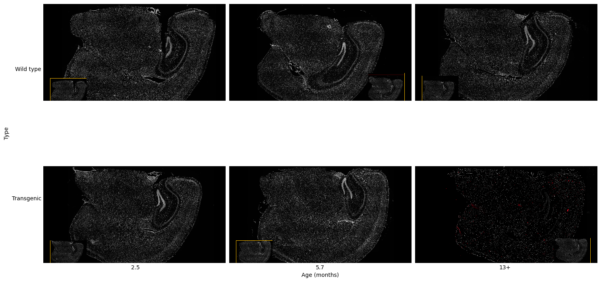
   <em>*Figure 1. Morphology images of Wt and transgenic mice across ages.*</em>

---

### 2.b Plaque detection and coordinate alignment

To obtain plaque coordinates, we hand-labeled **11 plaque-free regions** and **9 plaques** across a range of sizes, then trained a **random forest classifier** to segment the remaining plaques in the IF image.

Next, plaque coordinates were transformed from IF-image space to morphology-image space using a **RANSAC-based transformation** trained on **26 visually aligned landmark pairs**. After alignment, we achieved **RMSE = 3.2 µm**, which is small relative to the **median cell-to-plaque distance (61 µm)**-supporting that alignment error is unlikely to dominate distance-based trends.

After alignment, we performed plaque post-processing to improve biological plausibility and robustness: we merged intersecting plaques, removed plaques outside the brain boundary, and filtered plaques below the 5th percentile in area. This produced **1,736 Aβ plaques**, visualized below.

  
   <em>*Figure 2. Final plaque set after alignment and QC, shown as plaque geometries overlaid in morphology-image coordinates.*</em>

---

### 2.c
For each cell, we computed distance to the nearest plaque as the **Euclidean distance between the cell centroid and the nearest plaque boundary** (not the plaque centroid). This yields a direct geometric measure of proximity to plaque surfaces.

To build intuition, we overlay plaque polygons onto the morphology image and color tissue by distance to the nearest plaque, highlighting regions that are consistently near plaques versus regions that are relatively plaque-free.

  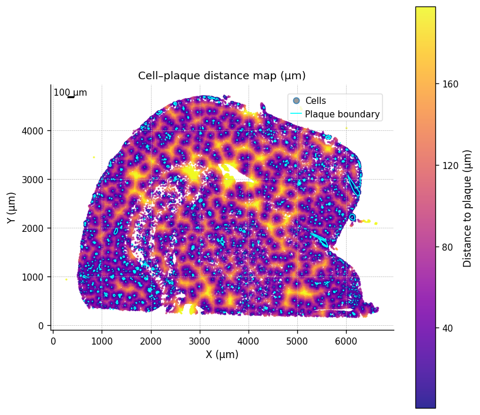
   <em>*Figure 3. Tissue-wide plaque proximity map: plaque geometries overlaid on morphology image, with tissue colored by distance to the nearest plaque boundary (cool colors indicate smaller distances).*</em>

Distances are spatially heterogeneous but concentrated near plaques:

- Maximum distance from any plaque: **457 µm**
- **>99%** of cells are within **200 µm** of a plaque
- Median distance: **61 µm**
- Standard deviation: **44.4 µm**
- Distribution is **right-skewed** with a long tail of cells far from plaques

  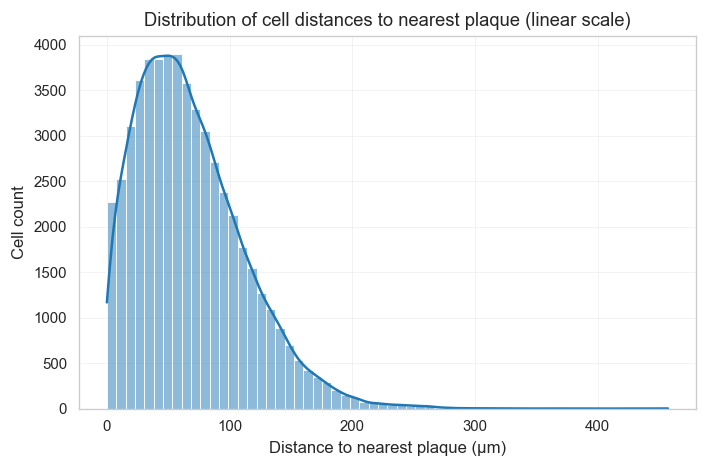
   <em>*Figure 4. Distribution of distances from each cell centroid to the nearest plaque boundary, showing strong right skew and a long tail of plaque-distant cells.*</em>

---

### 2.d Gene panel composition and sparsity
This Xenium dataset provides single-cell expression for **347 genes**, but expression is sparse. In the most AD-advanced sample (the 17.9-month transgenic mouse), **302/347 genes** have **zero median transcript count**. Across genes, transcript counts are **right-skewed**, and the fraction of cells with nonzero counts varies widely (**0.002 to 0.989**), underscoring substantial gene-dependent detection and expression variability.

The gene panel includes:
- **248** markers for 8 main cell types, neuronal cortical layer markers, and non-neuronal markers
- **83** genes related to activated microglia and astrocytes
- **16** plaque-induced genes (PIGs) curated from primary literature

  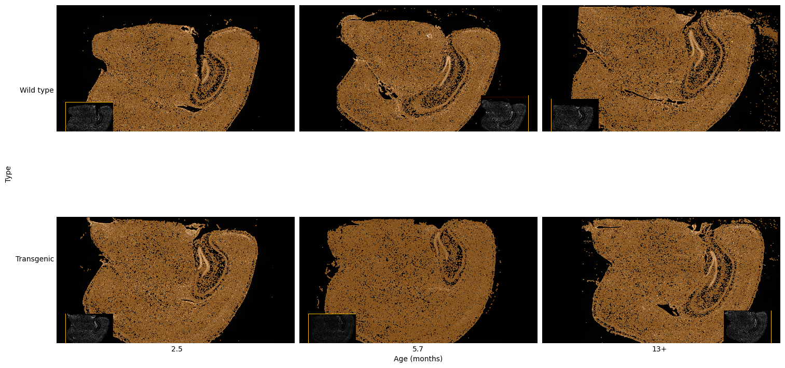
   <em>*Figure 5. Spatial distribution of individual cells across all mice.*</em>

---

We next compare the distribution of **log1p-transformed** transcript counts for the **16 PIGs** against the typical distribution across all 347 genes, focusing on the **17.9-month transgenic mouse** to study advanced pathology. We plot histograms (B = 50 bins) and (for PIGs) Gaussian KDE curves.

  
   <em>*Figure 6. Distributions of log1p-transformed transcript counts for each PIG, compared to the broader gene panel, highlighting sparsity and heavy tails.*</em>

A consistent pattern emerges: for **13/16 PIGs**, the distribution has a **mode at zero**, followed by gradual density decay at higher counts. Different PIGs decay at different rates, indicating heterogeneous activation intensity and/or cell-state specificity.

To identify PIGs with particularly unusual expression structure, we combine diagnostics (including **zero inflation**, dispersion, and shape) into a composite "weirdness score." The five most unusual PIGs are:

| gene | zero_frac | weird_score |
|---|---:|---:|
| Cxcl10 | 1.00 | 9.35 |
| Cd74 | 0.98 | 8.13 |
| Serpina3n | 0.88 | 0.79 |
| C4b | 0.90 | 0.19 |
| Gfap | 0.69 | 0.05 |

Cxcl10 and Cd74 clearly stand out: both have weirdness scores > 8 and extremely high zero proportions (> 0.97), foreshadowing downstream modeling challenges (e.g., very small effective signal range after log transforms).

---

### 2.e Cell clustering workflow (PCA → kNN → Leiden → UMAP)
To characterize cell types and anatomical structure, we cluster cells using their 347-dimensional expression vectors:

1. PCA on expression space
2. kNN graph with **15 nearest neighbors**
3. **Leiden clustering**, yielding **K = 19** clusters
4. 2D embedding via **UMAP** for visualization

  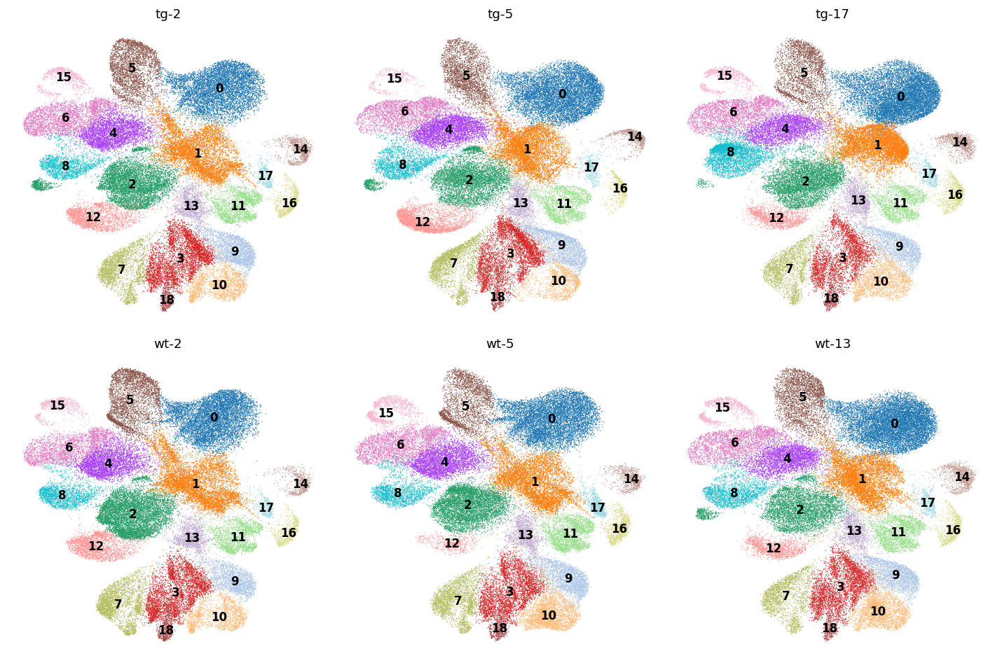
   <em>*Figure 7. UMAP projection of the joint Leiden clustering (K = 19) derived from PCA-reduced gene expression vectors.*</em>

Overlaying clusters on tissue reveals strong correspondence with brain morphology:

  
   <em>*Figure 8. Spatial overlay of Leiden clusters on each brain section, showing tight alignment between gene-expression-derived clusters and anatomical structure.*</em>

Representative cluster interpretations include:
- **Cluster 6 (vascular cells)** is concentrated near the outer rim, consistent with epidural space localization.
- **Cluster 14** traces hippocampal formation and follows the dentate gyrus shape; inferred as **dentate gyrus immature glutamatergic neurons**.
- **Cluster 10** dominates the amygdala/hypothalamus region; inferred as **hypothalamic medial mammillary glutamatergic neurons**.
- Ventricular cavities show a distinct lining cluster (**cluster 15**), inferred as **hypothalamic GnRH1-expressing glutamatergic neurons**, consistent with hypothalamic contributions to the third ventricle walls.

This anatomical concordance is central for later interpretation: spatial plaque proximity effects can reflect genuine plaque biology, but also the fact that plaques and cell types are unevenly distributed across brain regions.

---

## 3. Results: Plaque-Proximity Effects

## 3.a RQ1 - How does cell type composition change in plaque proximity?

### 3.a.i Logistic regression specification and interpretation
We model the relationship between **cluster membership** and **distance to the nearest plaque** using logistic regression. After fitting, we find statistically significant coefficients for **14 of 19 clusters**, using a **Bonferroni-adjusted p-value threshold of 0.01**.

To make coefficients interpretable, we translate them into:
- **p(0):** baseline probability of observing a cluster at the plaque surface
- **p(100):** probability of observing a cluster at 100 µm from plaque
- **p(100) − p(0):** relative change over 100 µm away from plaque

Key effects (selected):

**Clusters depleted with distance (negative slopes; enriched near plaques):**

| Cluster | Slope βk | p(0) | p(100) | Relative change |
|---|---:|---:|---:|---:|
| Immune | −0.01427 | 0.159 | 0.043 | −72.7% |
| Vascular | −0.01116 | 0.100 | 0.035 | −64.9% |
| Pons, Gluta | −0.00772 | 0.015 | 0.007 | −53.4% |
| Intra/Extratelencephalic, Gluta | −0.00361 | 0.075 | 0.054 | −28.7% |
| Cortex medial, GABA | −0.00282 | 0.041 | 0.031 | −23.8% |
| Astrocyte | −0.00114 | 0.136 | 0.123 | −9.5% |

**Clusters enriched with distance (positive slopes; depleted near plaques):**

| Cluster | Slope βk | p(0) | p(100) | Relative change |
|---|---:|---:|---:|---:|
| Hypothalamic Gnrh1, Gluta | +0.02346 | 0.002 | 0.019 | +927.0% |
| Medulla, GABA | +0.01815 | 0.002 | 0.012 | +508.2% |
| Cerebral LGE, GABA | +0.00781 | 0.016 | 0.035 | +114.3% |
| Olfactory bulb, Gluta | +0.00678 | 0.011 | 0.021 | +94.9% |
| Dentate, Gluta | +0.00591 | 0.014 | 0.025 | +78.5% |
| Corticothalamic, Gluta | +0.00384 | 0.029 | 0.042 | +44.8% |
| Hypothalamic medial, Gluta | +0.00256 | 0.033 | 0.042 | +27.9% |
| Oligodendrocyte | +0.00208 | 0.161 | 0.191 | +18.7% |

These coefficients are summarized visually below.

  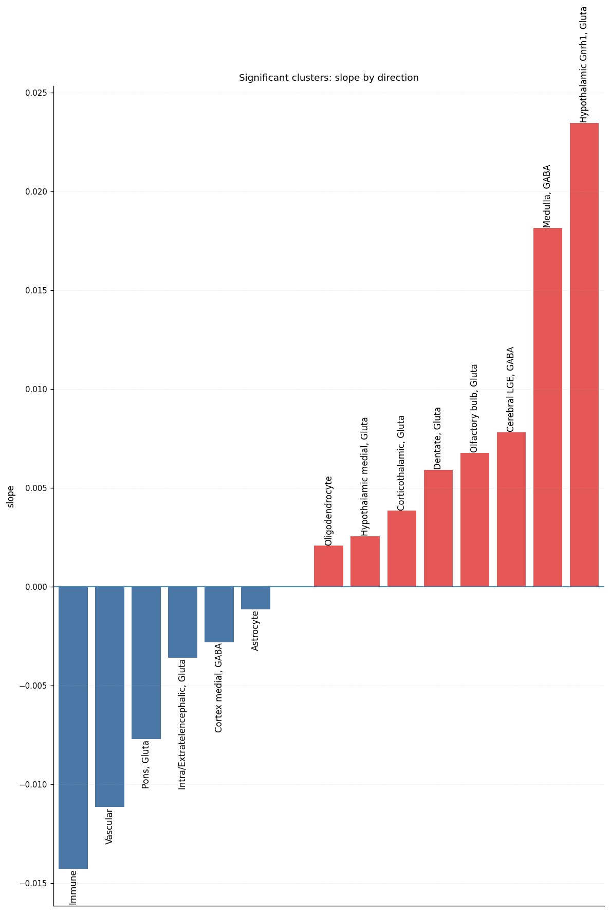
   <em>*Figure 9. Logistic-regression slopes by cell type (Leiden cluster), summarizing how cluster frequency changes as a function of distance to the nearest plaque.*</em>

Overall, the results show a clear composition shift near plaques:
- **Neuronal cell types are generally depleted** around plaques.
- **Immune, vascular, and astrocytic** populations are **enriched** at the smallest distances.

This aligns with known AD mechanisms: plaques are associated with neuronal degeneration, reactive astrocytosis and microglial activation, and vascular remodeling.

A particularly strong effect appears for **Hypothalamic GnRH1-expressing glutamatergic neurons (cluster 15)**, whose frequency increases ~10× over 100 µm. Spatial overlays suggest these cells largely reside in ventricle cavities and are therefore typically far from plaques (cerebrospinal fluid regions are effectively plaque-free), explaining the steep distance-associated rise.

We also observe a more surprising pattern: several neuronal clusters (e.g., intra-/extratelencephalic glutamatergic, pons glutamatergic, cortex-medial GABAergic) appear relatively enriched near plaques compared to other neurons. One plausible hypothesis is differential resilience: these neurons may be less vulnerable to plaque-associated damage, yielding a weaker depletion pattern than other neuronal populations.

To complement the regression summary, we examine frequency vs. distance using binned distance profiles.

  
   <em>*Figure 10. Cluster frequency as a function of binned distance to the nearest plaque, highlighting nonlinear and threshold-like behaviors.*</em>

Several clusters show changes primarily at extreme distances rather than gradual shifts:
- Cluster 0 (oligodendrocyte lineage) shows a clear upward trend away from plaques.
- Cluster 15 increases sharply only after ~113 µm.
- Cluster 14 declines sharply after ~138 µm.
- Cluster 8 (immune) drops sharply after the first bin, then levels off.

These non-linearities motivate correlation and regression analyses that do not assume strict linear response across distance.

---

## 3.b RQ2 - Relationship between cell type composition, PIG expression, and plaque distance

Cluster-level marker enrichment shows that some clusters exhibit strong over- or under-expression of specific genes. For example:
- Cluster 8 (immune) over-expresses **Hexb** (z-score ~4).
- Cluster 14 (dentate gyrus immature glutamatergic) under-expresses **Cst3** (z-score ~−2).

This reinforces that anatomical/cell-type structure and gene expression patterns are tightly coupled and motivates a central question: **are plaque-associated PIG gradients direct effects, or are they mediated by cell-type composition shifts?**

  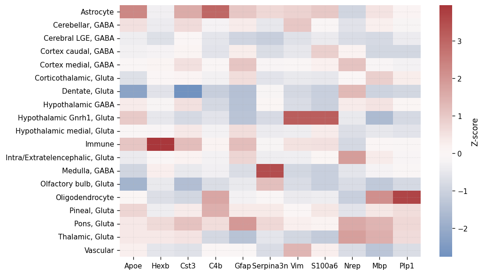
   <em>*Figure 11. Cluster-by-gene enrichment (z-score) heatmap illustrating marker structure and motivating composition–expression coupling analyses.*</em>

### 3.b.i Correlation: cell-type proportions vs mean PIG expression
We test whether distance-dependent PIG expression could be explained by changing cell-type composition. Concretely:
- Bin cells by plaque distance.
- For each bin, compute **cell-type proportions** and **mean PIG expression**.
- Compute a **Spearman rank correlation matrix** between cell-type proportions and PIG expression across bins.
- Use Spearman (rather than Pearson) to accommodate plausible non-linear/step-like behaviors.
- Perform significance testing with multiple-testing correction per gene–cell-type pair.

  
   <em>*Figure 12. Spearman correlations between distance-binned cell-type proportions and distance-binned mean PIG expression, with significance testing across gene–cell-type pairs.*</em>

We identify **9 cell types** with significant correlations to PIG expression. Notably:
- **8/9** are strongly correlated with a **core set of 14 PIGs**.
- The remaining cell type is strongly correlated with **Nrep** alone, suggesting a complementary pattern rather than redundancy with the core PIG set.

Detailed summary:

**Cell types vs. PIG expression**

| Cell type (ID & label) | Description | Sign of ρgc | PIG genes involved |
|---|---|---:|---|
| 07 - Corticothalamic, Gluta | Layer 6b corticothalamic glutamatergic neurons | Negative | Core 14 PIGs |
| 08 - Immune | Microglia/macrophages, etc. | Positive | Core 14 PIGs |
| 10 - Hypothalamic medial, Gluta | Medial mammillary glutamatergic neurons | Negative | Core 14 PIGs |
| 12 - Cerebral LGE, GABA | LGE-derived cerebral nuclei GABAergic neurons | Negative | Core 14 PIGs |
| 14 - Dentate, Gluta | Dentate gyrus immature glutamatergic neurons | Negative | Core 14 PIGs |
| 15 - Hypothalamic Gnrh1, Gluta | GnRH1-expressing glutamatergic neurons | Negative | Core 14 PIGs |
| 16 - Olfactory bulb, Gluta | Cajal–Retzius glutamatergic neurons | Negative | Core 14 PIGs |
| 17 - Medulla, GABA | Medulla GABAergic neurons | Negative | Core 14 PIGs |
| 03 - Intra/Extratelencephalic, Gluta | Intra-/extratelencephalic glutamatergic neurons | Positive | Nrep only |

**Counts by correlation direction**

| Direction | # cell types | Representative IDs |
|---|---:|---|
| Negative (ρgc = −1.00) | 7 | 07, 10, 12, 14, 15, 16, 17 (Core 14) |
| Positive (ρgc = +1.00) | 2 | 08 (Core 14); 03 (Nrep) |

Interpreted biologically, the core PIGs are most aligned with immune enrichment and neuronal depletion, consistent with a glial activation signature that strengthens in plaque-proximal bins.

### 3.b.ii Joint regression (Apoe): cell type + distance → expression
To quantify how much cell composition explains PIG expression gradients, we fit a joint linear regression predicting PIG expression from:
- Broad cell type (with **Vascular Endothelial Pericyte** as the baseline), and
- Distance to the nearest plaque.

We illustrate results for **Apoe**.

Model fit:
- **R² = 0.203** (20.3% variance explained in normalized transcript count)
- Overall F-test p-value: **< 2.13e−174** (joint null rejected)

Coefficients:

| Term | Coef (log) | p-value | Natural-scale factor | Interpretation vs Vascular_Endothelial_Pericyte |
|---|---:|---:|---:|---|
| Intercept (d=0, baseline) | 1.8328 | < 1e−300 | exp(1.8328) − 1 ≈ 5.25 | Baseline expected expression at plaque surface |
| Glia, Astrocyte Ependymal | +0.9494 | < 1e−300 | 2.584× | 158% higher than baseline |
| Glia, Oligodendrocyte Lineage | −0.0700 | 6.5e−06 | 0.932× | 6.8% lower than baseline |
| Immune, Microglia Macrophage | +0.3562 | < 1e−300 | 1.428× | 43% higher than baseline |
| Neuron, GABAergic | −0.0271 | 0.068 | 0.973× | 2.7% lower (not significant at 0.05) |
| Neuron, Glutamatergic | −0.1924 | < 1e−300 | 0.825× | 17.5% lower than baseline |
| Distance to plaque (per µm) | −0.0012 | < 1e−300 | 0.9988× per µm | Each µm reduces expected expression by ~0.12% |

This reinforces two earlier observations simultaneously:
1. Apoe is higher in **astrocytic and immune** populations and reduced in **neuronal** populations, especially glutamatergic neurons.
2. Even after accounting for cell type, there remains a significant **negative distance effect**, consistent with a true plaque-centered expression gradient.

### 3.b.iii Stratified mean expression by cell type and distance
We also visualize mean Apoe expression by distance bin and cell type, with 95% confidence intervals based on SEM.

  
   <em>*Figure 13. Mean Apoe expression across distance bins stratified by broad cell type, with 95% confidence intervals (SEM-based).*</em>

The stratified plot corroborates the regression interpretation: astrocyte/ependymal cells show higher Apoe than vascular baseline, and glutamatergic neurons show markedly lower Apoe, with differences that remain meaningful relative to uncertainty.

---

## 3.c RQ3 - How does PIG expression change in plaque proximity?

### 3.c.i Distance-binned means, confidence intervals, and ANOVA
We group cells into **5 equal-count distance bins** and compute, for each PIG:
- mean **log1p-normalized** transcript count per bin
- 95% confidence interval (SEM-based)

An ANOVA confirms that **all 16 PIGs** have significant differences in mean expression across distance bins at **Bonferroni-corrected FDR = 0.01**.

  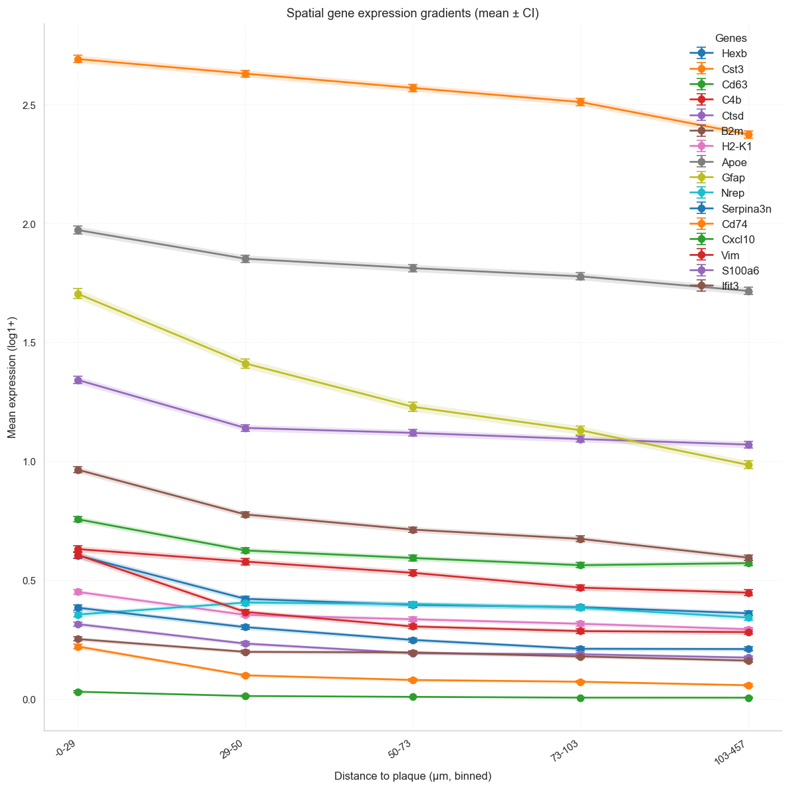
   <em>*Figure 14. Distance-binned mean expression of all 16 PIGs with 95% confidence intervals, showing consistent plaque-proximal elevation for glial/immune markers.*</em>

A prominent example is **Gfap**, which shows the largest proximal-to-distal mean difference on the log1p scale:
- Δ(log1p mean) ≈ **0.72** between closest and farthest bins
- SEM ≈ **0.01** (with **10,779 cells per bin**)
- On the natural scale: exp(0.72) ≈ **2.05×** higher expression near plaques

Across genes, the most consistent gradients include:
- Microglial markers (e.g., **Hexb, Ctsd, Cst3, Apoe**)
- Astrocytic markers (e.g., **Gfap, Serpina3n, Vim**)

Collectively, tissue within ~0–29 µm of plaques shows elevated glial/immune signatures that fade with distance.

### 3.c.ii Per-gene regression slopes and "distance-to-half-expression"
To summarize gradients continuously, we regress log1p-normalized transcript count against distance for each PIG and apply Benjamini–Hochberg FDR correction across the 16 regressions.

Results:
- **All 16 PIGs** show statistically significant **negative slopes** at **FDR = 0.01**.
- Slope magnitudes vary substantially. Translating slopes into a natural-scale interpretability metric ("distance to halve expression"):
  - **Gfap:** ~**128 µm** to halve expression
  - **Cxcl10:** ~**4,415 µm** to halve expression

Given the mouse brain diameter (~6,000 µm), Cxcl10’s gradient is effectively flat, consistent with its extreme zero inflation (low absolute expression variation across distance).

  
   <em>*Figure 15. Distance required (µm) to reduce predicted expression by half for each PIG, derived from per-gene distance regressions.*</em>

---

To increase explanatory power (R²), reduce heteroscedasticity, and test whether plaque shape contributes to local responses, we compute geometric properties of the nearest plaque for each cell:
- area
- perimeter
- major axis length
- orientation

  <!-- This was obtained with plot_boxgrid; usage in results.ipynb -->
  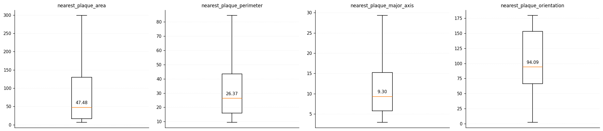
   <em>*Figure 16. Distributions of nearest-plaque geometry features (area, perimeter, major axis, orientation) summarized via box plots.*</em>

Nearest-plaque distance captures proximity to *one* plaque, but local pathology may depend on plaque *crowding*. We therefore add two "multi-plaque proximity" features within a radius **R = 61 µm** (the median nearest-plaque distance):
- **Count:** number of plaques within radius R
- **Mean Distance:** average distance to plaques within radius R

To validate that R is informative, we check the Count distribution and CDF. The distribution shows meaningful variation: **55.2%** of cells have **0** plaques within 61 µm, while the remainder have up to **21** plaques within that radius-indicating a usable local density signal.

  <!-- This was obtained with plot_multi_plaque_proximity; usage in results.ipynb -->
  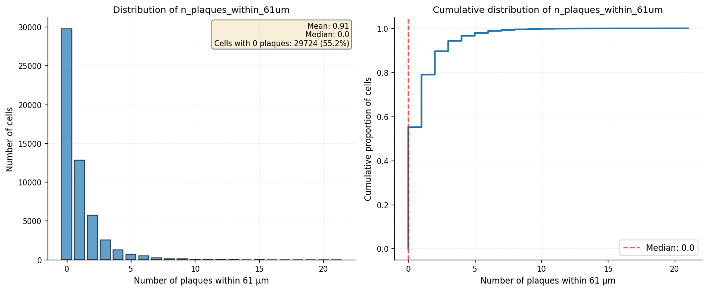
   <em>*Figure 17. Histogram and CDF of local plaque density (Count within R = 61 µm), validating that multi-plaque proximity provides informative variation beyond nearest-plaque distance.*</em>

To capture local cell–cell context and spatial signaling, we compute neighborhood mean expression features: for each cell and each PIG, we summarize the expression of the **15 other PIGs** across its **k = 100 nearest neighbors**.

Motivation for k = 100:
- balances locality with stability (not too small, not too large)
- approximates neighborhood effects at a scale relevant to cell–cell communication (~100 µm radius depending on density, assuming ~10 µm cell diameter and relatively dense cell packing)

We then compute Pearson correlations between each target PIG and the neighborhood means of the other PIGs, ranking by absolute strength.

  <!-- This was obtained with plot_corr_matrix; usage in results.ipynb -->
  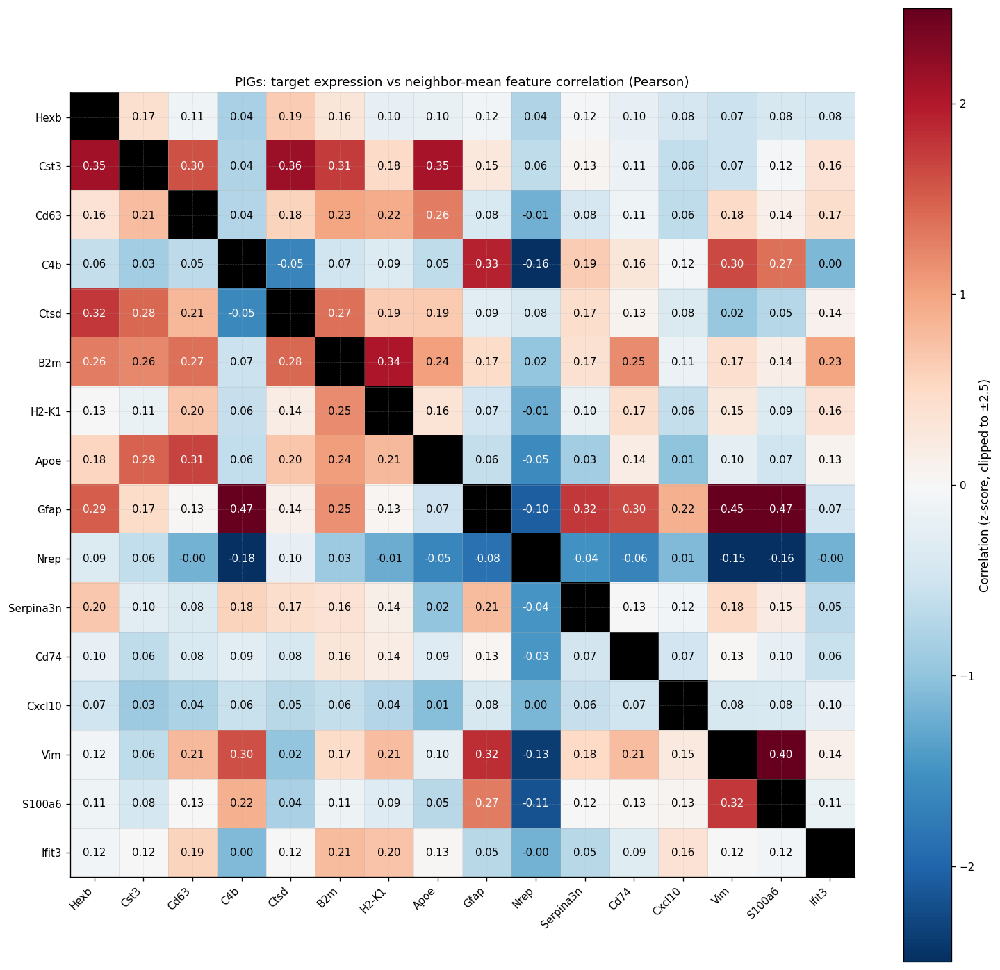
   <em>*Figure 18. Pearson correlations between each target PIG and the neighborhood mean expression of other PIGs (100-NN), highlighting non-symmetric target–neighbor relationships.*</em>

The matrix is not symmetric because target/neighbor roles are not commutative. The strongest relationships are:

| Target PIG | Neighbor PIG | Pearson correlation |
|---|---|---:|
| Gfap | C4b | 0.47 |
| Gfap | S100a6 | 0.47 |
| Gfap | Vim | 0.45 |

Interpretations:
- **Gfap/C4b:** reactive gliosis around plaques co-occurs with complement cascade activation; C4a/C4b is expressed in astrocytes, making co-variation expected.
- **Gfap/S100a6:** S100a6 is reported to be upregulated in astrocytes in AD, concentrated around Aβ plaques, often alongside Gfap-positive reactive astrocytes.
- **Gfap/Vim:** both are intermediate filament proteins upregulated in reactive astrogliosis; coordinated induction is expected in plaque-adjacent reactive astrocytes.

We systematically quantify how each feature group improves PIG prediction using nested linear models for each PIG:

- **Model 0:** distance only
- **Model 1:** distance + plaque geometry
- **Model 2:** distance + plaque geometry + multi-plaque proximity
- **Models 3_1, 3_2, 3_4, 3_8, 3_15:** Model 2 + neighborhood PIG context features using the top 1/2/4/8/15 neighbor PIGs (ranked by correlation)

We compare successive models using nested F-tests (α = 0.01) and apply BH-FDR correction across the 16 per-PIG tests for each comparison.

  <!-- This was obtained with plot_nested_regression_adj_r2; usage in results.ipynb -->
  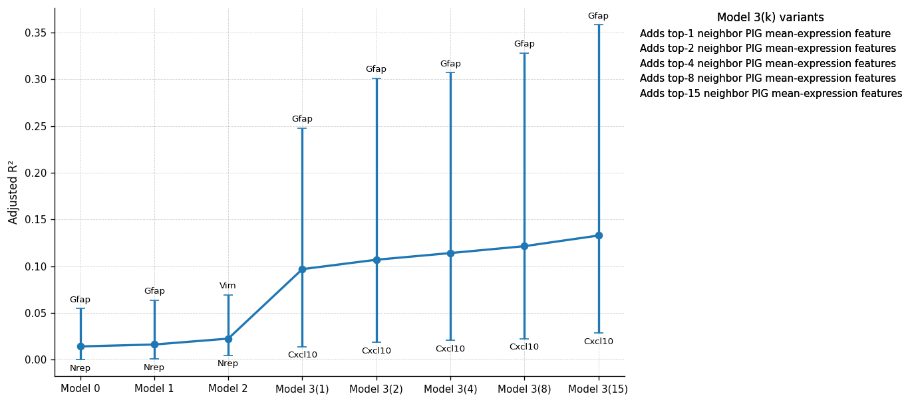
   <em>*Figure 19. Mean adjusted R² across PIGs for each nested model, including min/max ranges, showing which feature groups add meaningful predictive value.*</em>

Key findings:
- The largest average adjusted R² gain comes from adding the **single most correlated neighborhood PIG** (mean improvement **+0.074**). This is consistent with plaque proximity acting as a common confounder that drives coordinated PIG activation.
- Additional neighbor PIG proxies provide diminishing but still significant gains (e.g., **+0.036** for the next increment), and the nested analysis favors using up to **15** neighbor PIGs even though most benefit comes from the first proxy.
- **Gfap** achieves the highest adjusted R² in **7 of 8** model variants, consistent with it being strongly distance-linked.
- **Cxcl10** is lowest in **5 of 8** model variants, consistent with extreme zero inflation limiting explainable variance.
- Plaque geometry (Model 1) and multi-plaque proximity (Model 2) yield statistically significant (but modest) improvements in adjusted R² for **15/16 PIGs** (average improvements ~**0.0021** and **0.0063**, respectively), implying these spatial descriptors are biologically salient but secondary to neighborhood transcriptional context.

---

## 4. Predictive Modeling: Inferring Plaque Distance

## 4.a RQ4 - When modeling plaque distance, which features are most important?

### 4.a.i Benchmarking setup and results
We benchmark models that predict plaque distance from the **347-gene expression vector**, using a random **80/20 train/test split over cells**:

- Linear models: **LASSO**, **ElasticNet**
  - input: standardized log1p-transformed counts
- Tree models: **Random Forest**, **XGBoost**
  - input: unstandardized log1p-transformed counts

We report train/test R² and inspect residual structure and feature importance.

Performance:

| Model | Train R² | Test R² |
|---|---:|---:|
| LASSO | 0.1969 | 0.1955 |
| ElasticNet | 0.1969 | 0.1955 |
| Random Forest | 0.2252 | 0.1874 |
| XGBoost | 0.4784 | 0.2577 |

XGBoost achieves the best test R² but also the largest train–test gap, indicating overfitting. This is consistent with a higher model capacity. Meanwhile, LASSO and ElasticNet show near-identical train and test R². This can also be explained by lower model complexity when compared to tree-based models.

Residual plot for XGBoost shows heteroscedasticity. In the viscinity of plaques the model over-predicts, while far from plaques it tends to under-predict.

  
   <em>*Figure 20. Residual diagnostics for the XGBoost.*</em>

The prediction distribution is highly concentrated in the 0–100 µm range. This implies that XGBoost only learned to model a narrow band of distances.

  
   <em>*Figure 21. True vs predicted plaque distance distribution.*</em>

Looking at XGBoost residuals, we can identify 3 main types:
- **25.51%**: highly negative residuals (< −17.2 µm), mostly close to plaques (within 49 µm)
- **28.15%**: highly positive residuals (> 10.6 µm), mostly far from plaques (beyond 87 µm)
- **20.94%**: moderate residuals (−17.2 to 10.6 µm), mostly mid-range (49–87 µm)

Overlaying residuals on top of the brain image reveals a strong association with plaque centroids (red stars). This is once again due to the narrow range of predictions: XGBoost tends to be dominated by the average distance to plaque, meaning that it cannot model the full range of cell-to-plaque distance.

  
   <em>*Figure 22. Spatial error map shows alignment with plaque locations.*</em>

Let us now explore cluster-specific errors. Mean absolute residuals are largest for ventricular-associated cluster 15 (GnRH1-expressing glutamatergic neurons). This is because these cells occupy regions far from plaques and the model doesn't work in this extreme distance range.

| Cluster (Leiden) | Inferred cell type | n | Mean absolute residual (µm) |
|---:|---|---:|---:|
| 15 | Hypothalamic GnRH1-expressing glutamatergic neurons | 917 | 32.2295 |
| 18 | Pons glutamatergic neurons | 499 | 17.8746 |

Top predictive genes are mostly consistent across models. Notably, **Gfap** and **Spag16** appear in the top 5 genes across all models, and three of four models rank **Gfap** as the single most important predictor. This reinforces our earlier findings that Gfap peaks near plaques and quickly decays with distance. Other highly ranked genes include **Lyz2** (with association to immune and glial cells) and **Igf2**, which shows an opposite plaque-distal enrichment. Namely, it peakes around ~270 µm and declinines toward plaques.

| Rank | ElasticNet | LASSO | Random Forest | XGBoost |
|---:|---|---|---|---|
| 1 | Gfap (7.738978) | Gfap (7.864686) | Gfap (0.228450) | Spag16 (0.033058) |
| 2 | Spag16 (3.780172) | Spag16 (3.801531) | Spag16 (0.084622) | Lyz2 (0.023342) |
| 3 | Slc17a6 (3.025042) | Slc17a6 (3.073279) | Lyz2 (0.066671) | Gfap (0.016999) |
| 4 | Slc17a7 (2.953878) | Slc17a7 (3.057380) | Cabp7 (0.063918) | Igf2 (0.015752) |
| 5 | Igf2 (2.907111) | Igf2 (2.949014) | B2m (0.034584) | Strip2 (0.013022) |

Agreement across models suggests that these genes carry robust, biologically meaningful information about plaque proximity.

---

### 4.b. Additional feature modalities
To improve interpretability and performance while investigating feature importance, we add non-transcriptomic predictors. These include:

- Cell centroid coordinates
- Cell area
- Nucleus area
- Cell type (given by Leiden cluster ID)

We group distance predictors into four modalities:
- **Genes:** 347 expression values
- **Morphology:** cell area, nucleus area
- **Spatial:** cell centroid coordinates
- **Cluster:** Leiden cluster-based cell type

We then compare an ordinary linear regression to Partial Least Squares (PLS) model, which constrains predictions through a small number of latent components with maximal covariance with the plaque distance.

As a result, we obtained the following performance metrics:

| Model | Train R² | Test R² |
|---|---:|---:|
| Linear | 0.25 | 0.24 |
| PLS | 0.19 | 0.19 |

The full linear model improves over gene-only linear baseline and narrows the gap to XGBoost. This result suggests that a meaningful share of distance variance is explained by a linear combination of gene, spatial, morphological, and cell-type predictors. PLS shows lower R^2 but also better generalizability. This is due to the fact that PLS captures dominant plaque-related features while sacrificing some predictive power.

To test whether the PLS signature reflects biologically meaningful plaque-induced decay, we compare the PLS output in Tg17 and Wt13 mice after performing alignment.

  <!-- This was obtained with plot_overlay; usage in results.ipynb -->
  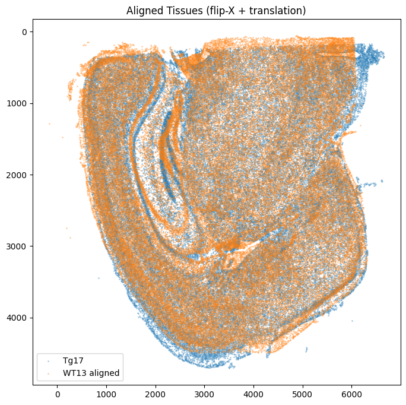
   <em>*Figure 23. Alignment between Tg17 and Wt13 brain morphology images.*</em>

Our findings reveal that, across plaques:
- Tg17 has more negative correlations between signature and distance (**mean ρ ≈ −0.19**) and more negative slopes (**mean slope ≈ −0.0055**).
- WT13 has near-flat trends (**mean ρ ≈ −0.02**, **mean slope ≈ −0.0018**).
- FDR-corrected results indicate **3 plaques** with significant decay in Tg but not Wt.
- However, most other plaques show decay in both Tg and Wt. This could be due to shared anatomical gradients: some expression patterns unveil across brain tissue regardless of plaques.
- We find that the inner (0–50 µm) region has, on average, higher signature in Tg than Wt mice. This is consistent with localized transcriptional programs near plaques.

To illustrate our findings, we will focus on a specific plaque (ID=1794) which has most cells around it. In the following two figures, we can see how the PLS signature behaves differently in Wt and Tg mice.

  

    
     <em>*Figure 24. Continuous PLS signature values vs distance for plaque 1794.*</em>
  

  

    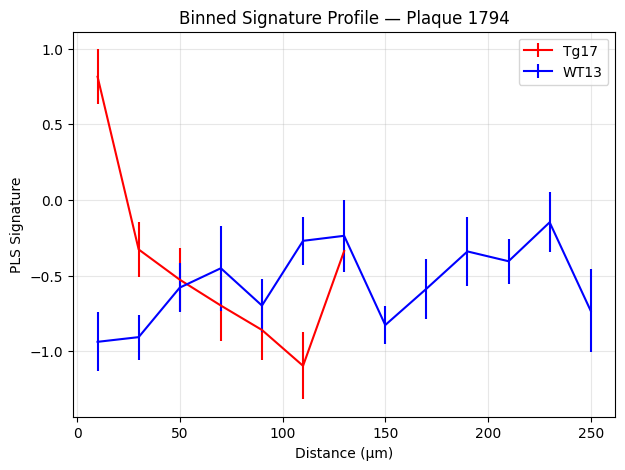
     <em>*Figure 25. Binned signature decay vs distance for plaque 1794.*</em>
  

Overall, the PLS signature appears biologically informative for a subset of plaques. Howeverm we remain limited by the large alignment error and the coinciding gene expression gradients across the shared brain anatomy in both Wt and Tg mice.

Next, we compare linear models (Ridge/Lasso/PLS) to nonlinear tree-based models at various input modalities. Results show:

- Linear models reach modest accuracy (**R² ≈ 0.20–0.24**) when gene expression is included.
- Morphology-only or spatial-only linear models perform close to a random guess.
- Nonlinear models result in much higher R^2.
- Surprisingly, **spatial-only** nonlinear models can reach **R² ≈ 0.64** (HistGradientBoosting). This exceeds even the full multimodal HistGradientBoosting.
- Adding cluster information improves tree models moderately (**R² ≈ 0.26–0.28**), while morphology adds little.

  <!-- This was obtained with plot_ablation_heatmap; usage in results.ipynb -->
  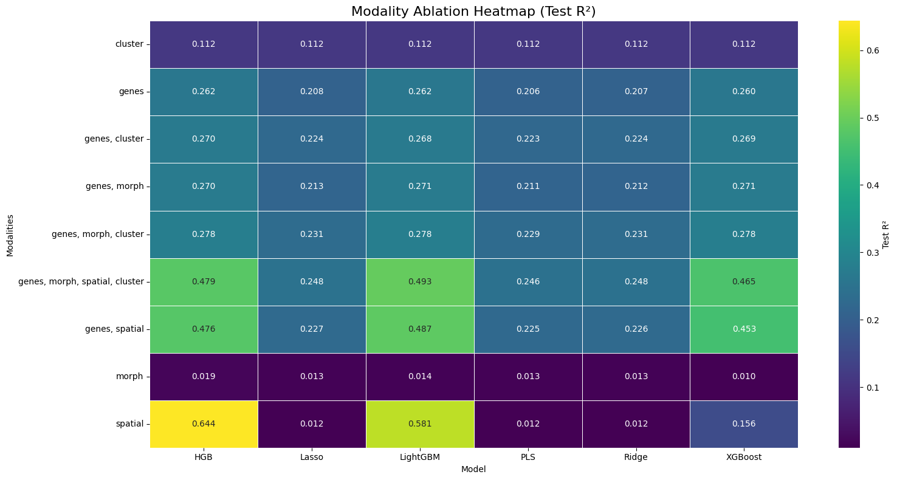
   <em>*Figure 26. Modality ablation performance across model classes.*</em>

  <!-- This was obtained with plot_best_model_per_modality; usage in results.ipynb -->
  
   <em>*Figure 27. Best model class per modality combination.*</em>

The high R² from spatial-only gradient boosted trees is suspicious. This could be due to anatomical bias. Plaque occurrence is not spatially uniform, with some brain regions accumulating more plaques than others. Because of this, coordinates predict *regional vulnerability* rather than the bone fide plaque distance.

To test whether spatial-only predictions are generalizable, we will evaluate them across different mice. Namely, we compare spatial-only model outputs across all Tg and WT animals:

  <!-- This was obtained with plot_spatial_compare; usage in results.ipynb -->
  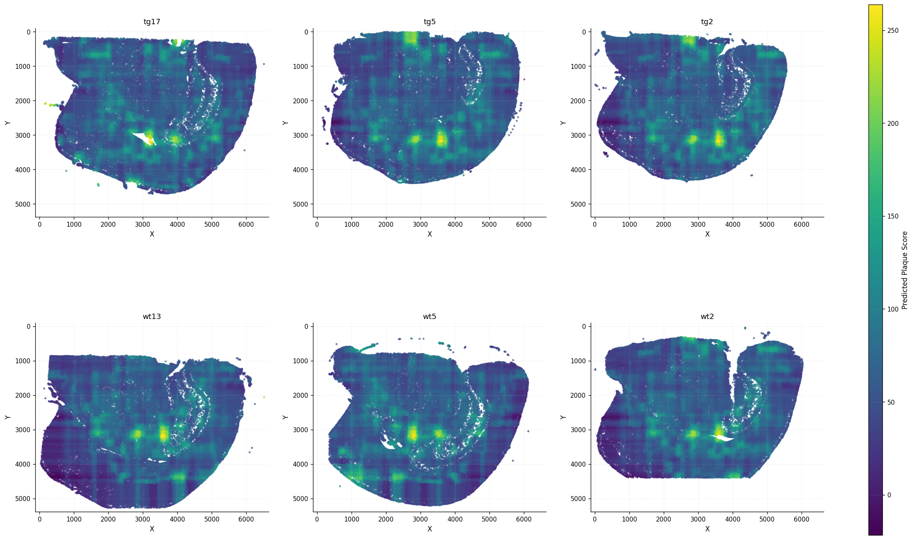
   <em>*Figure 28. Spatial-only prediction comparison across mice.*</em>

  <!-- This was obtained with plot_hist_comparison; usage in results.ipynb -->
  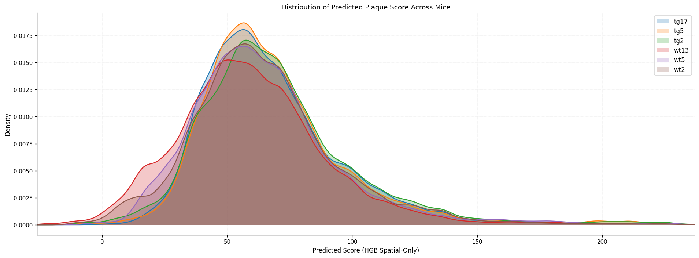
   <em>*Figure 29. Predicted plaque-distance score distributions across all mice (spatial-only model).*</em>

The model produces nearly identical prediction distributions across all mice:
- Output distributions differ by at most ~**6%** at any point.
- This is inconsistent with a pathology-sensitive model that should change its output significantly with genotype and disease stage.

To approach this more formally, we will quantify distributional similarity using Jensen–Shannon divergence (JSD):

  <!-- This was obtained with plot_jsd_heatmap; usage in results.ipynb -->
  
   <em>*Figure 30. Jensen–Shannon divergence matrix between spatial-only prediction distributions across mice.*</em>

Our findings show that:
- JSD values are mostly **0.05–0.10**, only slightly higher (~0.14–0.16) for comparisons involving Wt-13.
- Kolmogorov-Smirnov (KS) statistics are small (mostly **0.02–0.08**) despite extremely significant p-values driven by large sample sizes.
- ANOVA across Tg mice yields a very significant p-value (p ≈ **3.6e−22**) but with trivial effect size and no monotone increase with age.

From the results above, we can conclude that the spatial-only model mostly learns conserved brain anatomy and not plaque pathology. The high R² is therefore largely due to the anatomical confounding.
---

## 4.c Deep dive into the expression models

We begin by investigating the brain-region segmentation learned by our decision tree trained to predict plaque-distance from coordinates. For visualization, we approximate the murine brain with a 200×200 grid of spatial tiles and, within each tile, compute the average distance to the nearest plaque. This average distance is then visualized with color. 

When comparing the inferred decision surface to the ground-truth plaque-distance map, we can notice a prominent large-distance region in the ventricular area learned by the model. Further, the decision tree trivially identifies the "break-away" cells outside the brain boundary as being far from plaques. Finally, we can see that the tree draws a clear boundary between (i) coarser, more homogeneous regions around the diencephalon and (ii) finer-grained segmentation around the hippocampus and isocortex. This change in granularity is consistent with plaques being more uniformly spaced in the diencephalon, in contrast to the heterogeneous grouping observed in the hippocampus and isocortex.

  <!-- This was obtained with plot_true_vs_pred_heatmaps in results.ipynb -->
  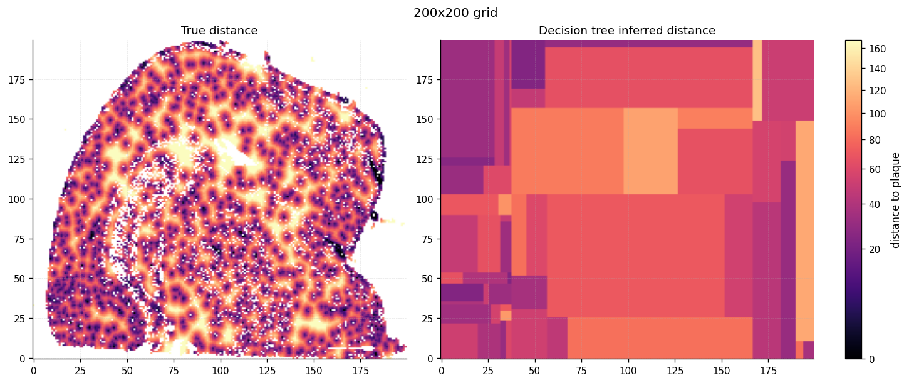
   <em>Figure 31. Ground-truth plaque-distance map and decision-tree reconstruction on a 200×200 grid.</em>

To measure the generalization capability of our expression models, we will introduce a tile-based cross-validation scheme. In this setting, we withhold contiguous tissue regions during training. 

Namely, we partition the brain into 391 square tiles. We will hold out 78 tiles (~20%) for testing and use the remaining 313 for training. In this setting, the train/test assignment is random at the tile level, not the cell level. As a result, we prevent the model from "seeing" large chunks of brain tissue. 

This is a substantially more strict scenario than holding out 20% of cells at random, because random cell-level splits still expose the model to the full  brain anatomy. This can inflate performance via spatial leakage. In other words, various (non-coordinate-based) predictors may act as proxies for coordinates, leading to spurious correlations picked up by the downstream model.

  <!-- This was obtained with plot_spatial_block_split in results.ipynb -->
  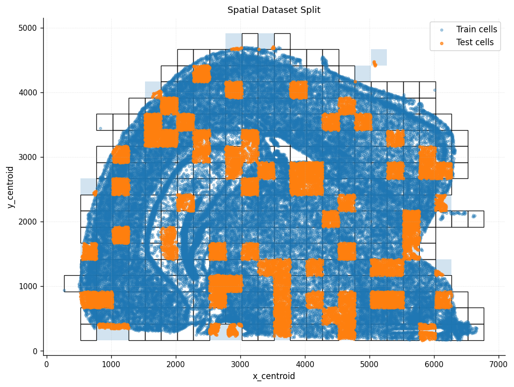
   <em>Figure 32. Random tile-based train/test split (391 tiles; 78 test, 313 train).</em>

Using this framework, we compare out-of-fold (OOF) performance for a multi-modal linear model and its three ablations. The full model is given by `target expression ~ distance to plaque + 15 PIG expression in neighbors + cell centroid coordinates`. Meanwhile, its threee ablations are: (i) `target expression ~ 15 PIG expression in neighbors`, (ii) `target expression ~ cell centroid coordinates`, and (iii) `target expression ~ distance to plaque`. 

Regardless of input features, the average R² under random cross-validation is consistently higher than under spatial block cross-validation (with overlapping 95% confidence intervals at the aggregate level). This indicates that random splits can overestimate generalization in the presence of spatial information leak. 

Further, this R^2 inflation is not uniform across genes. Some genes show extremely large relative differences, such as +138.2% for *Ctst* and +1,369% for *Nrep*. In other words, genes with stronger spatial variation will have the stronger generalization gap between random and spatial block CV. This highlights poor generalization performance for these genes.

  <!-- This was obtained with plot_mean_r2_with_extremes in results.ipynb -->
  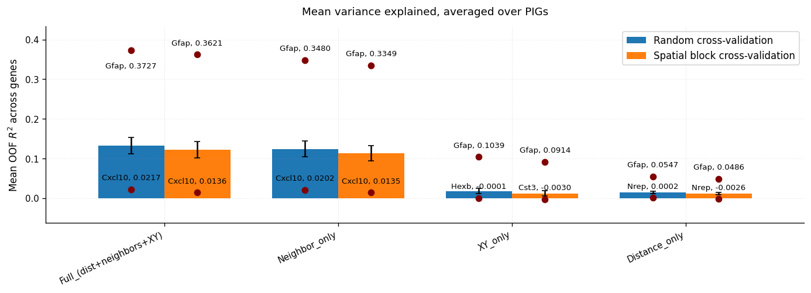
   <em>Figure 33. Mean OOF R² under random vs spatial block cross-validation across feature sets.</em>

In the next figure, we demonstrate the average relative coordinate leakage gap (%) between random and spatial block cross-validation (log-scaled). Larger gaps indicate a greater susceptibility to overfitting on brain-region-specific plaque accumulation patterns.

  <!-- This was obtained with plot_mean_relative_gap_with_extremes in results.ipynb -->
  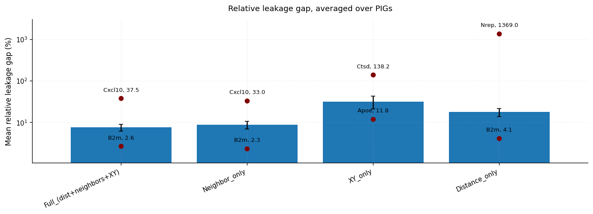
   <em>Figure 34. Mean relative leakage gap (%) between random and spatial block cross-validation (log-scaled).</em>

Next, we will explore a non-linear interaction between plaque distance and expression of other PIGs in neighboring cells. Namely, we define the **neighbor signature** (or **signature** for short) as the average expression level of "other PIGs" in the cell's neighborhood. We will examine average target PIG expression across joint bins of distance and signature. 

Distance is discretized into five bins (D1–D5 from closest to farthest from plaque), and the signature is also discretized into five bins (S1–S5 from lowest to highest mean expression of other PIGs). Across these distance/signature groups, target PIG expression varies substantially. This indicates that meaningful information is encoded jointly in proximity to plaques and local neighborhood state. This observation holds true for all PIGs except *Cxcl10*, where extreme zero inflation breaks this visual trend. 

Overall, the per-gene distance–signature interaction maps reveal smoothly varying gradients. The expression level is highest in localized peaks around plaques and maximal signature neighborhoods and decays elsewhere. In other words, the cell's neighborhood modulated the effect of distance to plaque on the target PIG expression. 

  <!-- This was obtained with plot_dist_signature_heatmaps_grid in results.ipynb -->
  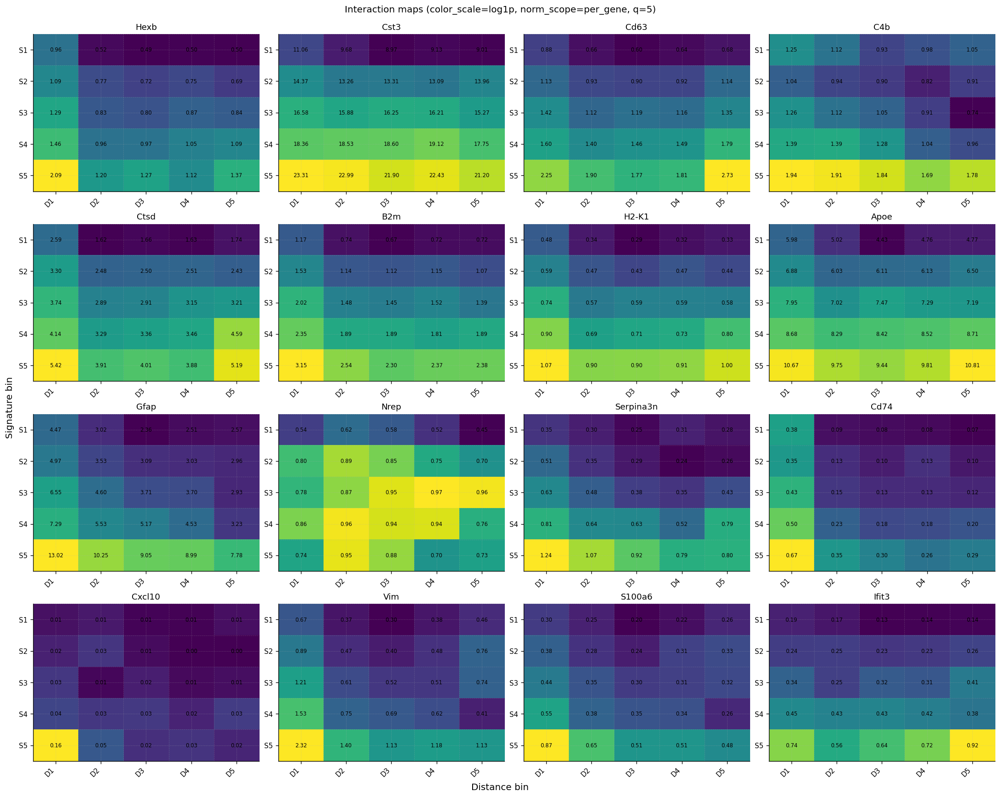
   <em>Figure 35. Distance–signature interaction patterns across D1–D5 and S1–S5 bins.</em>

We then evaluate whether explicitly modeling this interaction improves generalization under the spatial-block split. To this end, we compare the spatial-block OOF performance of a distance/signature interaction model against ablations that include only distance or only signature. 

On average, the interaction model performs best, but the improvement over the simpler signature-only model is not statistically significant at the 95% confidence level. This result reinforces the strength of neighborhood context as a standalone predictor. Further, it suggests that much of the interaction’s predictive value is already captured by the neighbor signature alone. Interestingly, however, the R^2 in best (Cst3, Gfap) and worst (Nrep) predicted genes varies substantially in all regression models. This highlights the strong variation in gene-to-gene spatial expression changes.

  <!-- This was obtained with plot_model_comparison_with_extremes in results.ipynb -->
  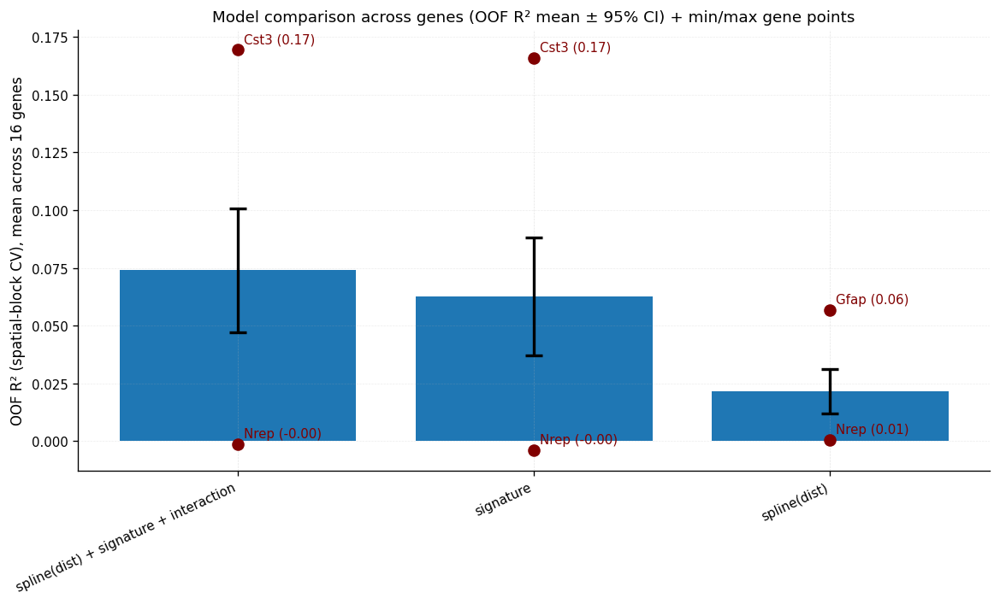
   <em>Figure 36. Spatial-block OOF R² for distance-only, signature-only, and interaction models.</em>

Since the interaction model is unexpectedly strong under spatial-block evaluation, we will next investigate *what* it is learning via two targeted ablations. 

In the first mode, we permute the cells *within each brain tile* and measure the performance drop. Since cells inside a tile remain relatively close, this perturbation is milder than a global random permutation. However, it still breaks cell-to-cell correspondence in local neighborhoods. Even under this mild disruption, spatial-block OOF performance drops by 62.9%, with no overlap in the 95% confidence intervals. This means that the model’s predictive power depends significantly on correctly matched neighborhood structure and not on the possibly leaked coarse location. 

Plotting the residuals after the perturbation reveals that the average absolute error is highest in highly heterogeneous regions such as the hippocampal formation and isocortex. Further, the residuals are elevated near the tissue periphery containing break-away cells. This illustrates an extreme form of heterogeneity. When a single tile mixes the "continental" cells within the main tissue mass and the "island" cells that are detached and therefore have extremely high distance-to-plaque, within-tile permutation introduces substantial surprise and correspondingly increases the average residual.

  <!-- This was obtained with plot_permutation_effect_across_genes in results.ipynb -->
  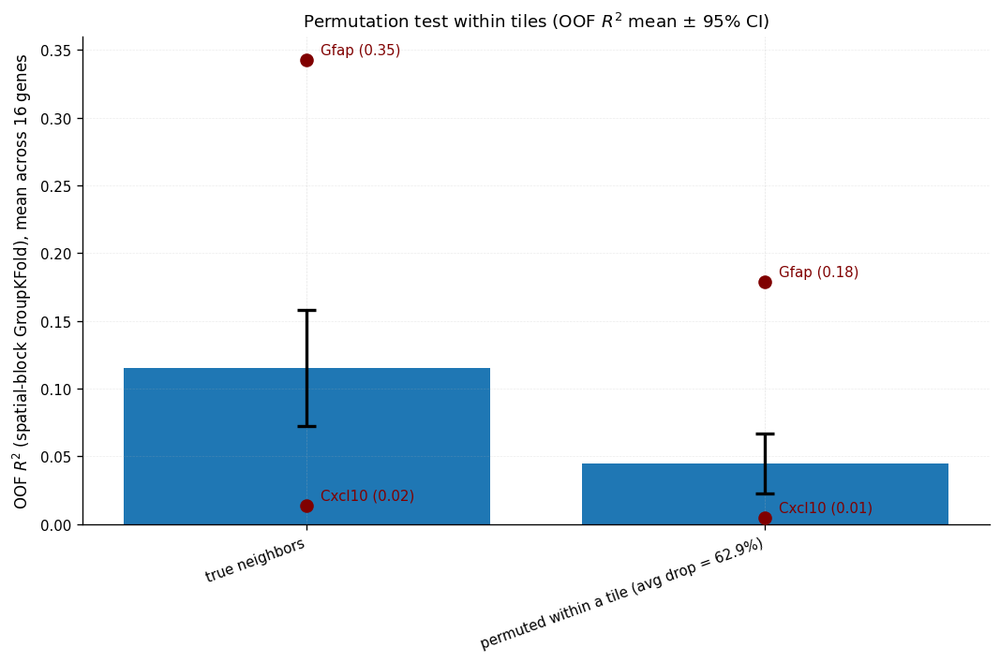
   <em>Figure 37. Effect of within-tile permutation on spatial-block OOF R² (62.9% average drop).</em>

  <!-- This was obtained with plot_spatial_scatter in results.ipynb -->
  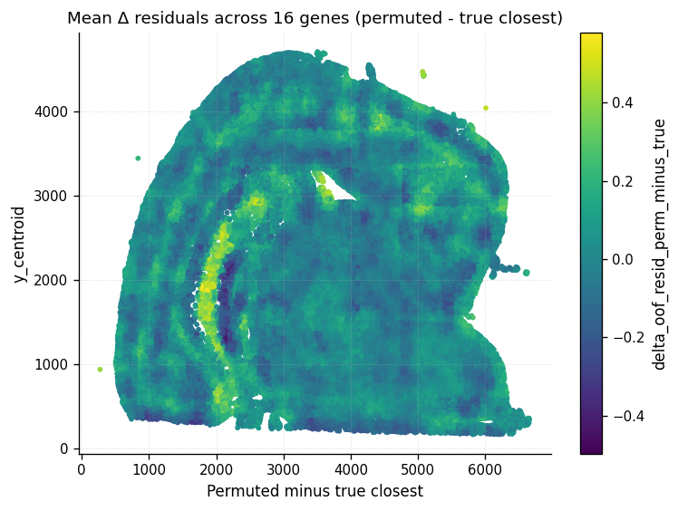
   <em>Figure 38. Tissue-wide map of permutation-induced residual changes.</em>

  <!-- This was obtained with plot_tile_heatmap in results.ipynb -->
  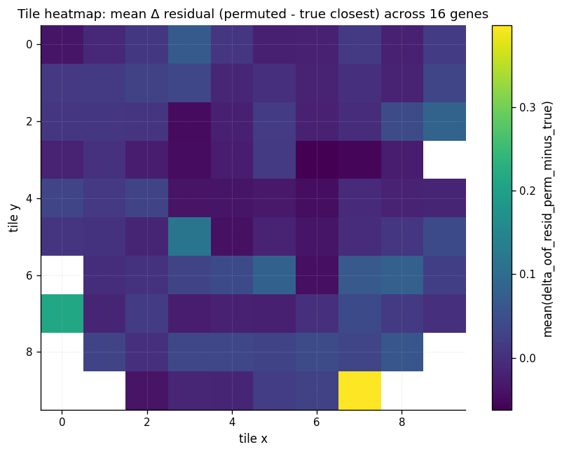
   <em>Figure 39. Tile-level summary of permutation-induced residual changes.</em>

In the second mode of ablation, we replace the 100 nearest neighbors with the 100 farthest neighbors. This ablation removes biologically and spatially relevant context more aggressively than within-tile permutation. As expected, this induces an even larger 86.4% drop in the spatial-block OOF R^2(significant at the 95% confidence level). This means that the predictive signal from the neighbor expression levels is highly local. 

When comparing prediction/observation agreement, we can see a monotonic improvement in alignment as we go from 100 farthest neighbors to 100 permuted neighbors within tile to bona fide 100 closest neighbors. The R² (0.018 for farthest, 0.045 for permuted, 0.115 for closest) and the calibration slope (0.05, 0.11, and 0.26, respectively) averaged across 16 PIGs reinforce this result. 

Despite the large differences in predictive strength, the residuals in the original and ablated models remain uncorrelated with plaque distance. This suggests that all three models learn a distance-independent bias. This is evident in the fact that the unexplained variance is distance-agnostic and homoscedastic.

  <!-- This was obtained with plot_true_vs_fake_far_neighbors_across_genes in results.ipynb -->
  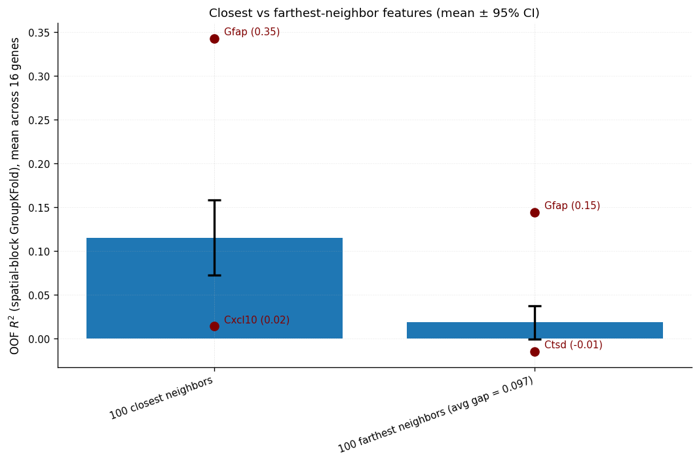
   <em>Figure 40. Closest-neighbor vs farthest-neighbor features under spatial-block CV (86.4% average drop).</em>

  <!-- This was obtained with plot_pred_vs_obs_combined in results.ipynb -->
  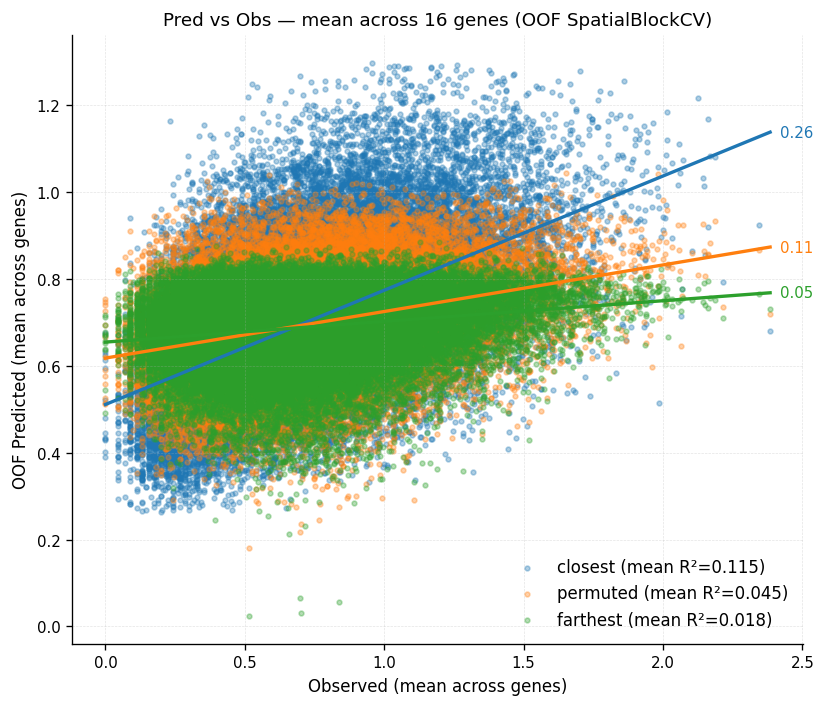
   <em>Figure 41. Predicted vs observed expression (main model and ablations).</em>

  <!-- This was obtained with plot_resid_vs_distance_combined in results.ipynb -->
  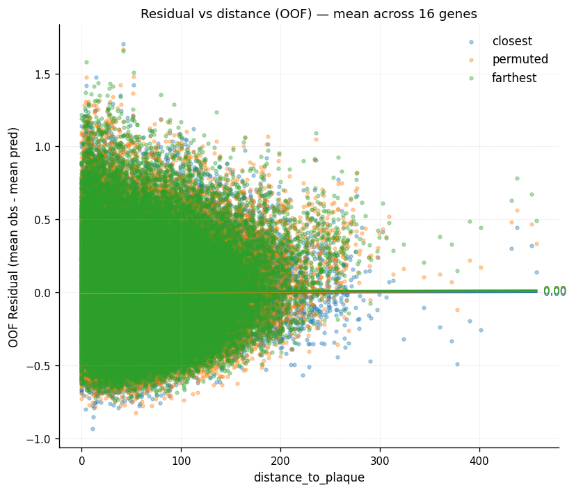
   <em>Figure 42. Residuals vs plaque distance (main model and ablations).</em>

---

## 5. Age and Genotype specific patterns

## 5.a RQ5 - How does the gene expression change with age for each cell type and mouse group?
Predicting gene expression only on the cell coordinate has clear limitations:

1. Plaque-dependent gene expression changes vary by cell type. For instance, microglia, astrocytes, and oligodendrocytes show much stronger changes near plaques than other cell types.
2. Aligning the morphology images across mice is complicated and introduces a significant mismatch due to the individual variations in anatomy and brain proportions. Thus, a coordinate-only model is unlikely to generalize well to unseen mice

To overcome these issues, we take into account the mouse type (Wt/Tg) and age in the following section.

### 5.b Disease specificity (Tg vs WT) by cell type

To examine the per-mouse variation in gene expression, we compute a z-normalized signature which is the log1p-transformed expression level averaged across 16 PIGs. The signature is computed for each mouse type and cell type pair (Tg/Wt x Leiden cluster). The results reveal that the average PIG expression in clusters 2, 5, 17 (Hypothalamic GABAergic, Thalamic Glutaergic, and Medulla GABAergic neurons, respectively) is much lower in oldest Tg mice compared to others. This indicates that these cell types can carry key importance in the development of AD.

  <!-- This was obtained with plot_pig_z_scores_per_cluster_per_mouse; usage in results.ipynb -->
  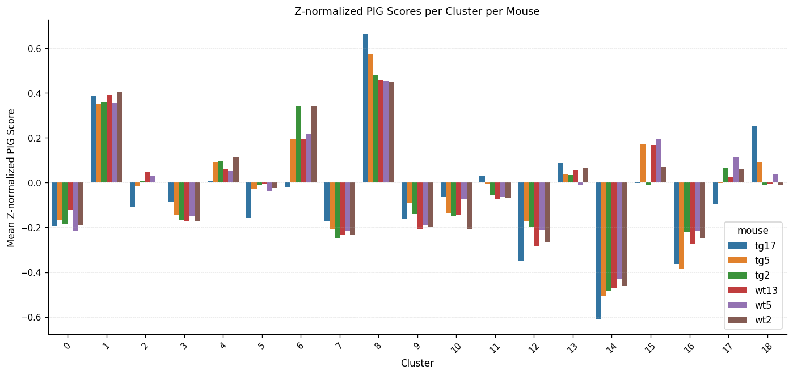
   <em>*Figure 43. Within gene z-normalized average PIG expression per mouse per cell type.*</em>

We will now analyze more closely how exactly the gene expression signature changes with genotype (Tg/Wt) and with age. This framework reveals plaque-induced changes in expression since it operates with general Wt aging as the baseline.
To this end, we will compute the difference in signatures between age-matched Tg/Wt mice and compute the correlation between this difference and age. We encode the absolute value of this relationship in oY while representing the sign as the circle radius. In other words, circles on the right half of the canvas represent cell types whose average PIG expression increases with age. Meanwhile, the height represents the strength of association with age. We can note that the cluster 18 (Pons Glutaergic neurons) is the right uppermost circle corresponding to the largest age-progressive relative increase of PIG expression. Meanwhile, on the other end of the spectrum, we have cluster 6 (vascular cells) with the largest age-progressive relative decrease in PIG expression. This result can be due to opposite effects plaques have on these cell types as plaque proximity is known to induce neural death but vascular enrichment.

  <!-- This was obtained with plot_volcano; usage in results.ipynb -->
  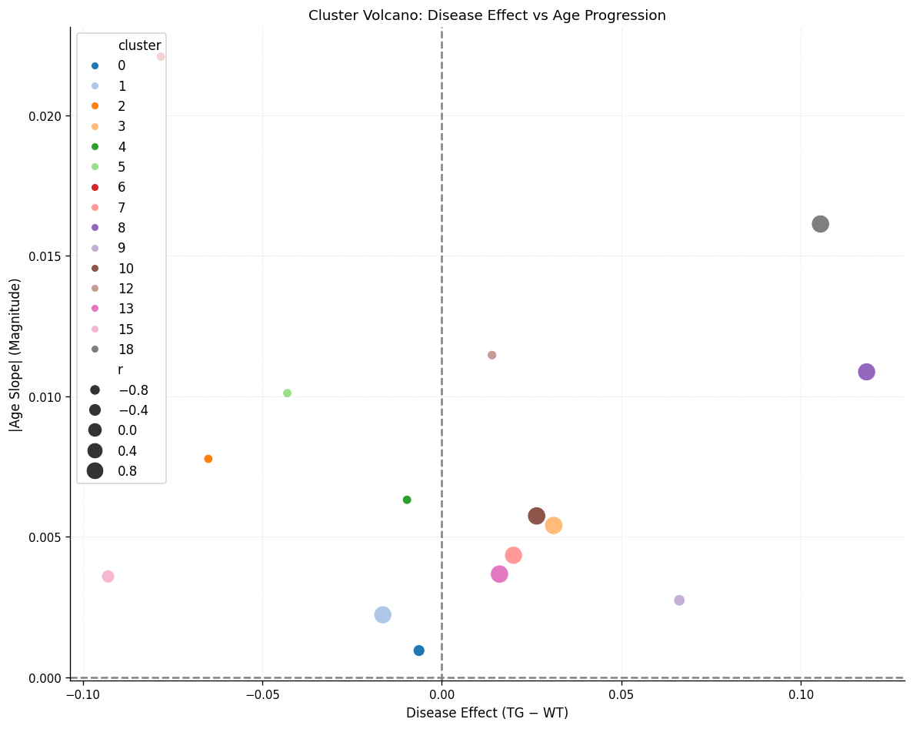
   <em>*Figure 44. Cluster-level summary of disease specificity (Tg − WT) alongside age progression, used to rank which cell types show the strongest plaque-linked transcriptional activation.*</em>

The same pattern can be seen in the next line plot where, in Tg mice, cluster 6 shows a steep decline with age whereas cluster 18 shows a steep increase.

  <!-- This was obtained with plot_age_progression; usage in results.ipynb -->
  
   <em>*Figure 45. Per-cluster changes in gene expression signature with age.*</em>

Next, we will look at the PCA-based vizualisation of each cell type. We can see that within each cluster, Wt and Tg cells are somewhat separated. Typically, the Wt cells compose the bulk of the point cloud whereas the Tg cells appear on the periphery. This shows systematic differences in the expression patterns between Tg and Wt mice that appear in most cell types.

  <!-- This was obtained with plot_cluster_pcas; usage in results.ipynb -->
  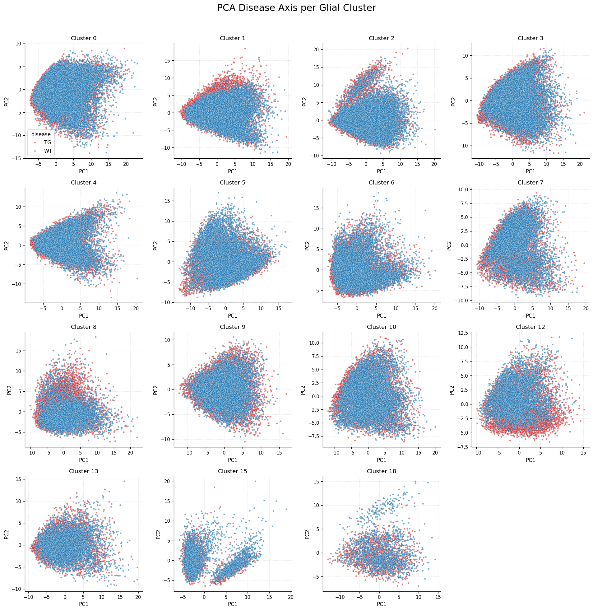
   <em>*Figure 46. PCA-based visualization Tg/Wt differences in each cell type.*</em>

### 5.c Age trajectories for Tg and WT at (2, 5, 13+ months)

We will now review the age trajectories in both mouse types. The following figure reveals that in transgenic mice, cluster 8 (immune cells) shows a monotone increase in average PIG expression from 2 to 5 to 17 months. The same cell type in the Wt mice remains stable.

  <!-- This was obtained with plot_age_curves_by_cluster; usage in results.ipynb -->
  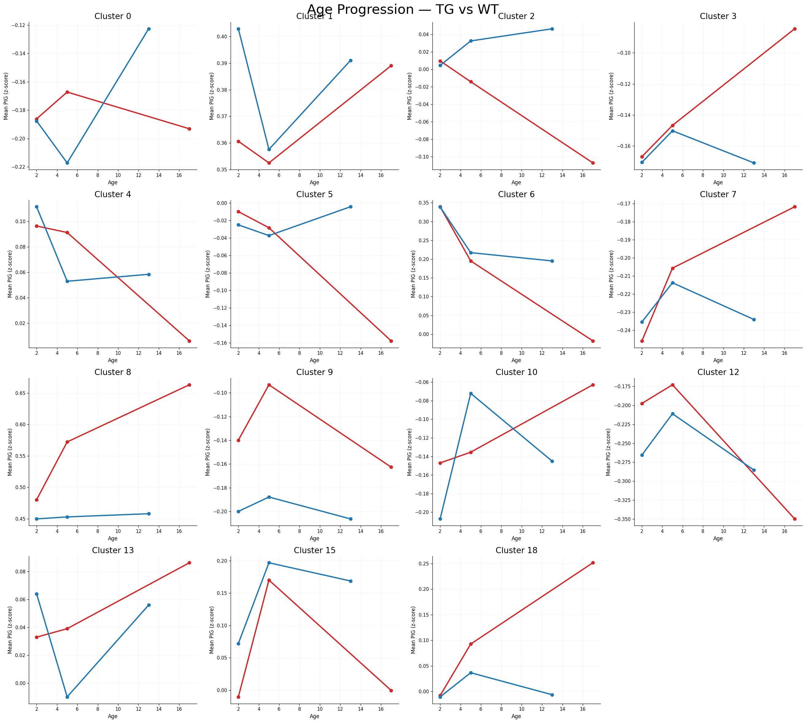
   <em>*Figure 48. Age progression trajectories of cluster-level activation for WT vs Tg, showing AD-specific, age-progressive glial activation in Tg animals.*</em>

Examining the heatmap of AD-specific genes, we can see that **Cluster 15 (Hypothalamic Gnrh1, Glutaergic)** is the strongest AD-specific activation cluster with **Cluster 6 (vascular)** as the next strongest. In these clusters, disease-specific genes such as **Syngr1, and Sparcl1** show large positive specificity scores (high in Tg, mostly silent in WT). This matches the existing knowledge on inflammatory remodeling pathways in AD as well as plaque-induced gene expression programs.

  <!-- This was obtained with plot_ad_specific_heatmap; usage in results.ipynb -->
  
   <em>*Figure 47. Heatmap of AD-specific genes (high in Tg, low in WT).*</em>

Shifting our focus to glial cells, we can see that the genes C3, Nme8, and Lyz2 show the biggest relative increase in expression in Tg relative to Wt.

  <!-- This was obtained with plot_top_de_heatmap; usage in results.ipynb -->
  
   <em>*Figure 36. Top differential genes per glial cluster.*</em>

Overall, our findings demonstrate that clusters 6 and 15 undergo progressive changes in gene expression patterns as a result of amyloid pathology. These signatures become increasingly more pronounced with age in Tg mice but not in the age-matched Wt mice.

---

## 6. Discussion and Limitations

### 6.a. What we can conclude robustly (and what we cannot)

Combining our analysis of cell type proportions, gene expression patterns, and plaque distance modeling, the results indicate that plaques play a central role in AD development; however, the presence of plaques and their impact significantly by cell type and brain region. Based on our findings, we can draw the following conclusions:

1. **Plaque proximity changes cell-type composition**. Immune and vascular cells as well as astrocytes are enriched in the plaque viscinity whereas most neurons are depleted (RQ1).
2. **Gene expression patterns are strongly linked to cell type changes**. Immune enrichment and neuronal depletion explain a significant proportion of variation PIG expression. However, some distance-related effects still persist even after the cell type is taken into account (RQ2).
3. **All 16 PIGs are elevated around plaques**. Further, *Gfap* exhibits the strongest spatial changes, whereas *Cxcl10* expression remains mostly flat due to zero inflation (RQ3).
4. **Gene expression somewhat encodes distance from plaque**. When attempting to infer plaque distance from gene expression alone, we get non-trivial R^2; however, the residuals are strongly colocalized with plaques and appear heteroscedastic (RQ4).
5. **Coordinate-based distance models can be deceptively strong**. Applying the coordinate-based models to unseen mice reveals little cross-mouse variation; instead, the models output identical predictions grounded in brain anatomy as opposed to bone fide plaque pathology (RQ4). Even within a single mouse, spatial cross-validation (CV) with held-out slices of brain tissue, shows a significant drop in R^2 when compared to random CV covering the entire brain. Some genes show the generalization gap of hundreds (Ctsd) to thousands (Nrep) of percent.
6. **Per age, per genotype average PIG expression reveals AD-specific, age-progressive transcriptional programs**. Two cell types (Hypothalamic Gnrh1, Glutaergic and vascular cells) show the strongest AD-specific activation (RQ5).
7. **Plaque occurrence is brain region specific**. This is demonstrated by the brain segmentation inferred by the decision-tree. The model outputs a coarse-grained segmentation in homogeneous regions around the diencephalon. There, the plaques appear evenly spaced, encouraging the model to approximate the whole region with a simple average. Meanwile, the tree learned a fine-grained segmentation in heterogeneous regions, namely hippocampus and isocortex. This indicates a significant variability in plaque occurrence in these regions. The denser "super-plaque-clusters" in these heteregoneous parts of the brain can have an especially debilitating effect on AD patients.
8. **Gene expression in neighboring cells is a strong predictor of PIG levels**. When comparing multiple regression models, those using even a single "other" PIG level averaged across neighbors achieve strong performance which generalizes to unseen brain slices. This highlights the importance of the local microenvironment which can dictate the transcriptional program of its cells.

We also acknowledge our limitations:

1. **Without additional experiements, we cannot infer causal relationships among PIG expression, plaques, and cell type composition**. Although we have uncovered strong associations between cell type prevalence, plaques, and gene expression, we cannot make causal claims on which of these three came first. Further, we have not ruled out a confounder which can drive changes in all 3 phenomena.
2. **The resolution of our analysis is limited by the quality of our alignment**. During the course of this study, we performed 2 types of alingment: IF/morphology and inter-mouse morphology image alingment. Both come with significant errors that limit the resolution at which we operate.
3. **Homoscedasticity of advanced models is countered by sub-optimal R^2**. Despite the uniform distribution of residual size at all plaque distances, our predictive models fail to achieve a perfect R^2. This means that much of the gene expression variability is distance-agnostic and can be explained by unrelated pathology mechanisms,

---

### 6.b Confounding and interpretation risks

- **Anatomical confounding**. Plaque density varies by brain region. Thus, any model using coordinates can learn spurious correlation with brain anatomy.
- **Spatial leakage and evaluation dependence**. Random cross-validation (CV) can inflate performance because nearby cells share context. The tile-based spatial block cross-validation (391 tiles with 78 held out) provides a more strict estimate of generalization capability since sizeable chunks of the brain are hidden at train time. The observed gene-to-gene variability in the spatial block/random CV performance gap implies that we may over-estimate our current generalization capabilities.
- **Neighborhood features can encode location**. Neighborhood gene expression levels can act as proxies for local tissue identity and thus the location in the brain. Our ablation study (Section 4.c) partially addresses this. Within-tile permutation results in a 62.9% drop in spatial-block OOF performance. Further, substituting 100 nearest neighbors with 100 farthest neighbors causes an 86.4% drop. These results support a real dependence on local structure. However, we have not fully eliminated the possibility of neighborhood gene expression covertly revealing coordinates.
- **Boundary artifacts and break-away cells**. The cells which appear detached from the brain and peripheral cells are often trivially far from plaques and can disproportionately influence segmentation, residual maps, and permutation behavior. This is especially apparent when tiles mix "continental" (main brain mass) and "island" (detached) cells.
- **Zero inflation**. Genes like *Cxcl10* illustrate that statistically significant findings can fail to be practical due to flat near-all-zero expression patterns.

---

### 6.c. Conclusions

Our findings reveal that plaques are accumulated in a brain-region-specific way and radiate a multi-modal influence into the surrounding tissue. Plaques re-model cell types and result in niches dominated by vascular and immune cells while being devoid of neurons. Further, plaques activate distinct transcriptional programs, with different genes affected at different distances.

When considering genes as AD therapy targets, it is crucial to ensure that plaque/gene association is specific to transgenic mice, is robust to spatial block cross validation, and persists across realistic distances from vasculature. In other words, the drug interventions should focus on near-plaque, non-sparse, cell-type-specific transcriptional programs that show a clear progression with age.

---

## 7. Appendix

### 7.a Multiple testing correction
- We used Bonferroni correction in RQ1 for per-cluster logistic regressions and in RQ3 for ANOVA across distance bins.
- Additionally, we applied Benjamini–Hochberg FDR correction in RQ3 when building per-PIG distance regressions and nested model comparisons.

### 7.b Feature engineering
- When discussing the features for linear regression, we use the following terms:
- Nearest plaque geometry refers to plaque area, perimeter, major axis length, and orientation.
- Multi-plaque proximity refers to the plaque count and the average distance within R. In our case, we set R = 61 µm, which is the median cell-to-plaque distance.
- Neighborhood context refers to the average expression of other PIGs in 100 nearest neighbors.
